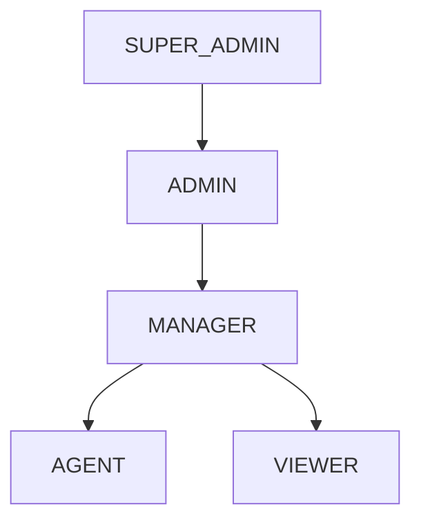

# Permissions — RBAC Backend

## Índice

- [Objetivo](#objetivo)
- [Descrição](#descrição)
- [Roles](#roles)
- [Permissões](#permissões)
- [Responsabilidades](#responsabilidades)
- [Dependências](#dependências)
- [Regras](#regras)
- [Futuras Melhorias](#futuras-melhorias)
- [Histórico de Revisões](#histórico-de-revisões)

---

## Objetivo

Documentar o sistema de controle de acesso baseado em papéis (RBAC) implementado no backend.

## Descrição

O sistema RBAC é composto por roles predefinidas do sistema e roles customizadas por Company. Cada role mapeia uma lista de permissões que controlam o acesso a recursos da API. A verificação ocorre via `@PreAuthorize` em controladores e `PermissionEvaluator` customizado.

## Roles

### Roles do Sistema

| Role | Descrição | Escopo |
|---|---|---|
| SUPER_ADMIN | Administrador da plataforma | Global (todas as Companies) |
| ADMIN | Administrador da Company | Company (todas as permissões) |
| MANAGER | Gerente da Company | Company (equipe + relatórios) |
| AGENT | Atendente | Company (próprios leads/conversas) |
| VIEWER | Observador | Company (somente leitura) |

### Hierarquia

## Permissões

### Formato

As permissões seguem o padrão `RECURSO:ACAO`:

| Recurso | Ações |
|---|---|
| contacts | create, read, update, delete |
| leads | create, read, update, delete, convert |
| opportunities | create, read, update, delete, win, lose |
| conversations | read, send, assign, transfer |
| campaigns | create, read, update, delete, pause, resume |
| automations | create, read, update, delete, toggle |
| templates | create, read, update, delete |
| reports | read, export |
| users | create, read, update, delete, invite |
| roles | create, read, update, delete |
| settings | read, update |
| billing | read, manage |
| audit | read |

### Matriz de Permissões por Role

| Recurso | SUPER_ADMIN | ADMIN | MANAGER | AGENT | VIEWER |
|---|---|---|---|---|---|
| contacts | CRUD | CRUD | CRUD | CRU | R |
| leads | CRUD | CRUD | CRUD | CRU | R |
| opportunities | CRUD | CRUD | CRUD | CRU | R |
| conversations | CRUD | CRUD | CRUD | CRUD | R |
| campaigns | CRUD | CRUD | CRUD | R | R |
| automations | CRUD | CRUD | CRUD | R | R |
| templates | CRUD | CRUD | CRUD | R | R |
| reports | CRUD | CRUD | R | R | — |
| users | CRUD | CRUD | CR | — | — |
| roles | CRUD | CRUD | — | — | — |
| settings | CRUD | CRUD | R | — | — |
| billing | CRUD | R | — | — | — |
| audit | CRUD | R | — | — | — |

## Responsabilidades

- Verificar permissões em cada endpoint
- Filtrar dados por Company (multi-tenancy)
- Garantir que AGENT só acesse próprios leads/conversas
- Suportar roles customizadas por Company

## Dependências

- [05-business-rules/Permissions.md](../05-business-rules/Permissions.md) — Regras de negócio
- [02-frontend/Permissions.md](../02-frontend/Permissions.md) — UI
- [03-database/Entities.md](../03-database/Entities.md) — Tabelas roles e user_roles

## Regras

- Verificação de permissão obrigatória em todos os endpoints (exceto auth)
- SUPER_ADMIN bypassa todas as verificações
- Roles customizadas só podem conceder permissões já existentes
- Mudanças de role são auditadas
- Permissões são avaliadas em tempo de execução (não cacheadas)

## Futuras Melhorias

- Permissões por campo (column-level security)
- Permissões condicionais (ex: só contacts da mesma equipe)
- Audit log de verificações de permissão
- Cache de permissões com invalidação por evento

## Histórico de Revisões

| Versão | Data | Autor | Descrição |
|---|---|---|---|
| 1.0.0 | 2026-07-15 | Architect | Criação inicial |
