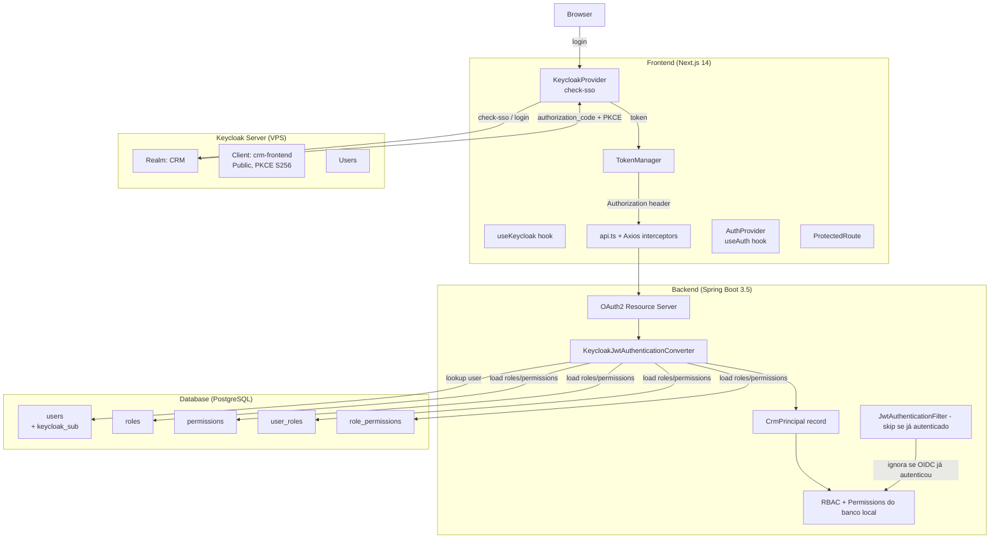
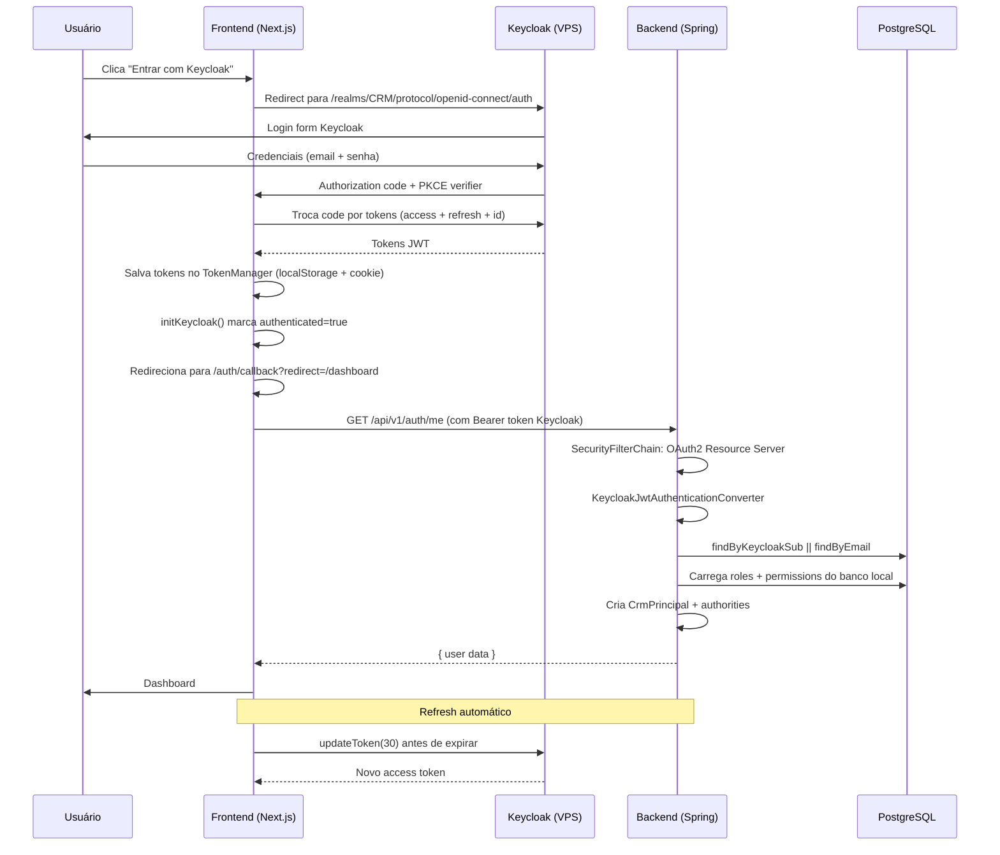

# Keycloak Integration — OIDC / OAuth 2.0

## Objetivo

Migrar a autenticação do CRM do mecanismo JWT proprietário (HMAC-SHA) para o padrão OIDC via Keycloak, preservando RBAC/permissões existentes e permitindo rollback imediato.

## Arquitetura

## Fluxo de Autenticação OIDC (PKCE)

## Componentes

### Backend

| Componente | Arquivo | Função |
|---|---|---|
| Resource Server Config | `SecurityConfig.java:49-53` | Ativa `.oauth2ResourceServer(jwt)` com converter customizado |
| JWT Converter | `KeycloakJwtAuthenticationConverter.java` | Extrai `realm_access.roles` e `resource_access.<client>.roles` do JWT; busca usuário CRM por `keycloakSub` ou `email`; carrega permissões do banco local |
| Principal Unificado | `CrmPrincipal.java` | Record com `userId`, `companyId`, `roles`, `permissions`, `keycloakSub` |
| Legacy Filter Skip | `JwtAuthenticationFilter.java:29-32` | Skip se `SecurityContext` já tem auth (Keycloak) |
| Auth Controller | `AuthController.java:24-31` | `POST /keycloak/callback` — registra login e dispara evento |
| Auth Service | `AuthService.java:231-241` | `handleKeycloakLogin()` — atualiza último login, publica evento |

### Frontend

| Componente | Arquivo | Função |
|---|---|---|
| Keycloak Singleton | `keycloak.ts` | Instância única `Keycloak` com PKCE S256, `check-sso`, `silentCheckSsoRedirectUri` |
| KeycloakProvider | `KeycloakProvider.tsx` | Contexto React com `useKeycloak()` hook; init assíncrono na montagem |
| TokenManager | `token-manager.ts` | `setKeycloakToken()`, `isKeycloakAuth()`, `getAccessToken()` prioriza KC |
| API Interceptor | `api.ts` | Tenta refresh Keycloak antes do legacy em erro 401 |
| AuthProvider | `useAuth.tsx` | `logout()` redireciona para Keycloak se `isKeycloakAuth()`; não limpa tokens KC |
| LoginForm | `LoginForm.tsx` | Botão "Entrar com Keycloak" |
| Callback Page | `auth/callback/page.tsx` | Página OIDC callback com `Suspense` |
| ProtectedRoute | `ProtectedRoute.tsx` | `isEffectiveAuthenticated` combina `useAuth` + Keycloak |
| Middleware | `middleware.ts` | `/auth/callback` é público |
| Silent SSO | `silent-check-sso.html` | Iframe invisível para SSO silencioso |

### Database

| Migration | Arquivo | Descrição |
|---|---|---|
| V009 | `V009__add_keycloak_sub_to_users.sql` | Adiciona coluna `keycloak_sub VARCHAR(255)` com índice |

## Estratégia de Coexistência (Legacy + Keycloak)

Ambos mecanismos funcionam simultaneamente durante a migração:

| Aspecto | Legacy (JWT HMAC) | Keycloak (OIDC) |
|---|---|---|
| Token | JWT assinado com HMAC-SHA (backend) | JWT assinado com RS256 (Keycloak) |
| Login | `POST /auth/login` (email + bcrypt) | Redirect para Keycloak (PKCE) |
| Refresh | `POST /auth/refresh` (Redis) | `keycloak.updateToken()` (PKCE) |
| RBAC | Roles + permissions no JWT | Roles do Keycloak + permissões do banco local |
| User linking | Direto por userId | Por `keycloakSub` ou `email` |
| Logout | `POST /auth/logout` (revoga refresh) | `keycloak.logout()` (encerra sessão SSO) |

**Regra de resolução:**
1. Request chega com `Authorization: Bearer <token>`
2. `JwtAuthenticationFilter` verifica se `SecurityContext` já tem auth → se sim, skip
3. Se não, tenta validar como JWT legacy (HMAC)
4. Simultaneamente, `OAuth2ResourceServer` tenta validar como JWT Keycloak (RS256 via JWKS)
5. O converter que processar primeiro prevalece

## Variáveis de Ambiente

### Frontend (`.env.local`)

| Variável | Exemplo | Obrigatória |
|---|---|---|
| `NEXT_PUBLIC_KEYCLOAK_URL` | `http://76.13.237.238:8080` | Sim |
| `NEXT_PUBLIC_KEYCLOAK_REALM` | `CRM` | Sim |
| `NEXT_PUBLIC_KEYCLOAK_CLIENT_ID` | `crm-frontend` | Sim |

### Backend (`application-dev.yml` / `application-prod.yml`)

| Propriedade | Exemplo | Obrigatória |
|---|---|---|
| `spring.security.oauth2.resourceserver.jwt.issuer-uri` | `http://76.13.237.238:8080/realms/CRM` | Sim (para OIDC) |
| `spring.security.oauth2.resourceserver.jwt.jwk-set-uri` | `http://76.13.237.238:8080/realms/CRM/protocol/openid-connect/certs` | Recomendado |
| `app.cors.allowed-origins` | `http://localhost:3000` | Sim |

## Configuração do Keycloak

### Realm: `CRM`
- Access Token Lifespan: 15 minutos
- SSO Session Max: 8 horas

### Client: `crm-frontend`
- **Client authentication:** Off (público)
- **Standard Flow:** ON
- **Direct Access Grants:** OFF
- **Valid redirect URIs:** `http://localhost:3000/auth/callback`
- **Valid post logout redirect URIs:** `http://localhost:3000/login`
- **Web origins:** `http://localhost:3000`

### User
- Username/Email: `ghilherme007@gmail.com`
- Role mapping: `ADMIN` (mapeada como Realm Role)
- Email verified: ON

## Rotas Protegidas

### Públicas (sem autenticação)
- `POST /api/v1/auth/login`
- `POST /api/v1/auth/register`
- `POST /api/v1/auth/forgot-password`
- `POST /api/v1/auth/reset-password`
- `POST /api/v1/users/accept-invite`
- `GET /actuator/**`
- `/login`, `/register`, `/forgot-password`, `/reset-password`
- `/auth/callback`
- `OPTIONS /**` (CORS preflight)

### Autenticadas (qualquer role)
- `GET /api/v1/auth/me`
- `POST /api/v1/auth/keycloak/callback`
- `/api/v1/permissions/**`
- `/api/v1/roles/**`
- `/api/v1/audit/**`

## Teste

### Pré-requisitos
- Docker rodando com PostgreSQL, Redis, RabbitMQ
- Backend rodando (`mvn spring-boot:run` com Java 25)
- Frontend rodando (`npm run dev`)
- Keycloak acessível em `http://76.13.237.238:8080`

### Cenário 1: Login Keycloak (SSO)
1. Acessar `http://localhost:3000`
2. Clicar "Entrar com Keycloak"
3. Login com `ghilherme007@gmail.com`
4. Redirecionado para `/auth/callback` → `/dashboard`
5. Banner verde exibe dados do JWT
6. Clicar "Sair" → redirecionado para `/login`

### Cenário 2: Login Legacy (fallback)
1. Acessar `http://localhost:3000/login`
2. Inserir email + senha
3. Clicar "Entrar"
4. Redirecionado para `/dashboard`
5. Logout via botão → `POST /auth/logout`

## Rollback

### Desativar Keycloak (voltar apenas JWT legacy)

**Frontend:**
1. Remover `KeycloakProvider` do provider tree
2. Remover botão "Entrar com Keycloak" do `LoginForm`
3. Reverter `useAuth.tsx` para logout legacy
4. Reverter `ProtectedRoute.tsx` para usar apenas `isAuthenticated`
5. Reverter `api.ts` para não tentar refresh Keycloak
6. Remover `/auth/callback` page

**Backend:**
1. Remover configuração `spring.security.oauth2.resourceserver.jwt` de `application-dev.yml` e `application-prod.yml`
2. Remover `KeycloakJwtAuthenticationConverter` do `SecurityConfig`
3. Remover `AuthController.keycloakCallback()`
4. Reverter `JwtAuthenticationFilter` para não ter skip
5. Manter coluna `keycloak_sub` na tabela `users` (não afeta nada se vazia)

## Histórico de Revisão

| Versão | Data | Autor | Descrição |
|---|---|---|---|
| 1.0.0 | 2026-07-23 | Dev | Criação inicial da documentação de integração Keycloak |
