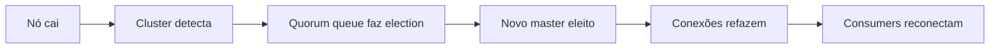
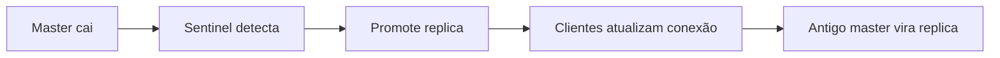

# Docker — Containerização

## Índice

- [Objetivo](#objetivo)
- [Descrição](#descrição)
- [Docker Compose](#docker-compose)
- [Dockerfiles](#dockerfiles)
- [Responsabilidades](#responsabilidades)
- [Dependências](#dependências)
- [Regras](#regras)
- [Futuras Melhorias](#futuras-melhorias)
- [Histórico de Revisões](#histórico-de-revisões)

---

## Objetivo

Documentar a containerização do sistema com Docker.

## Descrição

Todo o sistema é containerizado com Docker. Docker Compose é usado para desenvolvimento local. Dockerfiles são otimizados para produção.

## Docker Compose

### Serviços

| Serviço | Imagem | Porta | Descrição |
|---|---|---|---|
| backend | crm-backend:latest | 8080 | API Backend |
| frontend | crm-frontend:latest | 3000 | Frontend |
| postgres | postgres:16 | 5432 | Database |
| redis | redis:7 | 6379 | Cache |
| rabbitmq | rabbitmq:3-management | 5672 | Message Broker |
| minio | minio/minio | 9000 | S3 Storage |

### Comandos

```bash
# Iniciar tudo
docker-compose up -d

# Ver logs
docker-compose logs -f backend

# Parar tudo
docker-compose down

# Rebuild
docker-compose up -d --build
```

## Dockerfiles

### Backend (Multi-stage)

```dockerfile
# Build stage
FROM eclipse-temurin:21-jdk AS builder
WORKDIR /app
COPY pom.xml .
COPY .mvn .mvn
RUN ./mvnw dependency:go-offline
COPY src ./src
RUN ./mvnw package -DskipTests

# Runtime stage
FROM eclipse-temurin:21-jre
WORKDIR /app
COPY --from=builder /app/target/*.jar app.jar
EXPOSE 8080
ENTRYPOINT ["java", "-jar", "app.jar"]
```

### Frontend (Multi-stage)

```dockerfile
# Build stage
FROM node:20-alpine AS builder
WORKDIR /app
COPY package*.json .
RUN npm ci
COPY . .
RUN npm run build

# Runtime stage
FROM node:20-alpine
WORKDIR /app
COPY --from=builder /app/.next/standalone .
COPY --from=builder /app/public ./public
EXPOSE 3000
CMD ["node", "server.js"]
```

## High Availability — RabbitMQ

### Topologia

- **Cluster**: 3 nós com rabbitmq:3-management
- **Quorum Queues**: replication factor 3 para durabilidade
- **Load Balancer**: HAProxy roteando conexões AMQP (5672) e Management (15672)

### Configuração

| Parâmetro | Valor | Descrição |
|---|---|---|
| cluster_formation.peer_discovery_backend | classic_config | Discovery via config estática |
| cluster_formation.nodeslist | rabbit@node1, rabbit@node2, rabbit@node3 | Nós do cluster |
| quorum_queue.replication_factor | 3 | Réplicas por fila |
| queue_master_locator | min-masters | Distribuição de masters |

### Métricas de Saúde

- `rabbitmqctl cluster_status` — Status do cluster
- `rabbitmqctl list_queues name consumers messages` — Filas ativas
- Dead Letter Queue monitoramento via plugin Management UI

### Falha e Recovery



## High Availability — Redis

### Topologia

- **Redis Sentinel**: 3 sentinels para failover automático
- **Replication**: 1 master + 2 replicas por master
- **Cluster Mode**: 6 nós (3 masters + 3 replicas) para sharding

### Configuração

| Parâmetro | Valor | Descrição |
|---|---|---|
| sentinel monitor | mymaster 127.0.0.1 6379 2 | Quorum de sentinels |
| sentinel down-after-milliseconds | 5000 | Tempo para detectar falha |
| sentinel failover-timeout | 10000 | Timeout do failover |
| replica-read-only | yes | Replicas somente leitura |

### Métricas de Saúde

- `redis-cli info replication` — Status da replicação
- `redis-cli info memory` — Uso de memória
- `redis-cli sentinel masters` — Status dos sentinels

### Falha e Recovery



## Responsabilidades

- Containerizar todos os serviços
- Otimizar imagens para produção
- Gerenciar variáveis de ambiente
- Suportar desenvolvimento local

## Dependências

- [00-core/TechStack.md](../00-core/TechStack.md) — Docker
- [01-backend/Overview.md](../01-backend/Overview.md) — Backend
- [02-frontend/Overview.md](../02-frontend/Overview.md) — Frontend

## Regras

- Multi-stage builds obrigatórios
- Imagens base: Alpine quando possível
- Non-root user em produção
- Health checks em todos os serviços
- .dockerignore sempre presente
- Imagens versionadas (não latest em produção)

## Futuras Melhorias

- Docker BuildKit para cache
- Multi-platform builds (arm64)
- Docker Scout para segurança
- Slim imagens para reduzir tamanho

## Histórico de Revisões

| Versão | Data | Autor | Descrição |
|---|---|---|---|
| 1.0.0 | 2026-07-15 | Architect | Criação inicial |
