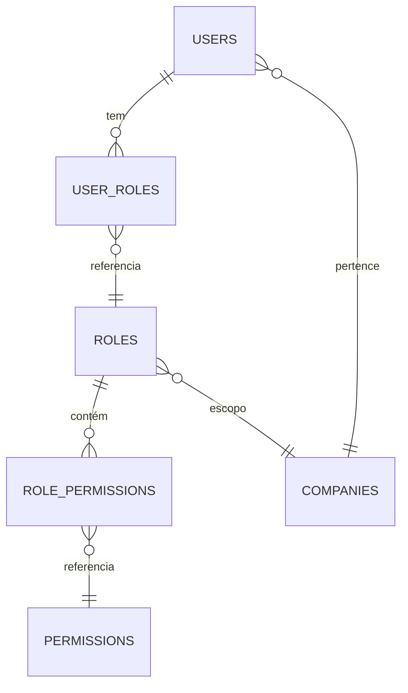
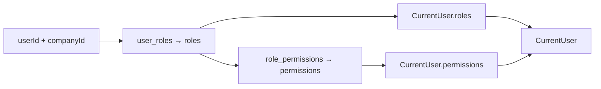

# AUTHORIZATION — Estratégia de Autorização (RBAC)

## Objetivo

Definir a estratégia de autorização RBAC da nova arquitetura: quem resolve roles/permissões, como elas chegam aos serviços e como estes as aplicam — com o **Keycloak como único emissor de JWT** e o **`crm-auth-service` como resolvedor do RBAC** (no `CurrentUser`).

## Índice

- [1. Princípios](#1-princípios)
- [2. Modelo RBAC Atual (base)](#2-modelo-rbac-atual-base)
- [3. Fontes de Roles e Permissões](#3-fontes-de-roles-e-permissões)
- [4. Mapeamento Keycloak → CRM](#4-mapeamento-keycloak--crm)
- [5. Resolução no Auth Service](#5-resolução-no-auth-service)
- [6. Enforcement nos Serviços](#6-enforcement-nos-serviços)
- [7. Bootstrap e Multi-tenancy](#7-bootstrap-e-multi-tenancy)
- [8. Ciclo de Vida de uma Permissão](#8-ciclo-de-vida-de-uma-permissão)
- [Referências](#referências)
- [Histórico de Revisão](#histórico-de-revisão)

---

## 1. Princípios

- **A fonte de verdade de autorização é o banco CRM** (tabelas `roles`, `permissions`, `user_roles`, `role_permissions`), não o Keycloak.
- O Keycloak pode expor roles em claims (`realm_access.roles`, `resource_access.<client>.roles`), mas elas servem apenas como **sinal de entrada** (bootstrapping/mapeamento), nunca como autorização final.
- O `crm-auth-service` resolve roles/permissões **na resolução do `CurrentUser`** e as entrega ao gateway, que propaga aos serviços — as decisões de autorização tornam-se **stateless** para os serviços.
- Opcionalmente, o Keycloak pode incluir roles do CRM no JWT via **client role mapper** (claims adicionadas no JWT do próprio Keycloak) para validação autoritativa de roles nos serviços.
- Consistência eventual: alterações de RBAC passam a valer no próximo `CurrentUser` resolvido (ou re-resolução por evento).

---

## 2. Modelo RBAC Atual (base)

O modelo atual permanece e é reaproveitado:



| Entidade | Papel |
|---|---|
| `users` | usuário com `company_id` e `keycloak_sub` |
| `roles` | papel com escopo por `company_id` (`SUPER_ADMIN`, `ADMIN`, `MANAGER`, `AGENT`, `VIEWER`) |
| `permissions` | permissão granular (`user:read`, `user:write`, `dashboard:view`, …) |
| `user_roles` | vínculo usuário × role (por company) |
| `role_permissions` | vínculo role × permission |

---

## 3. Fontes de Roles e Permissões

| Item | Fonte | Quando é lida |
|---|---|---|
| Permissões | `permissions` + `role_permissions` (CRM DB) | Resolução do `CurrentUser` (auth-service) |
| Roles CRM | `roles` + `user_roles` (CRM DB) | Resolução do `CurrentUser` (auth-service) |
| Roles Keycloak | `realm_access.roles` / `resource_access.<client>.roles` | Apenas mapeamento de entrada (bootstrap) |

---

## 4. Mapeamento Keycloak → CRM

O mapeamento de roles é **opcional** e usado apenas para bootstrapping de admins:

| Realm role (Keycloak) | CRM role | Observação |
|---|---|---|
| `SUPER_ADMIN` | `SUPER_ADMIN` | Empresa/plataforma |
| `ADMIN` | `ADMIN` | Escopo de empresa |
| `MANAGER` | `MANAGER` | Escopo de empresa |
| `AGENT` | `AGENT` | Escopo de empresa |
| (sem role) | `AGENT` | Role default do provisionamento |

Regras:

1. No provisionamento, se o usuário trouxer realm role mapeável, ela é atribuída no CRM (criação única).
2. Depois do provisionamento, **o mapeamento não é mais reaplicado**: o RBAC é gerido no CRM.
3. O **admin da plataforma** pode ser bootstrapado via variável de ambiente (e-mail) + `SUPER_ADMIN`, sem depender do Keycloak.

---

## 5. Resolução no Auth Service



Passos na resolução do `CurrentUser`:

1. `userRoleRepository.findByUserIdAndCompanyId(userId, companyId)` → role ids.
2. `roleRepository.findById(...)` → nomes (`RoleName`).
3. `roleRepository.findByNameAndCompanyId(roleName, companyId)` → role.
4. `rolePermissionRepository.findByRoleId(roleId)` → permission ids.
5. `permissionRepository.findById(...)` → nomes (`Permission.name`).

O resultado (roles + permissions deduplicadas) compõe o `CurrentUser` (CURRENT_USER.md). **Esse fluxo é movido do converter atual (`KeycloakJwtAuthenticationConverter`) para o auth-service.** Opcionalmente, as roles também são mapeadas para o JWT do Keycloak via **client role mapper** (mesmo emissor — Keycloak).

---

## 6. Enforcement nos Serviços

Os serviços de negócio aplicam autorização com o starter `crm-security-spring-boot-starter`, consumindo o `CurrentUser` distribuído pelo gateway:

```java
@RequiresPermission("user:read")
public ResponseEntity<List<UserResponse>> list() { ... }
```

| Mecanismo | Exemplo |
|---|---|
| `@RequiresPermission("permission:code")` | Anotação sobre métodos/classes |
| `@PreAuthorize("hasAuthority('ROLE_ADMIN')")` | Compatível com o modelo atual (`ROLE_*` authorities) |
| `SecurityUtils.currentUser().permissions().contains("user:write")` | Regras condicionais/transversais |

O starter garante **fail-closed**: sem `CurrentUser` válido, a requisição é rejeitada (401); sem a permissão, 403.

---

## 7. Bootstrap e Multi-tenancy

- **Bootstrap do SUPER_ADMIN**: variável `AUTH_BOOTSTRAP_SUPER_ADMIN_EMAIL` no auth-service; no primeiro provisionamento, cria empresa default + role `SUPER_ADMIN`.
- **Multi-tenancy**: todas as consultas de RBAC são filtradas por `companyId`/`tenantId` do `CurrentUser`. `permissions`/`roles` são resolvidas no escopo da empresa do usuário.
- Roles de sistema (`is_system = true`) permanecem protegidas contra edição/exclusão (comportamento atual mantido).

---

## 8. Ciclo de Vida de uma Permissão

1. Admin cria/atualiza role e vínculos no CRM (endpoints `/roles`, `/users/{id}/roles` atuais).
2. Próximo `CurrentUser` resolvido (login/refresh/re-resolução) carrega as novas roles/permissões.
3. Revogação imediata de acesso: desativar usuário no CRM + invalidar cache do `CurrentUser` → próximas resoluções falham; o JWT stateless do Keycloak expira em até 5 min.

| Evento | Efeito |
|---|---|
| Role atribuída/removida | Vigora no próximo `CurrentUser` (reflexo no refresh) |
| Usuário desativado | Cache invalidado; `auth.session.revoked` publicado |
| Permissão removida de role | Vigora no próximo `CurrentUser` |
| `auth.user.role_changed` | Consumido por audit e analytics |

## Referências

| Documento | Relação |
|---|---|
| [CURRENT_USER.md](./CURRENT_USER.md) | Modelo CurrentUser (roles/permissions) |
| [PROVISIONING.md](./PROVISIONING.md) | Role default e bootstrap |
| [EVENTS.md](./EVENTS.md) | Eventos de RBAC |
| [AUTH_SERVICE_API.md](./AUTH_SERVICE_API.md) | Endpoints de roles/permissions mantidos nos serviços |
| [05-business-rules/Permissions.md](../05-business-rules/Permissions.md) | Permissões do domínio |
| [01-backend/Permissions.md](../01-backend/Permissions.md) | Módulo de permissões atual |

## Histórico de Revisão

| Versão | Data | Autor | Descrição |
|---|---|---|---|
| 1.0.0 | 2026-07-31 | Architect | Sprint 0 — estratégia de autorização RBAC |
| 1.1.0 | 2026-07-31 | Architect | Ajuste: RBAC resolvido no CurrentUser (sem claims em token próprio); Keycloak único emissor |
