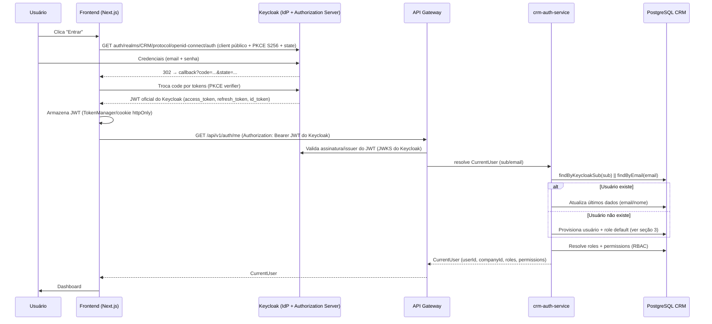
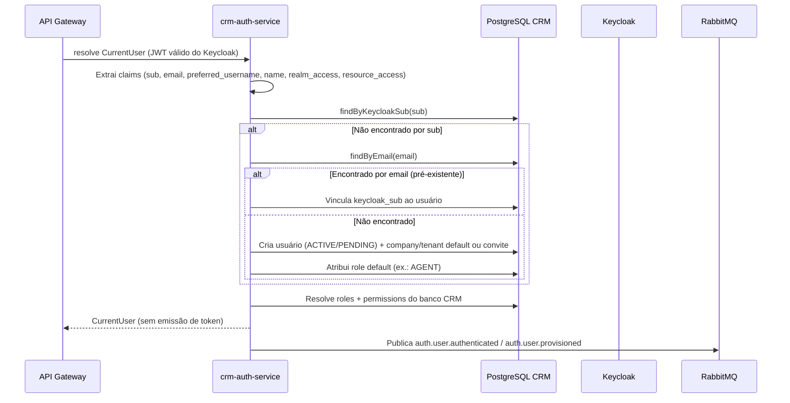
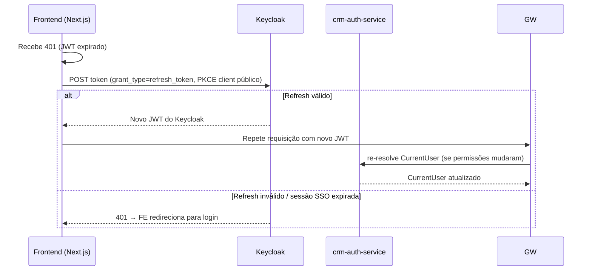
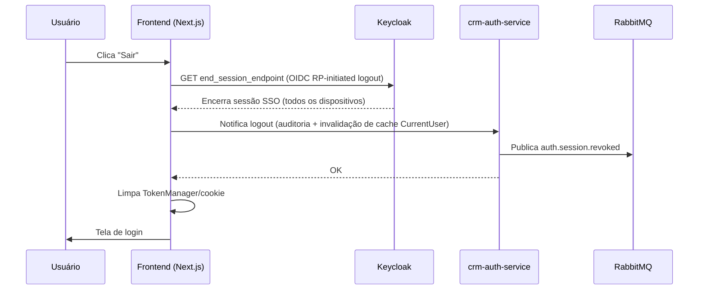

# AUTH_FLOWS — Fluxos de Autenticação

## Objetivo

Descrever em detalhe os fluxos de autenticação da nova arquitetura: login OIDC (Authorization Code + PKCE) diretamente com o **Keycloak** (único emissor de JWT), refresh/SSO, logout e **primeiro login com provisionamento automático** pelo `crm-auth-service`.

## Índice

- [1. Visão Geral dos Fluxos](#1-visão-geral-dos-fluxos)
- [2. Fluxo de Login (OIDC + PKCE com Keycloak)](#2-fluxo-de-login-oidc--pkce-com-keycloak)
- [3. Fluxo do Primeiro Login (Provisionamento Automático)](#3-fluxo-do-primeiro-login-provisionamento-automático)
- [4. Fluxo de Renovação (Refresh / SSO)](#4-fluxo-de-renovação-refresh--sso)
- [5. Fluxo de Logout](#5-fluxo-de-logout)
- [6. Regras de Sessão e Token](#6-regras-de-sessão-e-token)
- [Referências](#referências)
- [Histórico de Revisão](#histórico-de-revisão)

---

## 1. Visão Geral dos Fluxos

| Fluxo | Gatilho | Componentes envolvidos |
|---|---|---|
| Login | Usuário clica "Entrar" | Frontend → Keycloak (OIDC + PKCE) → Frontend → Gateway → Auth Service |
| Primeiro login | Primeiro acesso de um usuário novo | Idem + provisionamento no banco CRM pelo Auth Service |
| Refresh | Token expira (401) ou sessão SSO ativa | Frontend ↔ Keycloak (refresh/SSO) |
| Logout | Usuário clica "Sair" | Frontend → Keycloak (end-session) |

O fluxo é **OIDC Authorization Code + PKCE** com client **público** no browser. O `crm-auth-service` **não participa da troca de código** e **não emite tokens**: ele recebe o JWT já emitido pelo Keycloak para provisionar e resolver o `CurrentUser`.

> **Sprint 3 (implementado — frontend, 2026-07-31):** o fluxo real do frontend usa **`keycloak-js` v26** com `pkceMethod: "S256"`, `onLoad: "check-sso"` e `silent-check-sso.html`. O `keycloak-js` inicia o login (Authorization Code + PKCE), processa o retorno em `/auth/callback` e troca o code pelos tokens do Keycloak. O JWT é armazenado no `TokenManager` (localStorage) e espelhado num cookie `accessToken` (mesma origem) apenas para o middleware do Next.js decidir rotas protegidas no servidor. Nenhum token é emitido pelo `crm-auth-service` nem pelo backend para login.
>
> **Removido no Sprint 3:** o login legado com e-mail/senha do frontend (`POST /auth/login` → JWT HS256 do backend) e a lógica duplicada de refresh via `/auth/refresh`. O Keycloak é o **único** caminho de login no frontend.

---

## 2. Fluxo de Login (OIDC + PKCE com Keycloak)

**Pontos-chave:**

- O **Keycloak** autentica e é o **único emissor** do JWT oficial.
- **PKCE S256** + validação de `state` contra CSRF no callback (client público).
- O `crm-auth-service` **não troca código nem emite token**; ele resolve o `CurrentUser` a partir do JWT do Keycloak.
- O **gateway** propaga o `CurrentUser` aos microsserviços, que continuam validando o JWT do Keycloak.

**Sprint 3 — fluxo real implementado no frontend (2026-07-31):**

1. Usuário clica "Entrar" em `LoginForm` → `keycloak.login()` (client público `crm-frontend`, PKCE S256) → UI do Keycloak.
2. Keycloak redireciona para `/auth/callback?code=...&state=...`; o `KeycloakProvider` chama `keycloak.init` no montar, que processa o code e troca pelos tokens (o `keycloak-js` gerencia o verifier PKCE).
3. Pós-init autenticado: `useMe` habilita e chama `GET /api/v1/auth/me` do backend (Sprint 1) com o Bearer do JWT do Keycloak — usado para exibir nome/e-mail e para o middleware/autorização de tela.
4. O JWT é persistido no `TokenManager` (`kc_accessToken`/`kc_refreshToken`) e o `accessToken` é refletido num cookie de mesma origem para o middleware.
5. Sessão SSO ativa + sem tokens → `check-sso` reautentica silenciosamente sem redirecionar para login.

> A resolução de `CurrentUser` pelo gateway/auth-service (Sprint 4) **ainda não** acontece no frontend: hoje a identidade de negócio vem do `GET /api/v1/auth/me` do backend. Nenhuma etapa atual do frontend depende do auth-service.

---

## 3. Fluxo do Primeiro Login (Provisionamento Automático)

O primeiro login **não falha mais** quando o usuário não existe no banco CRM (comportamento atual: 500). O auth-service provisiona o usuário automaticamente.

> **Sprint 1 (implementado)**: no `crm-backend`, o provisionamento ocorre dentro da cadeia de segurança — o `KeycloakJwtAuthenticationConverter` chama `AuthService.provisionKeycloakUser` (após a validação do JWT pelo resource server) e só então monta o `CrmPrincipal` com `userId`/`companyId` não nulos. A migração desta lógica para o `crm-auth-service` está planejada para sprint futuro (PROVISIONING.md §4.2).
>
> **Sprint 2 (fundação — implementado)**: o `crm-auth-service` (novo serviço, porta 8082) resolve o `CurrentUser` a partir do JWT e do banco CRM; identidade autenticada sem usuário CRM retorna **`PROVISIONING_REQUIRED`** (200 discriminado) e usuário desativado → **401 `USER_INACTIVE`** — sem duplicar o provisionamento, que permanece no backend.
>
> **Comportamento (validado em produção, 2026-07-31)**: primeiro login → `/auth/me` **200** com usuário provisionado (role default `AGENT`); logins seguintes reusam o mesmo registro (idempotente); usuário `INACTIVE` → **401** ("Usuário desativado: contate o administrador.") mesmo com JWT válido.

**Regra de vinculação (ordem):**

1. `keycloakSub` (claim `sub`) — vínculo forte.
2. `email` (claim `email`, verificado no Keycloak) — vínculo por e-mail.
3. Conflito de e-mail → política de empresa/convite (ver PROVISIONING.md).

**Comportamento dos endpoints após provisionamento:**

- `GET /api/v1/auth/me` → **200** com `CurrentUser` completo (antes: 500).
- JWT inválido/assinatura inválida → **401** (validação do resource server, antes do provisionamento) — nenhum usuário é criado.
- Falha previsível de provisionamento (token sem `sub`/e-mail válido, sem empresa ativa, flag desligada) → **401** com mensagem (nunca 500 por `userId = null`).
- Os microsserviços continuam validando o JWT do Keycloak; o RBAC vem do `CurrentUser` distribuído pelo gateway.

---

## 4. Fluxo de Renovação (Refresh / SSO)

- A **renovação** é feita pelo frontend junto ao Keycloak (SSO).
- O auth-service **re-resolve o `CurrentUser`** quando permissões mudam (cache invalidado).
- O frontend usa o mesmo interceptor atual de 401 (single-flight) trocando a chamada de refresh para o Keycloak.

**Sprint 3 — refresh real implementado no frontend (2026-07-31):**

- O interceptor de **request** do axios chama `refreshKeycloakToken(30)` (envolve `keycloak.updateToken(30)`) quando o JWT vai expirar em < 30 s — refresh **proativo**, evitando 401 desnecessários.
- O interceptor de **response** trata 401 com guard `_retry`: em caso de **um** 401, tenta `refreshKeycloakToken` e repete a requisição uma única vez. Se o refresh falhar ou o retry 401 novamente, limpa os tokens e redireciona para `/login`.
- **Single-flight garantido pelo próprio `keycloak-js`** (chamadas concorrentes de `updateToken` se unificam).
- **Removido:** a rota legada `/auth/refresh` do backend e a fila manual de refresh (`api.ts`).
- A sincronização é bidirecional: o refresh do `keycloak-js` atualiza `kc.token`/`kc.refreshToken`, que o `refreshKeycloakToken` persiste de volta no `TokenManager`/cookie.

---

## 5. Fluxo de Logout

- **Logout local**: limpa o token no frontend e invalida o cache de `CurrentUser` no auth-service (evento).
- **Logout SSO**: encerra a sessão no Keycloak via `end_session_endpoint` (importante para multi-dispositivo).
- Logout em **um dispositivo específico**: revoga apenas a sessão daquele dispositivo no Keycloak (OIDC session management).

**Sprint 3 — logout real implementado no frontend (2026-07-31):**

- `AuthProvider.logout` → `KeycloakProvider.logout` → `keycloak.logout()` (RP-initiated logout, `end_session_endpoint` do Keycloak).
- Antes de chamar o Keycloak, os tokens do `TokenManager` e o cookie `accessToken` são limpos localmente.
- **Removido:** o logout legado via `POST /auth/logout` do backend. Não existe mais caminho de logout fora do Keycloak.

---

## 6. Regras de Sessão e Token

| Regra | Valor |
|---|---|
| Access Token TTL | 5 minutos (configurável no realm) |
| Refresh Token TTL | 7 dias (configurável no realm) |
| Rotação de refresh | Sim (Keycloak, por família) |
| Detecção de reuso | Sim (Keycloak revoga a família) |
| Sessões simultâneas | Permitidas (uma por dispositivo/família) |
| Sessão SSO Keycloak | 8 horas (configurável no realm) |
| Algoritmo do JWT | RS256 (chaves RSA do Keycloak) |
| Emissor | Keycloak (realm CRM) — **único emissor** |
| Validação nos serviços | JWKS do Keycloak |
| Armazenamento no frontend | TokenManager (`kc_accessToken`/`kc_refreshToken`) + cookie `accessToken` (mesma origem) para o middleware |

## Referências

| Documento | Relação |
|---|---|
| [OVERVIEW.md](./OVERVIEW.md) | Arquitetura geral |
| [PROVISIONING.md](./PROVISIONING.md) | Detalhes do provisionamento |
| [CURRENT_USER.md](./CURRENT_USER.md) | Modelo `CurrentUser` |
| [AUTH_SERVICE_API.md](./AUTH_SERVICE_API.md) | Contratos dos endpoints |
| [04-integrations/KEYCLOAK_INTEGRATION.md](../04-integrations/KEYCLOAK_INTEGRATION.md) | Fluxo atual (coexistência) |

## Histórico de Revisão

| Versão | Data | Autor | Descrição |
|---|---|---|---|
| 1.0.0 | 2026-07-31 | Architect | Sprint 0 — fluxos de autenticação, primeiro login, refresh e logout |
| 1.1.0 | 2026-07-31 | Architect | Ajuste: OIDC + PKCE direto com Keycloak (único emissor); auth-service apenas resolve CurrentUser |
| 1.2.0 | 2026-07-31 | Architect | Sprint 1 — primeiro login implementado no crm-backend (provisionamento no converter); /auth/me → 200; falhas → 401; usuário desativado → 401 (validado em produção) |
| 1.3.0 | 2026-07-31 | Architect | Sprint 3 — fluxo real do frontend documentado: keycloak-js (PKCE S256) no login; refresh proativo + retry único; logout sempre via Keycloak; removido login/refresh/logout legados |
