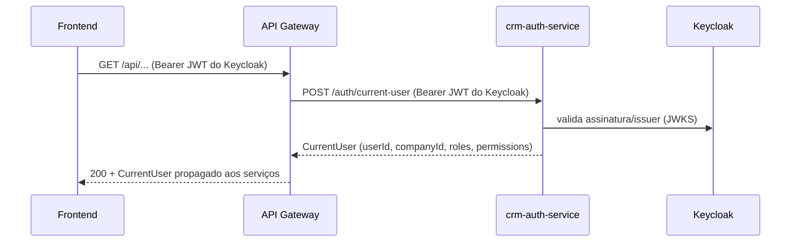

# AUTH_SERVICE_API — APIs do crm-auth-service

## Objetivo

Definir as APIs públicas (consumidas pelo frontend/gateway) e internas (consumidas pelos serviços) do `crm-auth-service`, incluindo contratos de entrada/saída. O auth-service **não expõe fluxo de login/refresh/logout próprio nem JWKS** — a autenticação e a emissão de JWT são de responsabilidade exclusiva do Keycloak.

## Índice

- [1. Visão Geral](#1-visão-geral)
- [2. Endpoints Públicos](#2-endpoints-públicos)
- [3. Endpoints Internos](#3-endpoints-internos)
- [4. Endpoints de Infraestrutura](#4-endpoints-de-infraestrutura)
- [5. Contratos (Exemplos)](#5-contratos-exemplos)
- [6. Autenticação entre Serviços](#6-autenticação-entre-serviços)
- [7. Migração dos Endpoints Atuais](#7-migração-dos-endpoints-atuais)
- [Referências](#referências)
- [Histórico de Revisão](#histórico-de-revisão)

---

## 1. Visão Geral

O `crm-auth-service` expõe:

- **Públicos** (`/auth/...`): consumidos pelo frontend e pelo gateway (perfil/`CurrentUser`).
- **Internos** (`/internal/...`): consumidos pelo gateway e serviços de negócio (resolução de `CurrentUser`, revogação de sessão) — acessíveis apenas na rede interna (network docker) e/ou mTLS.

> **Status Sprint 2 (fundação — 2026-07-31):** implementado `GET /internal/auth/current-user` e `/auth/health` (+ actuator health/info). Os demais endpoints desta seção permanecem planejados para sprints futuros (ver marcas "planejado" ao longo do documento).
>
> **Status Sprint 4 (integração — 2026-08-01):** o `crm-backend` passou a **consumir** `GET /internal/auth/current-user` como camada de identidade (via `AuthServiceClient`, flag `AUTH_IDENTITY_LAYER_ENABLED=true`, com fallback local). A emissão própria de tokens do backend (login/refresh/logout) foi removida — autenticação é exclusiva do Keycloak.

**Login, refresh, logout e emissão de JWT são feitos diretamente com o Keycloak** (ver AUTH_FLOWS.md). Toda resposta de erro segue o padrão atual (`GlobalExceptionHandler`): `{ status, error, message, timestamp }`.

---

## 2. Endpoints Públicos

| Método | Caminho | Descrição | Autenticação | Status |
|---|---|---|---|---|
| GET | `/auth/me` | Retorna o `CurrentUser` autenticado (resolve provisionamento/RBAC sob demanda) | Bearer JWT do Keycloak | Planejado |
| POST | `/auth/current-user` | Resolve/retorna o `CurrentUser` a partir do JWT (usado pelo gateway para enriquecer a requisição) | Bearer JWT do Keycloak | Planejado |
| GET | `/auth/health` | Healthcheck | — | **Implementado (Sprint 2)** |

> O frontend inicia o login diretamente no Keycloak (OIDC + PKCE) — não há `/auth/authorize` nem `/auth/callback` no auth-service. `/auth/me` e `/auth/current-user` apenas materializam o `CurrentUser`; **não** emitem tokens.

### Resolução do CurrentUser (via gateway)



---

## 3. Endpoints Internos

| Método | Caminho | Descrição | Autenticação | Status |
|---|---|---|---|---|
| GET | `/internal/auth/current-user` | Resolve o `CurrentUser` do JWT autenticado (usuário → empresa/tenant → roles → permissions); discrimina `RESOLVED` / `PROVISIONING_REQUIRED` | Bearer JWT do Keycloak | **Implementado (Sprint 2)** |
| POST | `/internal/sessions/revoke` | Revoga sessões/cache de um usuário (usado por outros serviços em desativação) | mTLS / service token | Planejado |
| GET | `/internal/users/{userId}/access` | Retorna roles/permissions atuais de um usuário (re-resolução sob demanda) | mTLS / service token | Planejado |
| GET | `/internal/users/by-keycloak-sub/{sub}` | Resolve usuário interno CRM pelo `sub` do Keycloak | mTLS / service token | Planejado |

> **Nota:** não existe `/internal/token/introspect` no auth-service — a validação do JWT é feita pelos próprios serviços via JWKS do Keycloak (stateless). O auth-service não é introspeção nem emissor.
>
> **Contrato do `GET /internal/auth/current-user`:** a identidade é **sempre derivada do contexto autenticado** — o endpoint não aceita `userId`/`companyId`/`roles`/`permissions` como entrada. Usuário desativado → `401 USER_INACTIVE`; requisição sem identidade válida → `401 Unauthorized`.

---

## 4. Endpoints de Infraestrutura

| Método | Caminho | Descrição | Status |
|---|---|---|---|
| GET | `/auth/health` | Healthcheck do serviço | **Implementado (Sprint 2)** |
| GET | `/actuator/health` | Healthcheck liveness/readiness | **Implementado (Sprint 2)** |
| GET | `/actuator/info` | Informações da build | **Implementado (Sprint 2)** |
| GET | `/actuator/metrics` | Métricas Prometheus | Planejado |
| GET | `/docs` | OpenAPI/Swagger (restringido em produção) | Planejado |

---

## 5. Contratos (Exemplos)

### `GET /internal/auth/current-user` — implementado (Sprint 2)

Bearer JWT do Keycloak (sem corpo). Usuário existente → `RESOLVED`:

```json
{
  "status": "RESOLVED",
  "currentUser": {
    "userId": "11111111-2222-3333-4444-555555555555",
    "email": "ghilherme007@gmail.com",
    "companyId": "11111111-2222-3333-4444-555555555555",
    "tenantId": "11111111-2222-3333-4444-555555555555",
    "roles": ["AGENT"],
    "permissions": ["contact:read", "contact:write", "dashboard:view"],
    "keycloakSub": "78490eac-150e-44db-b2c4-d7999c1c3801",
    "sessionId": null,
    "provider": "keycloak",
    "displayName": "Ghilherme"
  },
  "identity": null
}
```

Identidade autenticada sem usuário CRM → `PROVISIONING_REQUIRED` (200):

```json
{
  "status": "PROVISIONING_REQUIRED",
  "currentUser": null,
  "identity": {
    "sub": "78490eac-150e-44db-b2c4-d7999c1c3801",
    "email": "ghilherme007@gmail.com",
    "displayName": "Ghilherme"
  }
}
```

Usuário desativado → `401`:

```json
{
  "status": 401,
  "error": "USER_INACTIVE",
  "message": "User is inactive",
  "timestamp": "2026-07-31T12:00:00.000+00:00"
}
```

### `POST /auth/current-user` — planejado

Request:
```json
{
  "path": "/api/v1/contacts",
  "method": "GET"
}
```

Response `200`:
```json
{
  "sub": "5f0e1c2a-3b4d-4e5f-8a9b-0c1d2e3f4a5b",
  "keycloakSub": "78490eac-150e-44db-b2c4-d7999c1c3801",
  "email": "ghilherme007@gmail.com",
  "companyId": "c0ffee00-0000-0000-0000-000000000001",
  "tenantId": "c0ffee00-0000-0000-0000-000000000001",
  "roles": ["ADMIN"],
  "permissions": ["user:read", "user:write", "dashboard:view"],
  "status": "ACTIVE"
}
```

### `GET /auth/me` — planejado

Response `200` (shape compatível com `UserResponse` atual):
```json
{
  "id": "5f0e1c2a-3b4d-4e5f-8a9b-0c1d2e3f4a5b",
  "email": "ghilherme007@gmail.com",
  "firstName": "Ghilherme",
  "lastName": "Pereira",
  "companyId": "c0ffee00-0000-0000-0000-000000000001",
  "roles": ["ADMIN"],
  "permissions": ["user:read", "user:write", "dashboard:view"],
  "keycloakSub": "78490eac-150e-44db-b2c4-d7999c1c3801",
  "status": "ACTIVE"
}
```

---

## 6. Autenticação entre Serviços

| Caminho | Mecanismo |
|---|---|
| Services → Keycloak (JWKS) | Validação stateless do JWT (sem chamada extra) |
| Gateway → `/auth/current-user`, `/auth/me` | Bearer JWT do Keycloak (validado) — *planejado* |
| Services → `/internal/auth/current-user` | Bearer JWT do Keycloak (validado via JWKS) — *implementado (Sprint 2); consumido pelo crm-backend (Sprint 4)* |
| Services → `/internal/*` (demais) | mTLS ou service-to-service token (escopo `auth:internal`) — *planejado* |
| Frontend → Keycloak | OIDC + PKCE (client público), sem segredo no browser |
| Keycloak → auth-service | N/A (auth-service não troca código; apenas valida JWT e resolve) |

---

## 7. Migração dos Endpoints Atuais

| Endpoint atual (crm-backend) | Destino na nova arquitetura |
|---|---|
| `POST /auth/login` (email/senha) | **Removido no backend (Sprint 4)** — autenticação via Keycloak |
| `POST /auth/refresh` | **Removido no backend (Sprint 4)** — renovação via Keycloak/SSO no frontend |
| `POST /auth/logout` | **Removido no backend (Sprint 4)** — logout via `end_session_endpoint` do Keycloak |
| `GET /auth/me` | Movido para `crm-auth-service /auth/me` (*planejado*; o `crm-backend` mantém `/api/v1/auth/me` operacional — Sprint 1, agora resolvendo via `CurrentUser`) |
| `POST /auth/keycloak/callback` | **Removido no backend (Sprint 4)** — substituído pelo fluxo OIDC + PKCE direto com o Keycloak |
| `POST /auth/register`, `forgot-password`, `reset-password`, `change-password` | Avaliados: senhas não são mais geridas pelo CRM (Keycloak é IdP); decisão documentada no MIGRATION_PLAN.md |
| `POST /auth/register` (conta local) | Não recomendado manter; usuários devem ser provisionados via Keycloak |
| `GET/PUT /users/profile`, `/roles/**`, `/permissions/**` | Permanecem nos serviços de negócio (CRUD de usuários/roles/permissões é administração, não autenticação) |

## Referências

| Documento | Relação |
|---|---|
| [AUTH_FLOWS.md](./AUTH_FLOWS.md) | Fluxos de autenticação (Keycloak) |
| [CURRENT_USER.md](./CURRENT_USER.md) | Shape do `CurrentUser` |
| [AUTHORIZATION.md](./AUTHORIZATION.md) | Endpoints de roles/permissions mantidos |
| [API_MAP.md](../API_MAP.md) | Mapa de APIs atual |
| [ERROR_HANDLING.md](../ERROR_HANDLING.md) | Padrão de erro |

## Histórico de Revisão

| Versão | Data | Autor | Descrição |
|---|---|---|---|
| 1.0.0 | 2026-07-31 | Architect | Sprint 0 — APIs públicas e internas do auth-service |
| 1.1.0 | 2026-07-31 | Architect | Ajuste: sem login/refresh/logout/JWKS no auth-service; autenticação exclusiva via Keycloak |
| 1.2.0 | 2026-07-31 | Architect | Sprint 2 — implementado `GET /internal/auth/current-user` (RESOLVED / PROVISIONING_REQUIRED / 401 USER_INACTIVE) e `/auth/health`; demais endpoints marcados como planejados |
| 1.3.0 | 2026-08-01 | Architect | Sprint 4 — crm-backend consome `/internal/auth/current-user` (flag `AUTH_IDENTITY_LAYER_ENABLED`, fallback local); emissão própria de tokens removida (login/refresh/logout/keycloak-callback); `/auth/me` mantido no backend |
