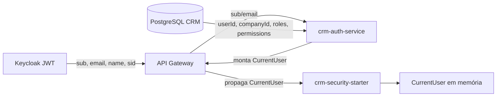

# CURRENT_USER — Modelo de Usuário Corrente

## Objetivo

Definir o modelo canônico `CurrentUser` — a representação do usuário autenticado que os serviços de negócio consomem — e como ele é materializado, propagado e validado na nova arquitetura, em que o **JWT é sempre emitido pelo Keycloak** e o **`CurrentUser` é resolvido pelo `crm-auth-service`**.

## Índice

- [1. Definição do Modelo](#1-definição-do-modelo)
- [2. Origem dos Campos](#2-origem-dos-campos)
- [3. Representação](#3-representação)
- [4. Propagação para os Serviços](#4-propagação-para-os-serviços)
- [5. Validação](#5-validação)
- [6. Compatibilidade com o Modelo Atual](#6-compatibilidade-com-o-modelo-atual)
- [Referências](#referências)
- [Histórico de Revisão](#histórico-de-revisão)

---

## 1. Definição do Modelo

O `CurrentUser` é um objeto imutável, **resolvido pelo `crm-auth-service`** a partir do JWT oficial do Keycloak e do banco CRM, e distribuído aos serviços pelo gateway. **Não é um token** — é um contexto de aplicação.

| Campo | Tipo | Origem | Obrigatório |
|---|---|---|---|
| `userId` | `UUID` | Banco CRM (`users.id`) | Sim |
| `email` | `String` | Keycloak → CRM | Sim |
| `companyId` | `UUID` | Banco CRM (`users.company_id`) | Sim |
| `tenantId` | `UUID` | Deriva de `companyId` (multi-tenancy) | Sim |
| `roles` | `List<String>` | Banco CRM (`user_roles` → `roles.name`) | Sim |
| `permissions` | `List<String>` | Banco CRM (`role_permissions` → `permissions.name`) | Sim |
| `keycloakSub` | `String` | Claim `sub` do Keycloak | Sim |
| `sessionId` | `String` | Sessão OIDC do Keycloak (`sid`) | Não |
| `provider` | `String` | `keycloak` (extensível a brokers) | Sim |
| `displayName` | `String` | Keycloak `name`/`given_name` + `family_name` | Não |

> **Nota:** o campo `userId` é o **UUID interno do CRM**, não o `sub` do Keycloak. O `sub` é preservado em `keycloakSub` (paridade com o `CrmPrincipal` atual).

> **Status Sprint 2 (fundação — 2026-07-31):** o `CurrentUser` está implementado como record imutável no `crm-auth-service` (`domain/identity/CurrentUser.java`) com esta mesma tabela de campos. Na implementação atual: `tenantId` deriva de `companyId` (default), `provider` default `keycloak`, listas `roles`/`permissions` defensivas (nunca `null`), `sessionId`/`displayName` opcionais. A representação JSON atual do serviço é **camelCase** (`userId`, `keycloakSub`, ...); o payload snake_case (`keycloak_sub`, ...) continua valendo como contrato de propagação via gateway/starter (sprint de integração).

---

## 2. Origem dos Campos



- **Identidade** (`keycloakSub`, `email`, `displayName`, `sessionId`): claims do JWT do Keycloak, espelhados no banco CRM (PROVISIONING.md).
- **Autorização** (`roles`, `permissions`, `companyId`, `tenantId`): **sempre** do banco CRM, resolvidos pelo auth-service no momento da resolução.
- **Sessão** (`sessionId`): claim `sid` da sessão OIDC do Keycloak.

---

## 3. Representação

O `CurrentUser` é distribuído como payload (JSON), **sem claims de aplicação em um token novo**:

```json
{
  "sub": "5f0e1c2a-3b4d-4e5f-8a9b-0c1d2e3f4a5b",
  "keycloak_sub": "78490eac-150e-44db-b2c4-d7999c1c3801",
  "session_id": "9e8d7c6b-5a4f-4e3d-2c1b-0a9f8e7d6c5b",
  "email": "ghilherme007@gmail.com",
  "company_id": "c0ffee00-0000-0000-0000-000000000001",
  "tenant_id": "c0ffee00-0000-0000-0000-000000000001",
  "roles": ["ADMIN"],
  "permissions": ["user:read", "user:write", "dashboard:view"],
  "provider": "keycloak",
  "display_name": "Ghilherme Pereira"
}
```

Convenções:

- `sub` = `userId` do CRM.
- Roles/permissions em **snake_case** no payload, convertidos para a convenção Java (`ROLE_*`/perm) pelo starter.
- Opcionalmente, o Keycloak pode incluir roles do CRM no JWT via **client role mapper** (para validação autoritativa de roles nos serviços) — ver AUTHORIZATION.md. Isso **não** é um novo emissor; é enriquecimento de claims no JWT do próprio Keycloak.

---

## 4. Propagação para os Serviços

O gateway valida o JWT do Keycloak, resolve o `CurrentUser` no auth-service e o propaga aos microsserviços via **header assinado/contexto de correlação** (ex.: `X-Current-User-*` ou payload assinado). O starter `crm-security-spring-boot-starter` disponibiliza o `CurrentUser` por três mecanismos:

| Mecanismo | Uso |
|---|---|
| `@AuthenticationPrincipal CurrentUser` | Em controllers Spring MVC |
| `@CurrentUser CurrentUser user` | Argument resolver dedicado (autorresolver) |
| `SecurityUtils.currentUser()` | Acesso estático em qualquer camada |

- O **gateway** é o único ponto que consulta o auth-service para obter o `CurrentUser`.
- Os serviços confiam no contexto propagado pelo gateway e validam a assinatura/issuer do JWT do Keycloak (estateless).
- A propagação via header é o **padrão final** nesta arquitetura (não há claims de aplicação em token próprio).

---

## 5. Validação

- **JWT**: assinatura validada via JWKS **do Keycloak** — sem chamada por request (stateless).
- `iss`: issuer do realm do Keycloak (ex.: `https://auth.crm.local/realms/CRM`).
- `aud`: deve conter o serviço consumidor (client role).
- `exp`/`nbf`: janela padrão.
- **Contexto propagado**: o gateway é a autoridade do `CurrentUser`; serviços podem validar o payload assinado (HMAC/chave compartilhada) quando o header for assinado.
- **Checagem de status do usuário**: na resolução do `CurrentUser`, usuários `INACTIVE`/`LOCKED` recebem erro/401 (cache invalidado por evento).

---

## 6. Compatibilidade com o Modelo Atual

| Modelo atual | Modelo alvo | Mapeamento |
|---|---|---|
| `CrmPrincipal(userId, companyId, roles, permissions, keycloakSub)` | `CurrentUser` | Campos 1:1; novos campos: `tenantId`, `sessionId`, `provider`, `email`, `displayName` |
| `CrmPrincipal.fromKeycloak(...)` | `CurrentUserMapper.fromContext(...)` | Construtor pelo starter |
| `CrmPrincipal.fromLegacy(...)` | removido (legacy eliminado) | — |
| `@AuthenticationPrincipal CrmPrincipal` | `@AuthenticationPrincipal CurrentUser` | Assinatura dos controllers |

A migração mantém o nome de método `getUserId()`/`getCompanyId()` idêntico, reduzindo o impacto nos controllers existentes.

## Referências

| Documento | Relação |
|---|---|
| [OVERVIEW.md](./OVERVIEW.md) | Arquitetura e componentes |
| [AUTH_FLOWS.md](./AUTH_FLOWS.md) | Fluxo de login e resolução do CurrentUser |
| [AUTHORIZATION.md](./AUTHORIZATION.md) | Roles/permissions e claims |
| [AUTH_SERVICE_API.md](./AUTH_SERVICE_API.md) | Endpoints de resolução do CurrentUser |
| [MIGRATION_PLAN.md](./MIGRATION_PLAN.md) | Substituição do CrmPrincipal por CurrentUser |

## Histórico de Revisão

| Versão | Data | Autor | Descrição |
|---|---|---|---|
| 1.0.0 | 2026-07-31 | Architect | Sprint 0 — modelo CurrentUser e propagação |
| 1.1.0 | 2026-07-31 | Architect | Ajuste: CurrentUser resolvido pelo auth-service e distribuído pelo gateway; sem claims em token próprio |
| 1.2.0 | 2026-07-31 | Architect | Sprint 2 — CurrentUser implementado no crm-auth-service (record imutável, tenantId=companyId, provider=keycloak, listas defensivas); JSON atual camelCase |
