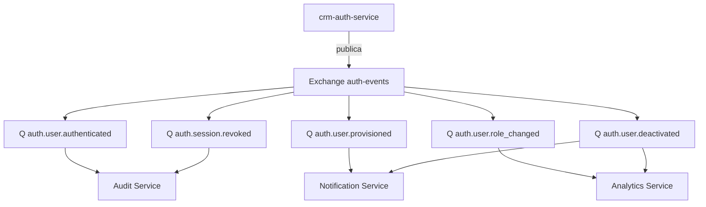

# EVENTS — Eventos e Integrações Futuras

## Objetivo

Definir os eventos publicados pelo `crm-auth-service`, seus consumidores e as integrações de autenticação planejadas para o futuro.

## Índice

- [1. Topologia de Mensageria](#1-topologia-de-mensageria)
- [2. Eventos do Auth Service](#2-eventos-do-auth-service)
- [3. Consumidores](#3-consumidores)
- [4. Contratos (Payloads)](#4-contratos-payloads)
- [5. Compatibilidade com o Mapa de Eventos Atual](#5-compatibilidade-com-o-mapa-de-eventos-atual)
- [6. Integrações Futuras](#6-integrações-futuras)
- [Referências](#referências)
- [Histórico de Revisão](#histórico-de-revisão)

---

## 1. Topologia de Mensageria



Regras (alinhadas a [EVENT_MAP.md](../EVENT_MAP.md)):

- Eventos são publicados com `eventId` (UUID) para idempotência e `occurredAt`.
- Routing key `<domain>.<entity>.<action>`.
- Consumidores processam de forma assíncrona; falhas vão para DLQ.
- O `EventPublisher` atual (in-process) é substituído por um produtor RabbitMQ no auth-service.

---

## 2. Eventos do Auth Service

| Evento | Routing key | Quando publica | Campos principais |
|---|---|---|---|
| `UserAuthenticated` | `auth.user.authenticated` | Login autenticado no Keycloak / resolução do `CurrentUser` | `userId`, `companyId`, `email`, `sessionId`, `provider`, `ipAddress`, `userAgent`, `occurredAt` |
| `UserProvisioned` | `auth.user.provisioned` | Primeiro login de usuário novo | `userId`, `companyId`, `email`, `keycloakSub`, `assignedRole`, `occurredAt` |
| `SessionRevoked` | `auth.session.revoked` | Logout / revogação de sessão | `userId`, `sessionId`, `reason`, `occurredAt` |
| `UserRoleChanged` | `auth.user.role_changed` | Role atribuída/removida | `userId`, `companyId`, `role`, `action`, `occurredAt` |
| `UserDeactivated` | `auth.user.deactivated` | Usuário desativado/desprovido | `userId`, `companyId`, `reason`, `occurredAt` |

> **Nota:** não há evento `auth.token.refreshed` — a renovação de tokens acontece exclusivamente no Keycloak (SSO) e não gera evento do auth-service.

---

## 3. Consumidores

| Consumidor | Eventos | Ação esperada |
|---|---|---|
| Audit | `authenticated`, `session.revoked`, `role_changed`, `deactivated` | Gravar `audit_logs` (substitui o `AuditEventListener` in-process atual) |
| Notification | `provisioned`, `deactivated` | E-mail de boas-vindas / aviso de desativação |
| Analytics | `authenticated`, `role_changed` | Métricas de login, ativação, LTV |
| Billing (futuro) | `provisioned`, `deactivated` | Criação/remoção de assentos |
| Cache (futuro) | `role_changed`, `deactivated` | Invalidação de cache de permissões |

---

## 4. Contratos (Payloads)

### `auth.user.provisioned`

```json
{
  "eventId": "3f2e1d0c-9b8a-4a6f-8d2e-1c0b9a8f7e6d",
  "type": "auth.user.provisioned",
  "occurredAt": "2026-07-31T10:00:00.000Z",
  "payload": {
    "userId": "5f0e1c2a-3b4d-4e5f-8a9b-0c1d2e3f4a5b",
    "companyId": "c0ffee00-0000-0000-0000-000000000001",
    "email": "ghilherme007@gmail.com",
    "keycloakSub": "78490eac-150e-44db-b2c4-d7999c1c3801",
    "assignedRole": "AGENT",
    "provider": "keycloak"
  }
}
```

### `auth.session.revoked`

```json
{
  "eventId": "7c6b5a49-8f7e-4d3c-2b1a-0f9e8d7c6b5a",
  "type": "auth.session.revoked",
  "occurredAt": "2026-07-31T10:05:00.000Z",
  "payload": {
    "userId": "5f0e1c2a-3b4d-4e5f-8a9b-0c1d2e3f4a5b",
    "sessionId": "9e8d7c6b-5a4f-4e3d-2c1b-0a9f8e7d6c5b",
    "reason": "logout"
  }
}
```

---

## 5. Compatibilidade com o Mapa de Eventos Atual

| Evento atual (Identity) | Evento alvo | Diferença |
|---|---|---|
| `UserCreated` (`identity.user.registered`) | `UserProvisioned` (`auth.user.provisioned`) | Alvo cobre também auto-provisionamento via Keycloak |
| `UserAuthenticated` (`identity.user.authenticated`) | `UserAuthenticated` (`auth.user.authenticated`) | Publicado pelo auth-service (não mais pelo backend) |
| `UserDeactivated` | `UserDeactivated` (`auth.user.deactivated`) | Mesmo formato |
| `UserRoleChanged` | `UserRoleChanged` (`auth.user.role_changed`) | Mesmo formato |
| `TokenRefreshed` | — | Removido (renovação é exclusiva do Keycloak) |

Os nomes/routing keys são preservados onde possível para não quebrar consumidores existentes (auditoria).

---

## 6. Integrações Futuras

| Integração | Descrição | Sprint estimada |
|---|---|---|
| **Login social / brokers** | Google, Microsoft como IdP broker no Keycloak; `provider` no `CurrentUser` e eventos | Pós-Sprint 6 |
| **MFA/TOTP** | Habilitado no Keycloak; aplicação apenas registra `provider`/método | Pós-Sprint 6 |
| **Federation SAML/LDAP** | Enterprise SSO via Keycloak | Roadmap v2 |
| **Webhooks de segurança** | Notificações de login suspeito, mudança de senha | Pós-Sprint 6 |
| **Conciliação periódica** | Job de reconciliação Keycloak ↔ CRM (PROVISIONING.md §7) | Sprint 6 |
| **Service tokens** | Emissão de tokens de serviço para integrações B2B | Futuro |

## Referências

| Documento | Relação |
|---|---|
| [PROVISIONING.md](./PROVISIONING.md) | Eventos de provisionamento |
| [AUTHORIZATION.md](./AUTHORIZATION.md) | Evento `role_changed` |
| [EVENT_MAP.md](../EVENT_MAP.md) | Mapa de eventos atual |
| [QUEUE_ARCHITECTURE.md](../QUEUE_ARCHITECTURE.md) | Topologia RabbitMQ |
| [07-roadmap/v2.md](../07-roadmap/v2.md) | SSO/SAML enterprise |

## Histórico de Revisão

| Versão | Data | Autor | Descrição |
|---|---|---|---|
| 1.0.0 | 2026-07-31 | Architect | Sprint 0 — eventos do auth-service e integrações futuras |
| 1.1.0 | 2026-07-31 | Architect | Ajuste: removido `auth.token.refreshed` (renovação exclusiva do Keycloak); eventos de autenticação alinhados à resolução do CurrentUser |
