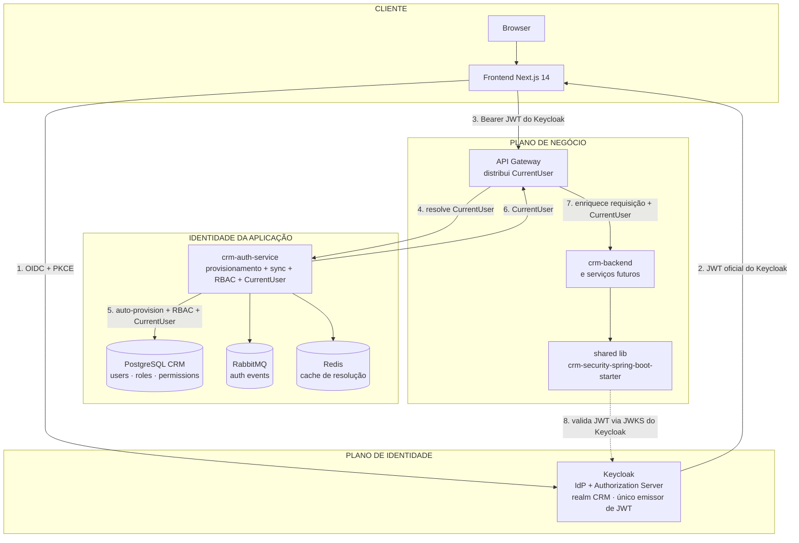
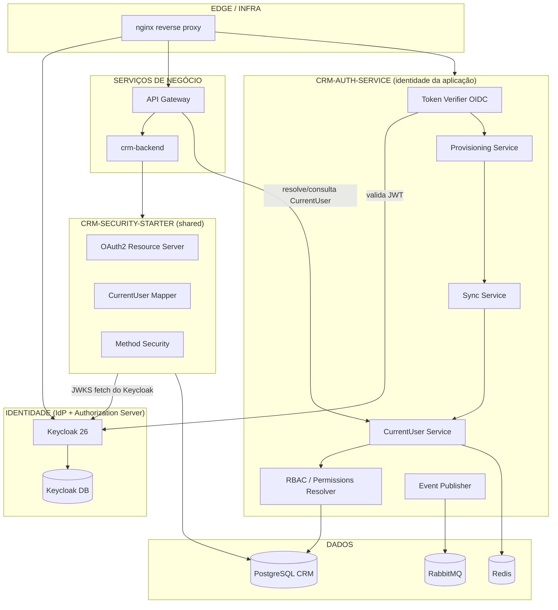

# OVERVIEW — Visão Geral da Nova Arquitetura de Autenticação

## Objetivo

Descrever a arquitetura alvo de autenticação do CRM, na qual o **Keycloak é o Identity Provider e o Authorization Server exclusivo** (único emissor de JWT) e o **`crm-auth-service`** atua como a **camada de identidade da aplicação** (provisionamento, sincronização, resolução de usuário/empresa/RBAC e `CurrentUser`), permitindo que os demais serviços reduzam o acoplamento direto com o Keycloak — sem que um novo emissor de tokens seja introduzido.

## Índice

- [1. Visão de Alto Nível](#1-visão-de-alto-nível)
- [2. Diagrama de Componentes](#2-diagrama-de-componentes)
- [3. Responsabilidades de Cada Componente](#3-responsabilidades-de-cada-componente)
- [4. Fluxos de Dados e Tokens](#4-fluxos-de-dados-e-tokens)
- [5. Arquitetura Atual vs Alvo](#5-arquitetura-atual-vs-alvo)
- [6. Não-Objetivos](#6-não-objetivos)
- [Referências](#referências)
- [Histórico de Revisão](#histórico-de-revisão)

---

## 1. Visão de Alto Nível

A nova arquitetura separa **identidade** de **autorização da aplicação** em três planos:

1. **Plano de Identidade (IdP + Authorization Server):** o Keycloak é o único responsável por *autenticar* o usuário (credenciais, SSO, MFA) e por *emitir o JWT oficial* consumido por toda a aplicação (OIDC + PKCE).
2. **Plano de Identidade da Aplicação (Auth Service):** o `crm-auth-service` é a camada que traduz o JWT do Keycloak para o contexto interno do CRM. Ele provisiona/víncula o usuário, sincroniza dados, resolve usuário interno, empresa/tenant e RBAC e gera o `CurrentUser`. **Não emite tokens e não possui JWKS próprio.**
3. **Plano de Negócio:** os serviços de negócio **continuam validando o JWT do Keycloak** (via JWKS do Keycloak), consomem o `CurrentUser` distribuído pelo gateway e tomam decisões de autorização com base em RBAC. O acoplamento direto com o Keycloak é reduzido ao longo da migração, mas não substituído por um novo emissor.

---

## 2. Diagrama de Componentes

---

## 3. Responsabilidades de Cada Componente

### Keycloak (Identity Provider + Authorization Server exclusivo)

| Responsabilidade | Detalhes |
|---|---|
| Autenticar usuário | Login (usuário/senha), SSO, sessão SSO |
| Emitir JWT oficial | OIDC Authorization Code + PKCE; **único emissor** de tokens da aplicação |
| JWKS público | Expõe `/.well-known/jwks.json` para os serviços validarem o JWT |
| Métodos futuros | MFA/TOTP, social brokers (Google/Microsoft), federation SAML/LDAP |
| **Não faz** | Não resolve RBAC/perfil do CRM; não expõe dados de negócio |

### crm-auth-service (identidade da aplicação)

| Responsabilidade | Detalhes |
|---|---|
| Validação do JWT | Recebe e valida o JWT oficial do Keycloak (OIDC client público, PKCE) |
| Provisionamento | Cria/vincula o usuário CRM no primeiro login (ver PROVISIONING.md) |
| Sincronização | Mantém dados Keycloak ↔ CRM atualizados (email, nome, status) |
| Resolução de usuário/empresa | Mapeia `sub`/`email` → usuário interno CRM e empresa/tenant |
| Resolução RBAC | Carrega roles/permissões do banco CRM e monta o `CurrentUser` |
| `CurrentUser` | Gera e distribui o `CurrentUser` (ver CURRENT_USER.md) |
| Auditoria | Registra logins, falhas e eventos de autenticação (ver EVENTS.md) |
| **Não faz** | **Não emite Access/Refresh tokens; não possui JWKS próprio; não é Authorization Server** |

### crm-security-spring-boot-starter (biblioteca compartilhada)

| Responsabilidade | Detalhes |
|---|---|
| Validação de tokens | Configura OAuth2 Resource Server apontando para a JWKS **do Keycloak** |
| Mapeamento `CurrentUser` | Converte claims do JWT + contexto recebido em `CurrentUser` (ver CURRENT_USER.md) |
| Autorização | Disponibiliza `@RequiresPermission` e `SecurityUtils.currentUser()` |
| Consumo do CurrentUser | Lê o `CurrentUser` distribuído pelo gateway (header/contexto) |
| Interoperabilidade | Durante a migração, aceita tokens Keycloak e contexto interno (flag) — removido no fim |

### API Gateway

| Responsabilidade | Detalhes |
|---|---|
| Receber o JWT | Valida o JWT do Keycloak e repassa a requisição autenticada |
| Resolver `CurrentUser` | Consulta o `crm-auth-service` e enriquece a requisição com o `CurrentUser` |
| Distribuir contexto | Propaga `CurrentUser` aos microsserviços (header/correlação) |
| Roteamento | Roteia `/auth/*` para o auth-service e `/api/*` para os serviços |

### Serviços de negócio (crm-backend e futuros)

| Responsabilidade | Detalhes |
|---|---|
| Receber o JWT | Via `Authorization: Bearer` (JWT do Keycloak) |
| Resolver `CurrentUser` | Via starter + contexto do gateway; autorização por `permissions`/`roles` |
| Operar o domínio | CRUDs e regras de negócio (contatos, pipeline, campanhas etc.) |
| **Não faz** | Não emite tokens; não fala diretamente com o Keycloak (ao final da migração) |

### Frontend (Next.js)

| Responsabilidade | Detalhes |
|---|---|
| Iniciar login | Redireciona para o Keycloak via OIDC + PKCE (client público) |
| Receber JWT | Recebe o JWT oficial do Keycloak no callback |
| Armazenar JWT | TokenManager (em memória/localStorage) ou cookie httpOnly (fase de hardening) |
| Renovar sessão | Renova via refresh token/SSO do Keycloak |
| Logout | Encerra a sessão no Keycloak (endpoint de logout OIDC) |
| **Não faz** | Não recebe tokens do auth-service; não emite tokens próprios |

### Infraestrutura

| Componente | Papel |
|---|---|
| nginx | Reverse proxy, roteamento `auth.` e `api.` |
| PostgreSQL | Dados CRM (users, roles, permissions) |
| Redis | Cache de resolução de `CurrentUser` e sessões |
| RabbitMQ | Eventos de autenticação |

---

## 4. Fluxos de Dados e Tokens

### Tokens

| Token | Emitido por | Algoritmo | Vida útil | Consumido por |
|---|---|---|---|---|
| Access Token (JWT oficial) | **Keycloak** (único emissor) | RS256 | 5 min (configurável) | Todos os serviços |
| Refresh Token (OIDC) | **Keycloak** | Opaque / JWE | 7 dias (configurável) | Frontend ↔ Keycloak (renovação) |
| ID Token | **Keycloak** | RS256 | curta | Frontend / auth-service (claims de identidade) |

Não existem tokens emitidos pelo `crm-auth-service`.

### Propagação do `CurrentUser`

1. Keycloak autentica e emite o JWT oficial (OIDC + PKCE).
2. Gateway recebe o JWT e consulta o `crm-auth-service` para obter/resolver o `CurrentUser`.
3. Auth-service provisiona/sincroniza o usuário, resolve empresa e RBAC e retorna o `CurrentUser`.
4. Gateway enriquece a requisição e propaga o `CurrentUser` aos microsserviços.
5. Serviços validam a assinatura/issuer do JWT via JWKS do Keycloak e consomem o `CurrentUser` para autorização (via starter).

---

## 5. Arquitetura Atual vs Alvo

| Aspecto | Atual | Alvo |
|---|---|---|
| Provedor de identidade | Keycloak + JWT próprio (coexistência) | Keycloak exclusivo (IdP + Authorization Server) |
| Quem emite token da aplicação | Backend (`JwtTokenProvider`, HS256) + Keycloak (RS256) | **Somente Keycloak** (RS256) |
| Identidade de aplicação | Backend (resource server + converter) | `crm-auth-service` (provisionamento + sync + RBAC + CurrentUser) |
| Vínculo de usuário | `keycloak_sub` vinculado apenas se usuário existir | Provisionamento automático no primeiro login |
| RBAC | Converter lê banco a cada request (acoplado ao resource server) | Auth-service resolve → `CurrentUser` distribuído pelo gateway |
| Validação nos serviços | JWKS do Keycloak | JWKS do Keycloak (mantido) |
| Módulos envolvidos | `infrastructure/security`, `application/identity`, `presentation/rest/identity` | Novo serviço + shared starter |
| Usuário inexistente | `GET /auth/me` → 500 (`InvalidDataAccessApiUsageException`) | Provisionado automaticamente → 200 |

---

## 6. Não-Objetivos

Esta arquitetura **não** define, nesta sprint:

- a extração completa de todos os microserviços de negócio (apenas o `crm-auth-service` é novo);
- a migração do banco de dados de identidade (schema atual permanece);
- políticas de MFA, federation externa ou login social (registradas como evolução em EVENTS.md);
- alteração do modelo de multi-tenancy atual (`companyId`/`tenantId` permanecem);
- **um novo emissor de tokens ou JWKS próprio** para o `crm-auth-service`.

## Referências

| Documento | Relação |
|---|---|
| [README.md](./README.md) | Índice da seção |
| [AUTH_FLOWS.md](./AUTH_FLOWS.md) | Fluxos detalhados |
| [PROVISIONING.md](./PROVISIONING.md) | Provisionamento e sincronização |
| [CURRENT_USER.md](./CURRENT_USER.md) | Modelo CurrentUser |
| [AUTHORIZATION.md](./AUTHORIZATION.md) | RBAC |
| [04-integrations/KEYCLOAK_INTEGRATION.md](../04-integrations/KEYCLOAK_INTEGRATION.md) | Estado atual da integração |
| [01-backend/Auth.md](../01-backend/Auth.md) | Autenticação atual do backend |

## Histórico de Revisão

| Versão | Data | Autor | Descrição |
|---|---|---|---|
| 1.0.0 | 2026-07-31 | Architect | Sprint 0 — visão geral da arquitetura alvo de autenticação |
| 1.1.0 | 2026-07-31 | Architect | Ajuste: Keycloak como único Authorization Server/emissor de JWT; auth-service sem emissão de tokens nem JWKS próprio |
