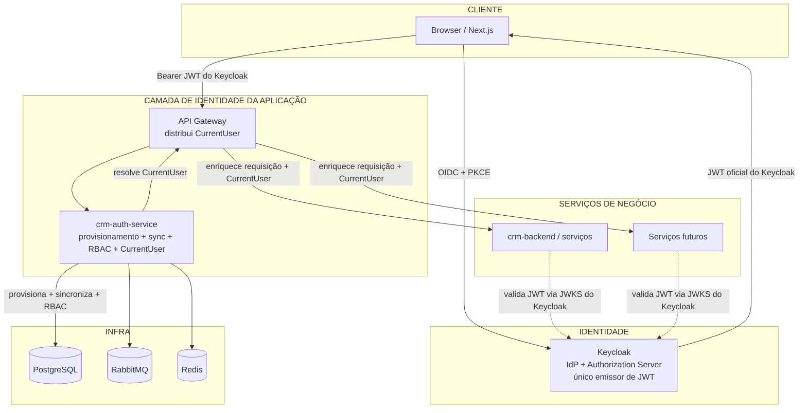

# 08-Auth-Refactor — Refatoração de Autenticação

## Objetivo

Documentar a nova arquitetura de autenticação do CRM, na qual:

- **Keycloak é o Identity Provider (IdP) e o Authorization Server exclusivo**, único emissor dos JWTs oficiais (OIDC + PKCE);
- um novo serviço **`crm-auth-service`** atua como a **camada de identidade da aplicação**: provisionamento automático, sincronização de dados, resolução do usuário interno, de empresa/tenant e de RBAC, auditoria de login e gerenciamento do `CurrentUser`;
- os demais microsserviços **continuam validando o JWT emitido pelo Keycloak**; o acoplamento direto com Keycloak é **reduzido** ao longo da migração, mas **não substituído por um novo emissor de tokens**.

O `crm-auth-service` **não** emite tokens, **não** mantém JWKS próprio e **não** substitui o Keycloak.

Esta seção é o produto da **Sprint 0** — fase de documentação. Nenhum código foi alterado.

## Índice

| Documento | Cobre |
|---|---|
| [OVERVIEW.md](./OVERVIEW.md) | Visão geral da arquitetura, responsabilidades de cada componente, diagrama de componentes |
| [AUTH_FLOWS.md](./AUTH_FLOWS.md) | Fluxo de autenticação, refresh, logout e primeiro login (diagramas de sequência) |
| [PROVISIONING.md](./PROVISIONING.md) | Provisionamento automático de usuários e sincronização Keycloak ↔ CRM |
| [CURRENT_USER.md](./CURRENT_USER.md) | Modelo `CurrentUser` e propagação para os serviços |
| [AUTHORIZATION.md](./AUTHORIZATION.md) | Estratégia de autorização RBAC |
| [AUTH_SERVICE_API.md](./AUTH_SERVICE_API.md) | APIs públicas e internas do `crm-auth-service` |
| [EVENTS.md](./EVENTS.md) | Eventos publicados e integrações futuras |
| [MIGRATION_PLAN.md](./MIGRATION_PLAN.md) | Plano de migração por sprints, rollback, critérios de aceite, riscos e impactos |

## Resumo Executivo

- **Keycloak** autentica o usuário (OIDC + PKCE) e é o **único emissor** do JWT oficial consumido por toda a aplicação.
- **`crm-auth-service`** recebe o JWT do Keycloak e, sem emitir tokens novos: provisiona/vincula o usuário, sincroniza dados, resolve usuário interno, empresa/tenant, RBAC e gera o **`CurrentUser`**.
- **Gateway** enriquece as requisições com o `CurrentUser` e as repassa aos microsserviços, que **continuam validando o JWT do Keycloak** (assinatura/issuer via JWKS) e consomem o `CurrentUser` para autorização.
- A **fonte de verdade de identidade e autorização** (emissão de JWT) é o Keycloak; a **fonte de verdade de RBAC e perfil CRM** é o banco do CRM, resolvida pelo auth-service.

## Arquitetura Atual vs Alvo

| Aspecto | Hoje (coexistência) | Alvo (pós-refactor) |
|---|---|---|
| Emissor de tokens | Backend (JWT HS256 próprio) + Keycloak (RS256) | **Somente Keycloak** (IdP + Authorization Server) |
| JWT da aplicação | Keycloak RS256 / app HS256 | JWT oficial do Keycloak (OIDC + PKCE) |
| Acoplamento a Keycloak | Direto no backend (resource server + `KeycloakJwtAuthenticationConverter`) | Reduzido: identidade de aplicação via `crm-auth-service` (sem novo emissor) |
| Vínculo usuário | `keycloak_sub` vinculado apenas se usuário já existir | Provisionamento automático no primeiro login |
| RBAC | Roles do JWT Keycloak + permissões do banco CRM (converter) | Resolvido pelo auth-service → `CurrentUser` distribuído pelo gateway |
| Validação nos serviços | JWKS do Keycloak | JWKS do Keycloak (mantido) |
| Frontend | `keycloak-js` + TokenManager dual | OIDC + PKCE direto com Keycloak (client público) |
| Usuário não existente | `GET /auth/me` → 500 | Provisionado automaticamente → 200 |

## Mapa desta seção x Requisitos da Sprint 0

| # | Requisito | Documento |
|---|---|---|
| 1 | Visão geral da arquitetura | OVERVIEW.md |
| 2 | Responsabilidades de cada componente | OVERVIEW.md |
| 3 | Fluxo de autenticação | AUTH_FLOWS.md |
| 4 | Fluxo do primeiro login | AUTH_FLOWS.md |
| 5 | Provisionamento automático de usuários | PROVISIONING.md |
| 6 | Sincronização de dados entre Keycloak e CRM | PROVISIONING.md |
| 7 | Modelo `CurrentUser` | CURRENT_USER.md |
| 8 | Estratégia de autorização (RBAC) | AUTHORIZATION.md |
| 9 | APIs públicas do Auth Service | AUTH_SERVICE_API.md |
| 10 | Eventos e integrações futuras | EVENTS.md |
| 11 | Diagramas de sequência e componentes | OVERVIEW.md, AUTH_FLOWS.md |
| 12 | Plano completo de migração por sprints | MIGRATION_PLAN.md |
| 13 | Estratégia de rollback | MIGRATION_PLAN.md |
| 14 | Critérios de aceite de cada sprint | MIGRATION_PLAN.md |
| 15 | Riscos e impactos | MIGRATION_PLAN.md |

## Referências

| Documento | Relação |
|---|---|
| [04-integrations/KEYCLOAK_INTEGRATION.md](../04-integrations/KEYCLOAK_INTEGRATION.md) | Estado atual da integração Keycloak (coexistência) — ponto de partida |
| [SECURITY_MAP.md](../SECURITY_MAP.md) | Segurança atual da aplicação |
| [01-backend/Auth.md](../01-backend/Auth.md) | Módulo de autenticação atual do backend |
| [ARCHITECTURE_DECISIONS.md](../ARCHITECTURE_DECISIONS.md) | ADRs atuais (ADR-007 JWT, ADR-012 RBAC placeholder) |
| [EVENT_MAP.md](../EVENT_MAP.md) | Mapa de eventos vigente |

## Histórico de Revisão

| Versão | Data | Autor | Descrição |
|---|---|---|---|
| 1.0.0 | 2026-07-31 | Architect | Sprint 0 — documentação da nova arquitetura de autenticação |
| 1.1.0 | 2026-07-31 | Architect | Ajuste: Keycloak como único Authorization Server/emissor de JWT; crm-auth-service como camada de identidade (sem emissão de tokens) |
