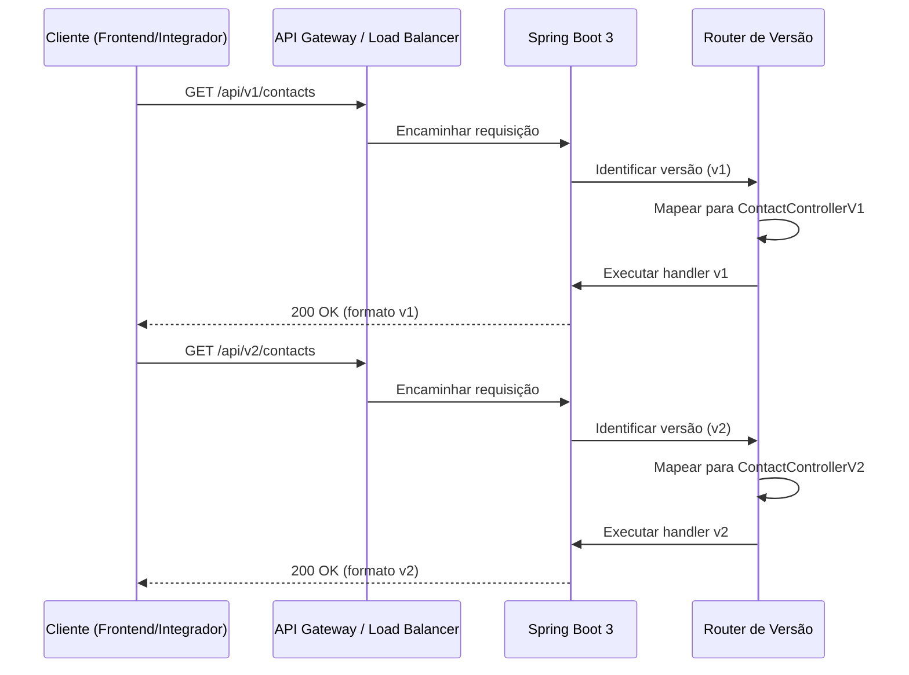
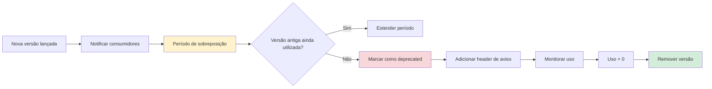
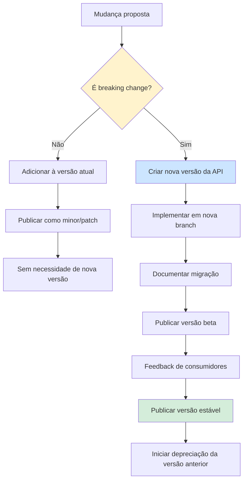
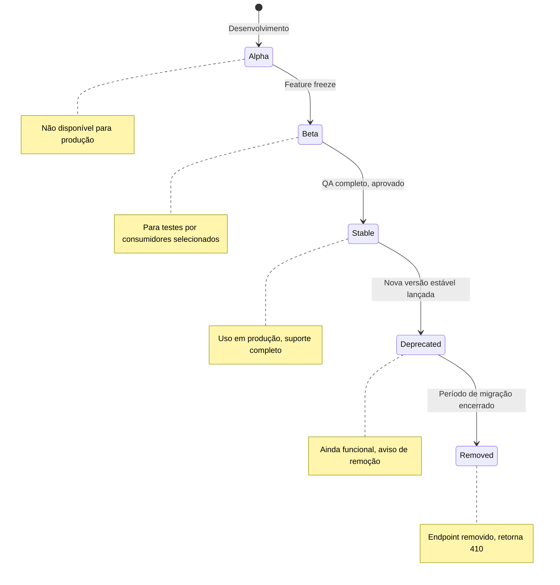

# Versionamento de API

## Objetivo

Definir a estratégia de versionamento da API REST do CRM SaaS Omnichannel, garantindo evolução compatível, comunicação clara com consumidores e transição segura entre versões. O versionamento deve permitir introduzir mudanças sem quebrar clientes existentes, mantendo ao mesmo tempo capacidade de inovação contínua.

## Escopo

- Versionamento via URL (`/api/v1/`, `/api/v2/`)
- Política de depreciação de versões anteriores
- Definição de breaking changes vs. non-breaking changes
- Ciclo de vida de cada versão da API
- Guia de migração entre versões
- Documentação OpenAPI (Swagger) por versão
- Versionamento de contratos com o frontend (Next.js 14)

## Responsabilidades

| Área | Responsabilidade |
|---|---|
| Backend (Spring Boot) | Implementar versionamento, manter versões, gerar OpenAPI |
| Arquitetura | Definir política de versionamento, aprovar breaking changes |
| Frontend (Next.js) | Consumir versão estável, planejar migração para novas versões |
| Documentação | Manter OpenAPI atualizada, escrever guias de migração |
| QA | Testar compatibilidade entre versões |

## Fluxos

### Fluxo de Versãoamento de Requisição



### Fluxo de Depreciação



### Fluxo de Breaking Change



### Ciclo de Vida da Versão



### Estrutura de URLs por Versão

```mermaid
flowchart TD
    A[Base URL] --> B[/api/v1/]
    A --> C[/api/v2/]
    A --> D[/api/v3/ - future]

    B --> B1[/contacts]
    B --> B2[/leads]
    B --> B3[/messages]
    B --> B4[/companies]

    C --> C1[/contacts]
    C --> C2[/leads]
    C --> C3[/messages]
    C --> C4[/companies]
    C --> C5[/search]

    style B fill:#d4edda
    style C fill:#cce5ff
    style D fill:#f8f9fa
```

## Dependências

| Dependência | Versão | Uso |
|---|---|---|
| Spring Boot | 3 | Framework REST com suporte a versionamento |
| SpringDoc OpenAPI | latest | Geração automática de documentação OpenAPI por versão |
| Next.js | 14 | Consumo da API versionada pelo frontend |
| Docker | 24 | Containerização de múltiplas versões |

## Boas Práticas

- **Versionamento na URL**: Utilizar `/api/v{n}/` para clareza e simplicidade de consumo
- **No breaking changes em versão estável**: Nunca alterar o contrato de uma versão estável sem criar nova versão
- **Header de deprecation**: Adicionar header `Deprecation: true` e `Sunset: {data}` quando uma versão estiver deprecated
- **Suporte mínimo**: Manter no máximo 2 versões ativas simultaneamente (estável + deprecated)
- **Período de migração**: Mínimo de 6 meses entre lançamento de nova versão e remoção da anterior
- **Changelog por versão**: Manter CHANGELOG.md com todas as mudanças de cada versão
- **OpenAPI por versão**: Gerar especificação OpenAPI independente para cada versão
- **Testes de compatibilidade**: Manter suite de testes para todas as versões ativas
- **Versão mínima do frontend**: Documentar qual versão da API cada versão do frontend consome

## Referências

- [Microsoft REST API Guidelines - Versioning](https://github.com/microsoft/api-guidelines/blob/vNext/azure/Guidelines.md#versioning)
- [Stripe API Versioning](https://stripe.com/blog/api-versioning)
- [OpenAPI Specification 3.1](https://spec.openapis.org/oas/v3.1.0)
- [RFC 8594 - Sunset Header Field](https://www.rfc-editor.org/rfc/rfc8594)

## Histórico de Revisão

| Data | Versão | Autor | Descrição |
|---|---|---|---|
| 15/07/2026 | 1.0 | Equipe de Arquitetura | Versão inicial da documentação de versionamento de API |
