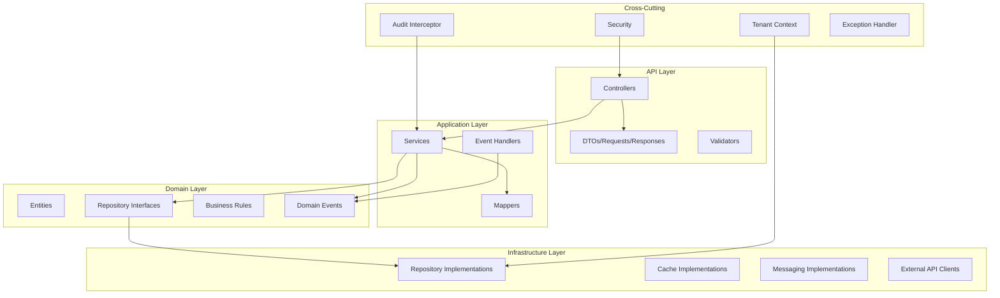

# BACKEND_MAP — Mapa do Backend

## Objetivo

Fornecer uma visão consolidada do backend Spring Boot com camadas, pacotes, serviços, eventos e configurações.

## Índice

- [Arquitetura em Camadas](#arquitetura-em-camadas)
- [Pacotes](#pacotes)
- [Serviços por Módulo](#serviços-por-módulo)
- [Eventos](#eventos)
- [Configurações](#configurações)
- [Referências](#referências)
- [Histórico de Revisão](#histórico-de-revisão)

---

## Arquitetura em Camadas



**Fonte:** [01-backend/Overview.md](./01-backend/Overview.md), [00-core/Architecture.md](./00-core/Architecture.md)

---

## Pacotes

| Pacote | Descrição |
|---|---|
| `com.crm.config` | Configurações Spring (Beans, Properties) |
| `com.crm.security` | JWT, filtros, RBAC |
| `com.crm.tenant` | Multi-tenancy (TenantContext, Interceptor) |
| `com.crm.common` | Utilitários, exceptions base, constantes |
| `com.crm.identity` | Módulo de identidade |
| `com.crm.company` | Módulo de empresa |
| `com.crm.contact` | Módulo de contatos |
| `com.crm.lead` | Módulo de leads |
| `com.crm.pipeline` | Módulo de pipeline |
| `com.crm.communication` | Módulo de comunicação |
| `com.crm.campaign` | Módulo de campanhas |
| `com.crm.analytics` | Módulo de analytics |
| `com.crm.integration` | Integrações externas |

### Sub-pacotes (por módulo)

| Sub-pacote | Descrição |
|---|---|
| `.controller` | Controllers REST |
| `.dto` | DTOs (request, response) |
| `.service` | Lógica de negócio |
| `.repository` | Interfaces de repositório |
| `.entity` | Entidades JPA |
| `.mapper` | Mappers (MapStruct) |
| `.event` | Eventos de domínio |
| `.config` | Configurações do módulo |
| `.exception` | Exceções específicas |
| `.validator` | Validadores customizados |

**Fonte:** [00-core/FolderStructure.md](./00-core/FolderStructure.md)

---

## Implementação Vigente (Sprint 8)

O código real usa o pacote base **`com.becommerce.crm`** (camadas `presentation/rest`, `application/domain`, `infrastructure`), com o design em portas e adaptadores (Ports & Adapters) e padrão de entidades `create`/`reconstitute`. Destaques:

| Módulo | Características |
|---|---|
| **Company** | `CompanyService` (CRUD + quotas), `CompanyQuotaService` (`usage`, `assertCanAddContact`, `assertCanAddSpace`), `CompanyController` (`GET /api/v1/companies/{id}/usage`). Uses `CurrentUser` (`principal.userId()/companyId()/roles()`), `TenantContext`, RLS. |
| **Contact** (novo, mín.) | `Contact`, `ContactRepository`+impl, `ContactService` (enforcement `max_contacts`), `ContactController`, DTOs, `ContactNotFoundException`. Reusa tabela `contacts` (V015). |
| **Storage** (novo, mín.) | `StorageObject`, ports, `StorageJpaEntity`, `StorageRepositoryImpl`, `StorageService` (enforcement `max_storage_mb`), `StorageController`, DTOs. Tabela `storage_objects` (V037). |
| **Invitation** (8.5) | `InvitationService` (+ auditoria); enforcement `max_users` = activeMembers + PENDING convites. |
| **Membership** | `MembershipService` (remove membro + auditoria `DELETE`). |
| **Audit** | `TenantAuditRecorder` (ler `AuditContext`, fallback ator; seta/restaura tenant), `AuditModule` (+`MEMBERSHIPS`, +`INVITATIONS`). |
| **Me** | `MeService.switchCompany` (troca empresa ativa + auditoria `TENANTS UPDATE`). |
| **Identity** | `AuthService` (GUC `app.current_company_id` no primeiro acesso). |
| **Tenant infra** | `infrastructure.tenant.context.TenantContext` (ThreadLocal) + `infrastructure.tenant.datasource.TenantAwareDataSource` (SET/RESET dos GUCs). |

**Multi-tenancy real**: shared schema + RLS FORCE (policy por `company_id = app.current_tenant_id()`). Ver [MULTI_TENANCY.md](./MULTI_TENANCY.md) e [DATABASE_MAP.md](./DATABASE_MAP.md).

---

## Serviços por Módulo

### Identity

| Serviço | Responsabilidade |
|---|---|
| `AuthService` | Login, logout, tokens |
| `UserService` | CRUD usuários, convites |
| `RoleService` | Gestão de roles |
| `PermissionService` | Permissões RBAC |

### Company

| Serviço | Responsabilidade |
|---|---|
| `CompanyService` | CRUD empresas |
| `TenantService` | Gestão de schemas |
| `SettingsService` | Configurações |
| `BillingService` | Faturamento |

### Contact

| Serviço | Responsabilidade |
|---|---|
| `ContactService` | CRUD contatos |
| `TagService` | Gestão de tags |
| `SegmentService` | Segmentação |
| `ImportService` | Importação CSV |

### Lead

| Serviço | Responsabilidade |
|---|---|
| `LeadService` | CRUD leads |
| `LeadScoringService` | Scoring automático |
| `LeadConversionService` | Conversão lead→cliente |

### Pipeline

| Serviço | Responsabilidade |
|---|---|
| `PipelineService` | CRUD pipelines |
| `StageService` | CRUD estágios |
| `OpportunityService` | CRUD oportunidades |
| `KanbanService` | Lógica kanban |

### Communication

| Serviço | Responsabilidade |
|---|---|
| `ChatService` | Lógica de chat |
| `ConversationService` | CRUD conversas |
| `MessageService` | Envio/recebimento |

### Campaign

| Serviço | Responsabilidade |
|---|---|
| `CampaignService` | CRUD campanhas |
| `TemplateService` | CRUD templates |
| `AutomationService` | CRUD automações |
| `AutomationEngine` | Motor de automação |

### Analytics

| Serviço | Responsabilidade |
|---|---|
| `DashboardService` | KPIs e métricas |
| `ReportService` | Relatórios |

### Integration

| Serviço | Responsabilidade |
|---|---|
| `WhatsAppService` | Integração WhatsApp |
| `EmailService` | Envio de email |
| `OpenAIService` | Integração IA |
| `WebhookService` | Webhooks |
| `FileStorageService` | Upload de arquivos |

### Cross-Cutting

| Serviço | Responsabilidade |
|---|---|
| `NotificationService` | Notificações |
| `AuditService` | Log de auditoria |
| `CacheService` | Gestão de cache |
| `SchedulerService` | Tarefas agendadas |

---

## Eventos

### Producers

| Evento | Producer | Queue |
|---|---|---|
| `UserCreated` | UserService | `user.events` |
| `ContactCreated` | ContactService | `contact.events` |
| `LeadCreated` | LeadService | `lead.events` |
| `LeadScored` | LeadScoringService | `lead.events` |
| `OpportunityCreated` | OpportunityService | `pipeline.events` |
| `OpportunityMoved` | KanbanService | `pipeline.events` |
| `MessageSent` | MessageService | `message.events` |
| `MessageReceived` | MessageService | `message.events` |
| `CampaignStarted` | CampaignService | `campaign.events` |
| `CampaignCompleted` | CampaignService | `campaign.events` |

### Consumers

| Consumer | Evento | Ação |
|---|---|---|
| `CacheInvalidationHandler` | Todos | Invalidar cache |
| `AuditHandler` | Todos | Registrar auditoria |
| `NotificationHandler` | LeadCreated, MessageReceived | Criar notificação |
| `MetricsHandler` | OpportunityMoved, CampaignCompleted | Atualizar métricas |
| `AutomationTriggerHandler` | LeadCreated, ContactCreated | Disparar automações |

**Fonte:** [01-backend/Events.md](./01-backend/Events.md)

---

## Configurações

### application.yml

```yaml
server:
  port: 8080
  servlet:
    context-path: /api/v1

spring:
  datasource:
    url: jdbc:postgresql://localhost:5432/crm
    username: ${DB_USERNAME}
    password: ${DB_PASSWORD}
  jpa:
    hibernate:
      ddl-auto: validate
    properties:
      hibernate:
        dialect: org.hibernate.dialect.PostgreSQLDialect
        default_schema: ${TENANT_SCHEMA:public}
  flyway:
    enabled: true
    locations: classpath:db/migration
  redis:
    host: ${REDIS_HOST:localhost}
    port: ${REDIS_PORT:6379}
  rabbitmq:
    host: ${RABBITMQ_HOST:localhost}
    port: ${RABBITMQ_PORT:5672}
    username: ${RABBITMQ_USERNAME:guest}
    password: ${RABBITMQ_PASSWORD:guest}

  security:
    oauth2:
      resourceserver:
        jwt:
          issuer-uri: ${KEYCLOAK_ISSUER_URI}
          jwk-set-uri: ${KEYCLOAK_JWKS_URI}

app:
  auth:
    identity-layer:
      enabled: ${AUTH_IDENTITY_LAYER_ENABLED:false}
      auth-service-url: ${AUTH_SERVICE_URL:}

integration:
  whatsapp:
    api-url: ${WHATSAPP_API_URL}
    api-key: ${WHATSAPP_API_KEY}
  email:
    host: ${EMAIL_HOST}
    port: ${EMAIL_PORT}
    username: ${EMAIL_USERNAME}
    password: ${EMAIL_PASSWORD}
  openai:
    api-key: ${OPENAI_API_KEY}

tenant:
  header: X-Tenant-ID
  resolver: header  # header ou jwt
```

**Fonte:** [01-backend/Overview.md](./01-backend/Overview.md)

---

## Referências

| Documento | Caminho |
|---|---|
| Overview | [01-backend/Overview.md](./01-backend/Overview.md) |
| Modules | [01-backend/Modules.md](./01-backend/Modules.md) |
| Auth | [01-backend/Auth.md](./01-backend/Auth.md) |
| Cache | [01-backend/Cache.md](./01-backend/Cache.md) |
| Events | [01-backend/Events.md](./01-backend/Events.md) |
| Scheduler | [01-backend/Scheduler.md](./01-backend/Scheduler.md) |
| Audit | [01-backend/Audit.md](./01-backend/Audit.md) |
| Architecture | [00-core/Architecture.md](./00-core/Architecture.md) |
| CodingStandards | [00-core/CodingStandards.md](./00-core/CodingStandards.md) |
| SUMMARY | [SUMMARY.md](./SUMMARY.md) |

---

## Histórico de Revisão

| Versão | Data | Autor | Descrição |
|---|---|---|---|
| 1.0.0 | 2026-07-15 | Architect | Criação inicial do mapa do backend |
| 1.1.0 | 2026-08-12 | Architect | Adicionada seção Implementação Vigente (company quotas, contact, storage, invitation, audit, tenant infra) |
