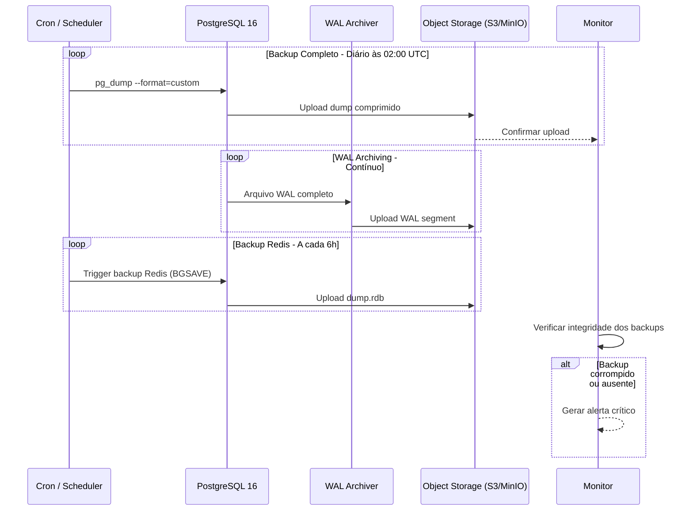
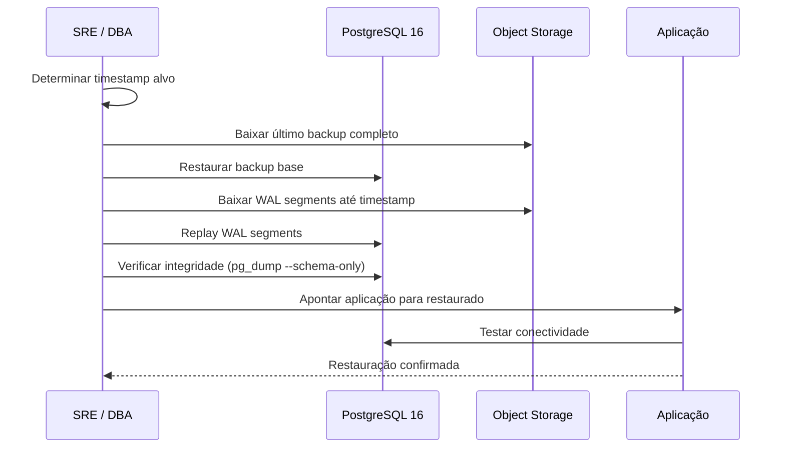
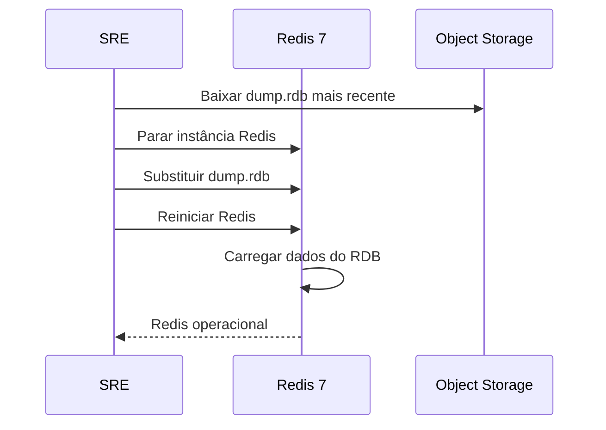
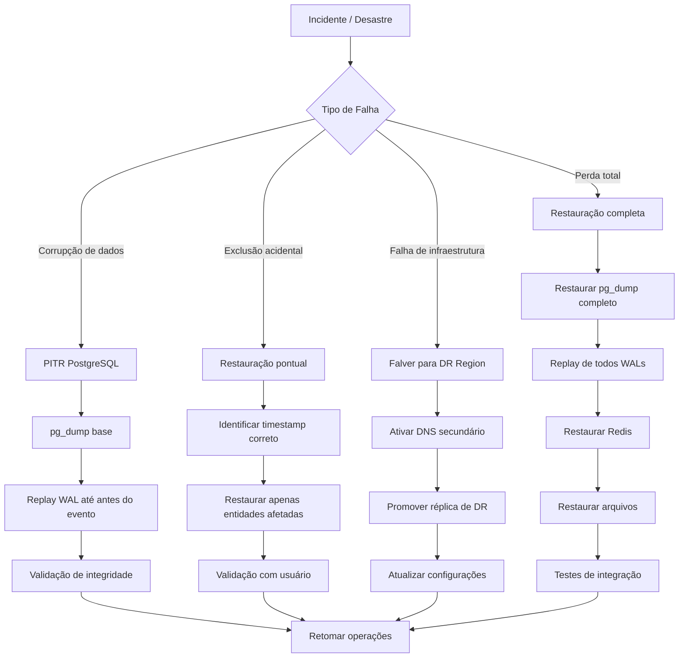

# Backup e Recuperação

## Objetivo

Definir a estratégia de backup e recuperação do CRM SaaS Omnichannel, garantindo a integridade e disponibilidade dos dados em cenários de falha, corrupção, exclusão acidental ou desastre. A estratégia deve atender a metas definidas de RPO (Recovery Point Objective) e RTO (Recovery Time Objective) para todos os componentes críticos do sistema.

## Escopo

- Backup e recuperação de PostgreSQL 16 (pg_dump + WAL archiving)
- Backup e recuperação de Redis 7 (RDB + AOF)
- Backup de arquivos armazenados (uploads de anexos, imagens)
- Backup de configurações e segredos (Docker, variáveis de ambiente)
- RPO e RTO definidos por tier de criticidade
- Procedimentos de restauração documentados
- Plano de recuperação de desastres (Disaster Recovery)
- Testes periódicos de backup e restauração

## Responsabilidades

| Área | Responsabilidade |
|---|---|
| SRE / Infraestrutura | Executar backups, monitorar integridade, testar restauração |
| DBA | Gerenciar pg_dump, WAL archiving, Point-in-Time Recovery |
| Desenvolvimento | Garantir que dados voláteis estejam em bancos persistentes |
| Segurança | Gerenciar criptografia de backups, acesso a segredos |
| Gestão | Aprovar RPO/RTO, financiar infraestrutura de DR |

## Fluxos

### Fluxo de Backup Automatizado (PostgreSQL)

### Fluxo de Restauração Point-in-Time (PITR)

### Fluxo de Restauração de Redis

### Plano de Recuperação de Desastres

## Dependências

| Dependência | Versão | Uso |
|---|---|---|
| PostgreSQL | 16 | pg_dump, WAL archiving, Point-in-Time Recovery |
| Redis | 7 | RDB snapshots, AOF para persistência |
| Docker | 24 | Containerização dos serviços de backup |
| Object Storage (S3/MinIO) | - | Armazenamento seguro e durável de backups |
| Flyway | 10 | Controle de versão do schema para restauração |
| pgBackRest | latest | Backup corporativo PostgreSQL (alternativa ao pg_dump) |

## Boas Práticas

- **RPO ≤ 1 hora**: Perda máxima aceitável de dados é 1 hora (WAL archiving contínuo)
- **RTO ≤ 4 horas**: Tempo máximo para restaurar o sistema ao operacional
- **Backup off-site**: Manter cópias em região/geografia diferente da produção
- **Criptografia**: Criptografar todos os backups em repouso (AES-256) e em trânsito (TLS)
- **Retenção de backups**: Manter backups diários por 30 dias, semanais por 90 dias, mensais por 1 ano
- **Testes mensais**: Realizar restauração simulada mensalmente em ambiente de staging
- **Documentação atualizada**: Manter procedimentos de restauração revisados e testados
- **Monitoramento de WAL**: Alertar quando o acúmulo de WAL exceder o threshold configurado
- **Segredos fora de backup**: Nunca incluir segredos em dumps; utilizar vault separado (HashiCorp Vault)
- **Backup de configurações**: Versionar infraestrutura como código (IaC) no repositório Git

## Referências

- [PostgreSQL Backup and Restore](https://www.postgresql.org/docs/16/backup-dump.html)
- [PostgreSQL WAL Archiving](https://www.postgresql.org/docs/16/runtime-config-wal.html)
- [Redis Persistence](https://redis.io/docs/management/persistence/)
- [pgBackRest Documentation](https://pgbackrest.org/)
- [AWS Disaster Recovery Whitepaper](https://docs.aws.amazon.com/whitepapers/latest/disaster-recovery-aws/disaster-recovery-overview.html)

## Histórico de Revisão

| Data | Versão | Autor | Descrição |
|---|---|---|---|
| 15/07/2026 | 1.0 | Equipe de Arquitetura | Versão inicial da documentação de backup e recuperação |
