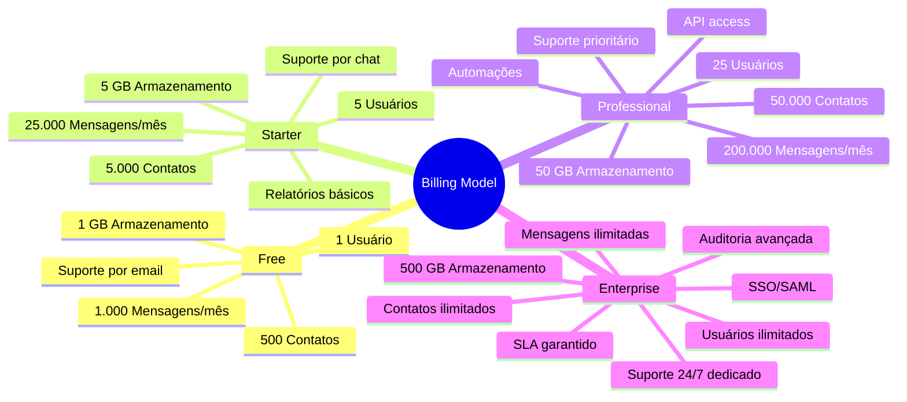
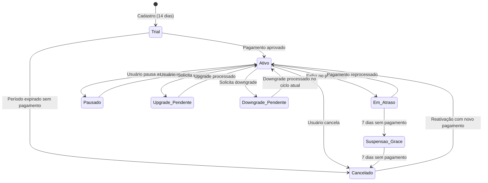
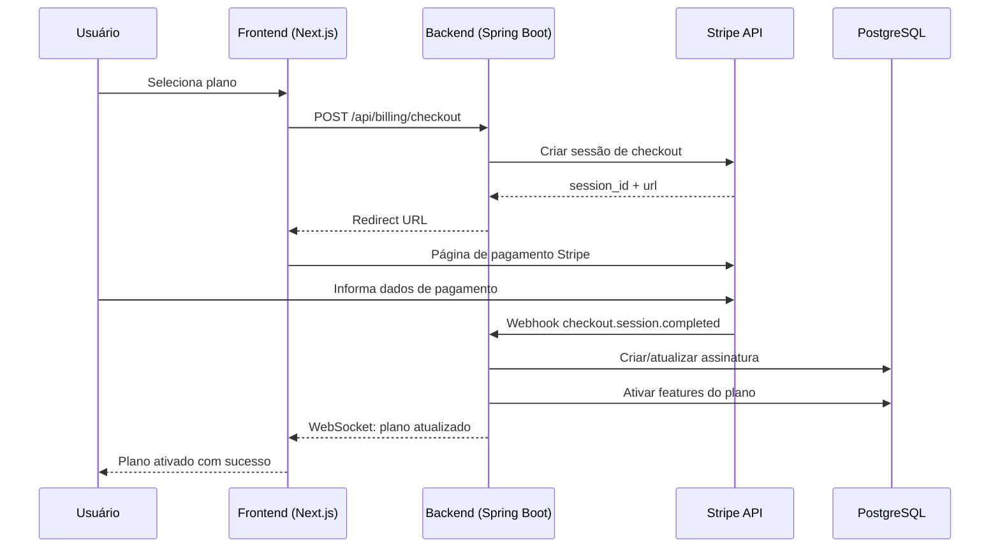
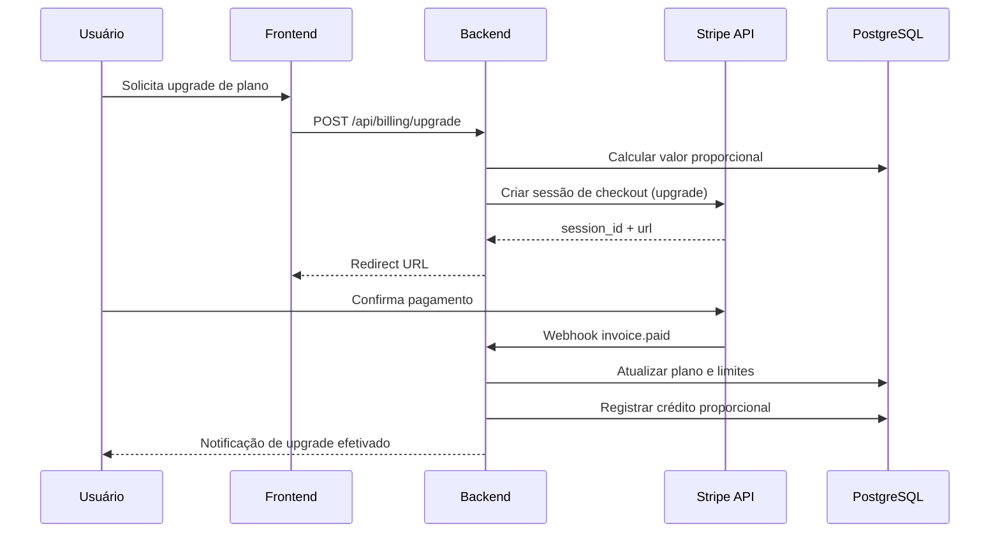
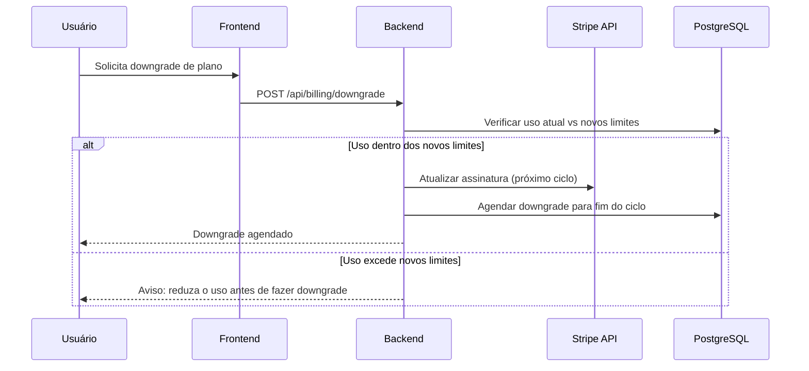
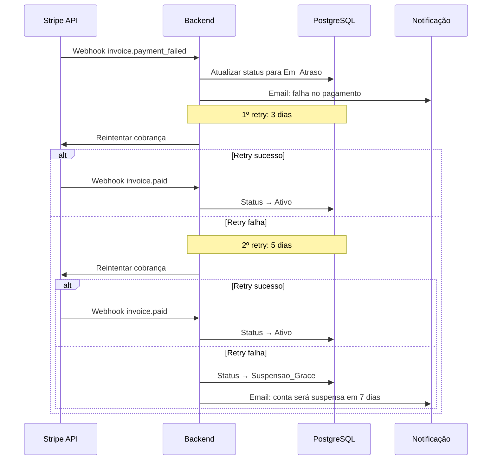

# Billing Model

## Objetivo

Definir o modelo de cobrança do CRM SaaS Omnichannel, incluindo planos, limites, ciclo de vida da assinatura, integração com pagamento (Stripe), período de teste e fluxos de upgrade/downgrade.

## Escopo

- Planos disponíveis e features por plano
- Limites de uso (usuários, contatos, mensagens, armazenamento)
- Ciclo de vida da assinatura (trial, ativação, renovação, cancelamento)
- Integração com Stripe (assinaturas, faturas, webhooks)
- Fluxos de upgrade e downgrade
- Geração de faturas e relatórios de uso

## Responsabilidades

| Papel | Responsabilidade |
|---|---|
| Product Owner | Definir features e limites de cada plano |
| Backend Developer | Implementar integração com Stripe e lógica de billing |
| Frontend Developer | Implementar UI do portal de cobrança e gestão de plano |
| DevOps | Configurar webhooks e monitorar pipeline de pagamento |
| QA | Validar fluxos de assinatura, cobrança e limites |

## Fluxos

### Planos e Limites

### Ciclo de Vida da Assinatura

### Fluxo de Checkout (Stripe)

### Fluxo de Upgrade

### Fluxo de Downgrade

### Fluxo de Fallback de Pagamento

## Dependências

| Dependência | Tipo | Uso |
|---|---|---|
| Stripe API | Externa | Processamento de pagamentos, assinaturas e faturas |
| PostgreSQL | Infra | Armazenamento de dados de billing e assinaturas |
| Redis | Infra | Cache de limites de uso e status de assinatura |
| RabbitMQ | Infra | Eventos de billing (upgrade, downgrade, cancelamento) |
| SendGrid / SES | Externa | Envio de emails de fatura e notificações de pagamento |

## Boas Práticas

- **Idempotência**: Todas as operações de billing devem ser idempotentes, usando idempotency keys do Stripe.
- **Webhook verification**: Sempre verificar a assinatura dos webhooks do Stripe para evitar fraudes.
- **Grace period**: Implementar período de carência de 7 dias antes de suspender contas com falha de pagamento.
- **Proration**: Cálculo proporcional automático em upgrades durante o ciclo vigente.
- **Audit trail**: Registrar todas as transações de billing para auditoria e suporte.
- **Rate limiting**: Proteger endpoints de billing contra abuso.
- **Segurança**: Nunca armazenar dados de cartão de crédito. Delegar ao Stripe.
- **Backup billing**: Manter registro local do estado da assinatura como fallback.
- **Test mode**: Usar Stripe test mode para ambiente de desenvolvimento e staging.

## Referências

- [Stripe Billing Documentation](https://stripe.com/docs/billing)
- [Stripe Webhooks](https://stripe.com/docs/webhooks)
- [Stripe Customer Portal](https://stripe.com/docs/customer-management/portal)
- [Stripe API Reference](https://stripe.com/docs/api)

## Histórico de Revisão

| Versão | Data | Autor | Descrição |
|---|---|---|---|
| 1.0 | 15/07/2026 | Paulo Alves | Criação inicial do documento |
