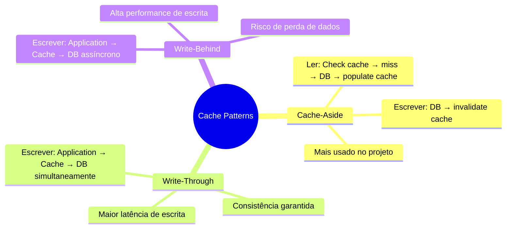
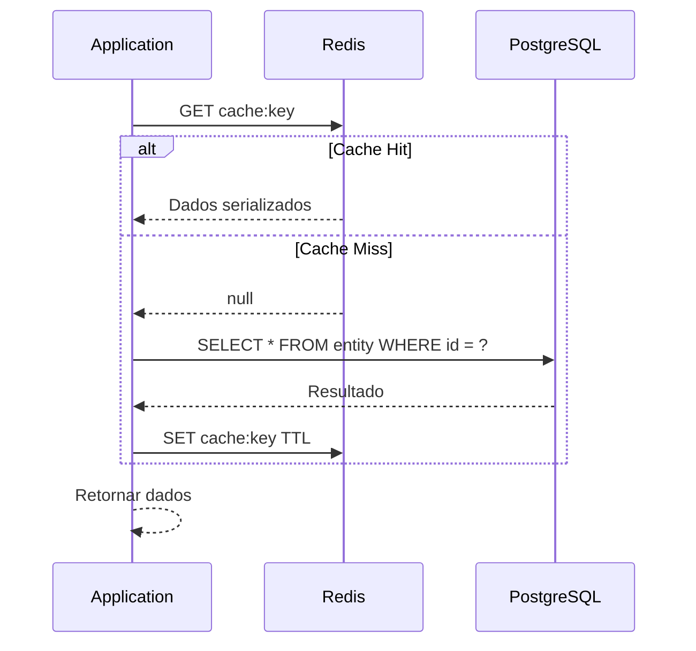
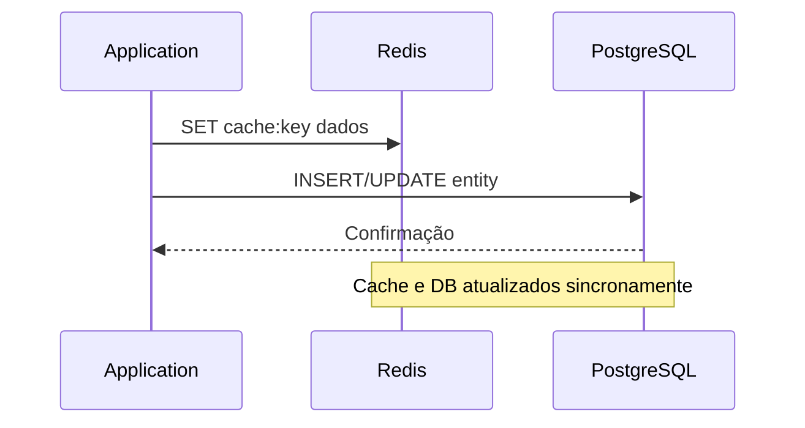
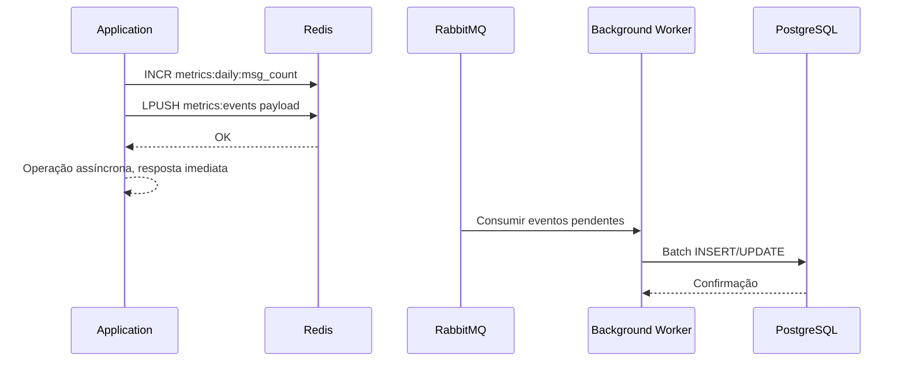
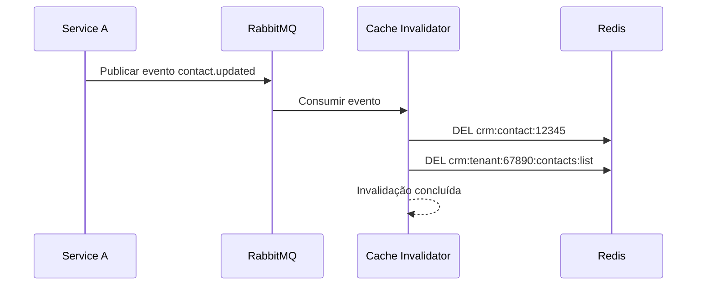
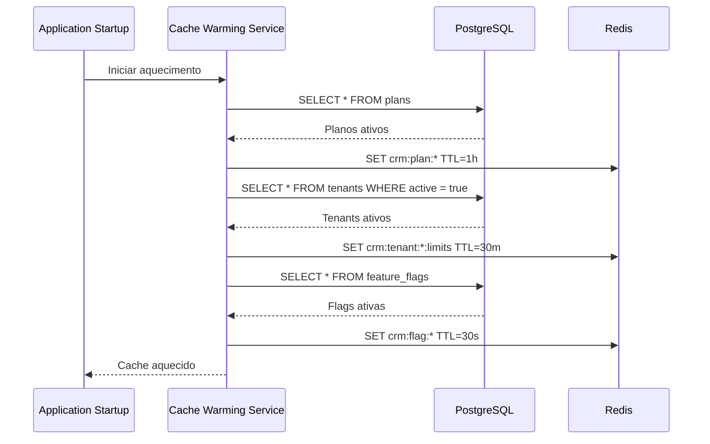
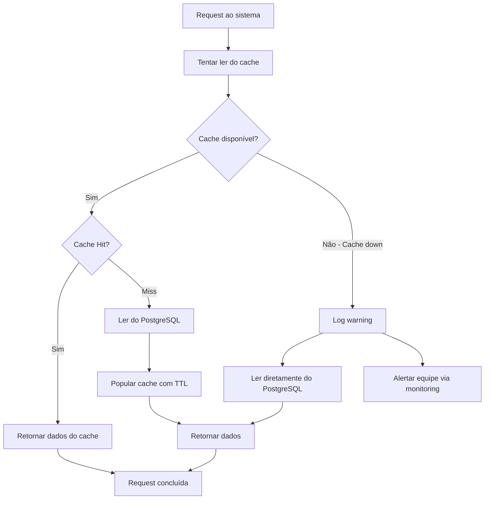
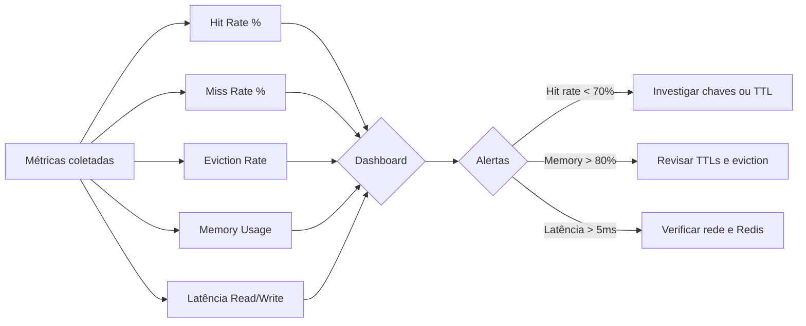

# Cache Strategy

## Objetivo

Documentar a estratégia de cache completa do CRM SaaS Omnichannel, incluindo padrões de utilização, convenções de nomenclatura, políticas de TTL, estratégias de invalidação, aquecimento, monitoramento e comportamento de fallback.

## Escopo

- Padrões de cache: Cache-Aside, Write-Through, Write-Behind
- Convenções de nomenclatura de chaves
- Políticas de TTL por entidade
- Estratégias de invalidação
- Cache warming (aquecimento)
- Monitoramento e métricas de cache
- Comportamento de fallback quando o cache falha

## Responsabilidades

| Papel | Responsabilidade |
|---|---|
| Backend Developer | Implementar lógica de cache nos repositórios e services |
| DevOps | Configurar Redis, monitorar memória e performance |
| Architect | Definir padrões e convenções de cache |
| QA | Testar cenários de cache hit, miss, invalidação e fallback |

## Fluxos

### Padrões de Cache



### Cache-Aside (Padrão Principal)



### Write-Through



### Write-Behind (para métricas e analytics)



### Convenções de Nomenclatura de Chaves

```
Formato: {namespace}:{entity}:{identifier}:{field}

Exemplos:
  crm:contact:12345              → Dados de contato
  crm:contact:12345:interactions  → Interações do contato
  crm:tenant:67890:contacts:list  → Lista de contatos do tenant
  crm:user:11111:permissions      → Permissões do usuário
  crm:plan:pro:limits            → Limites do plano Professional
  crm:session:abc123             → Sessão do usuário
  crm:metrics:daily:msg_count    → Contador diário de mensagens
  crm:flag:maintenance_mode      → Feature flag
```

### Políticas de TTL por Entidade

| Entidade | TTL | Padrão | Justificativa |
|---|---|---|---|
| Dados de contato | 5 min | Cache-Aside | Dados mudam frequentemente |
| Interações do contato | 2 min | Cache-Aside | Alto volume de atualizações |
| Lista de contatos | 3 min | Cache-Aside | Lista reativa a novos registros |
| Permissões do usuário | 15 min | Cache-Aside | Mudam raramente |
| Dados do tenant | 30 min | Cache-Aside | Configurações estáveis |
| Limites do plano | 1 hora | Write-Through | Raramente alterados |
| Sessão do usuário | 24 horas | Cache-Aside | Expiração natural |
| Métricas diárias | 1 hora | Write-Behind | Batch de escrita |
| Feature flags | 30 seg | Cache-Aside | Precisam ser near-realtime |
| Dados de busca | 10 min | Cache-Aside | Queries pesadas |

### Estratégias de Invalidação

```mermaid
flowchart TD
    A[Evento de mudança] --> B{Tipo de mudança}
    B -->|Escrita em entidade| C[Invalidação direta]
    C --> C1[DEL crm:contact:{id}]
    C --> C2[DEL crm:tenant:{id}:contacts:list]
    B -->|Mudança de plano| D[Invalidação em cascata]
    D --> D1[DEL crm:plan:{plan_id}:limits]
    D --> D2[DEL crm:user:{id}:permissions]
    D --> D3[DEL crm:tenant:{id}:*]
    B -->|Logout / revogação| E[Invalidação de sessão]
    E --> E1[DEL crm:session:{token}]
    B -->|Manutenção| F[Flush seletivo]
    F --> F1[DEL crm:flag:*]
    F --> F2[DEL crm:metrics:*]
```

### Invalidação via RabbitMQ



### Cache Warming



### Comportamento de Fallback



### Monitoramento de Cache



## Dependências

| Dependência | Tipo | Uso |
|---|---|---|
| Redis 7 | Infra | Cache principal com suporte a Redis Cluster |
| PostgreSQL 16 | Infra | Fonte de verdade (source of truth) |
| RabbitMQ 3 | Infra | Eventos de invalidação de cache |
| Spring Boot Cache | Lib | Integração de cache via Spring Cache |
| Lettuce | Lib | Cliente Redis para Java |
| Micrometer | Lib | Métricas de cache para observabilidade |

## Boas Práticas

- **TTL sempre definido**: Nunca criar chaves sem TTL para evitar memory leak.
- **Serialização**: Usar JSON (Jackson) para serialização de objetos em cache.
- **Compressão**: Comprimir valores maiores que 1KB antes de armazenar.
- **Key size**: Manter chaves compactas para economizar memória.
- **Batch operations**: Usar pipeline Redis para operações em lote (mget, mset).
- **Singleflight**: Evitar thundering herd com bloqueio de cache warming concorrente.
- **Nunca confiar no cache como source of truth**: Cache é sempre revogável.
- **Monitoramento**: Instrumentar hit rate, miss rate e latência de cache em todos os endpoints.
- **Max memory policy**: Configurar Redis com `allkeys-lru` ou `volatile-lru`.
- **Connection pooling**: Usar pool de conexões Lettuce com tamanho adequado.

## Referências

- [Redis Documentation](https://redis.io/docs/)
- [Spring Cache Abstraction](https://docs.spring.io/spring-framework/reference/integration/cache.html)
- [Lettuce Client](https://lettuce.io/)
- [Cache-Aside Pattern](https://learn.microsoft.com/en-us/azure/architecture/cache-patterns/cache-aside)

## Histórico de Revisão

| Versão | Data | Autor | Descrição |
|---|---|---|---|
| 1.0 | 15/07/2026 | Paulo Alves | Criação inicial do documento |
