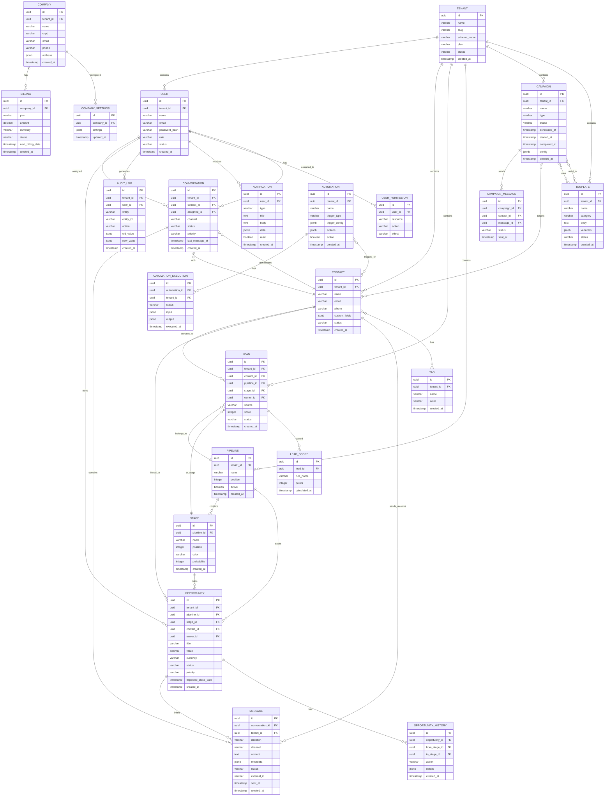

# DATABASE_MAP — Mapa do Banco de Dados

## Objetivo

Fornecer uma visão consolidada do banco de dados PostgreSQL com diagrama ER em Mermaid, entidades, relacionamentos e regras.

## Índice

- [Diagrama ER](#diagrama-er)
- [Entidades Principais](#entidades-principais)
- [Regras de Esquema](#regras-de-esquema)
- [Referências](#referências)
- [Histórico de Revisão](#histórico-de-revisão)

---

## Diagrama ER

---

## Entidades Principais

### Identidade
- `TENANT` — Schema isolation de cada cliente
- `USER` — Usuários com roles (SUPER_ADMIN, ADMIN, MANAGER, AGENT, VIEWER)
- `USER_PERMISSION` — Permissões granulares (RBAC)
- `COMPANY` — Dados da empresa/tenant
- `COMPANY_SETTINGS` — Configurações customizáveis

### Contato
- `CONTACT` — Contatos com campos customizados
- `TAG` — Tags para segmentação
- `LEAD` — Leads com scoring e pipeline
- `LEAD_SCORE` — Histórico de scoring
- `CUSTOMER` (implícito via CONTACT com status CUSTOMER)

### Pipeline
- `PIPELINE` — Pipelines de vendas
- `STAGE` — Estágios do pipeline
- `OPPORTUNITY` — Oportunidades de negócio
- `OPPORTUNITY_HISTORY` — Histórico de movimentação

### Comunicação
- `CONVERSATION` — Conversas multicanal
- `MESSAGE` — Mensagens (texto, mídia, status)

### Campanha
- `CAMPAIGN` — Campanhas de marketing
- `CAMPAIGN_MESSAGE` — Mensagens enviadas por campanha
- `TEMPLATE` — Templates de mensagens

### Automação
- `AUTOMATION` — Regras de automação
- `AUTOMATION_EXECUTION` — Log de execuções

### Sistema
- `NOTIFICATION` — Notificações do usuário
- `AUDIT_LOG` — Log de auditoria (todas as ações)
- `BILLING` — Dados de faturamento

---

## Regras de Esquema

| Regra | Descrição |
|---|---|
| Multi-tenancy | Schema isolation por tenant (`tenant_{id}`) |
| UUID PK | Todas as tabelas usam UUID v4 como PK |
| Soft Delete | `deleted_at` em todas as tabelas de negócio |
| Audit | `created_at`, `updated_at` em todas as tabelas |
| Índices | Índices em FKs, campos de busca e ordenação |
| JSONB | `custom_fields`, `metadata`, `settings` como JSONB |

---

## Referências

| Documento | Caminho |
|---|---|
| Overview | [03-database/Overview.md](./03-database/Overview.md) |
| ERD | [03-database/ERD.md](./03-database/ERD.md) |
| Entities | [03-database/Entities.md](./03-database/Entities.md) |
| Relationships | [03-database/Relationships.md](./03-database/Relationships.md) |
| Indexes | [03-database/Indexes.md](./03-database/Indexes.md) |
| UUID | [03-database/UUID.md](./03-database/UUID.md) |
| SoftDelete | [03-database/SoftDelete.md](./03-database/SoftDelete.md) |
| Audit | [03-database/Audit.md](./03-database/Audit.md) |
| SUMMARY | [SUMMARY.md](./SUMMARY.md) |

---

## Histórico de Revisão

| Versão | Data | Autor | Descrição |
|---|---|---|---|
| 1.0.0 | 2026-07-15 | Architect | Criação inicial do mapa de banco de dados |
