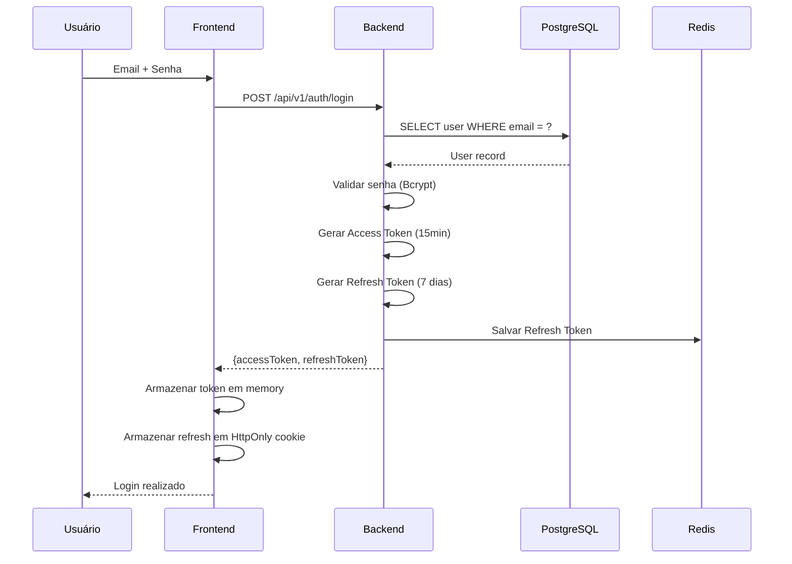
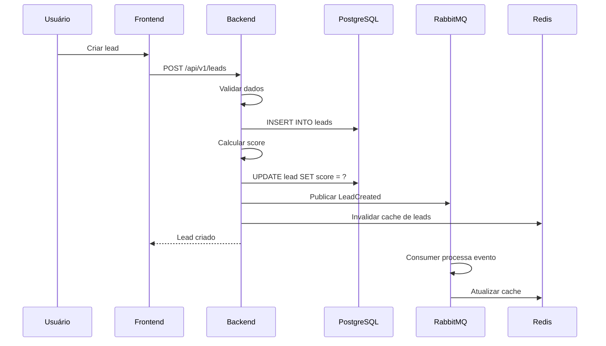
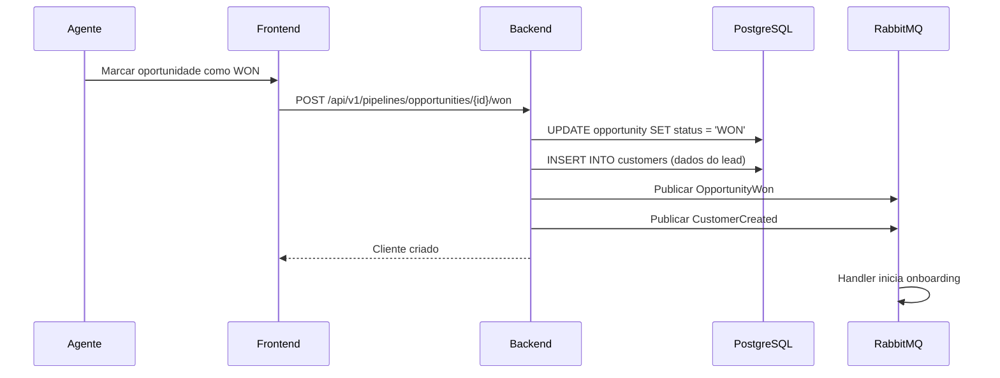
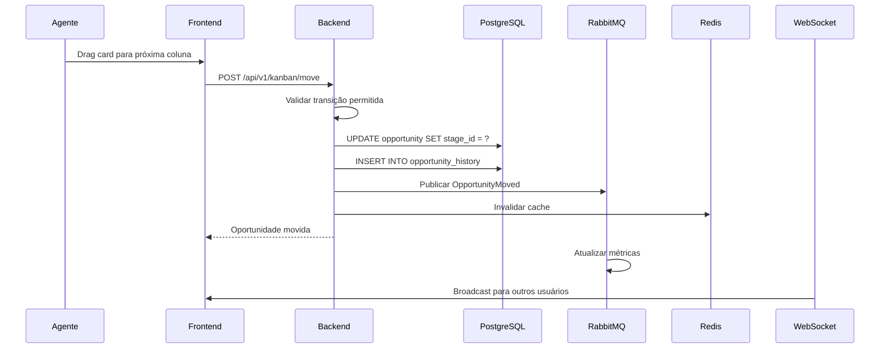
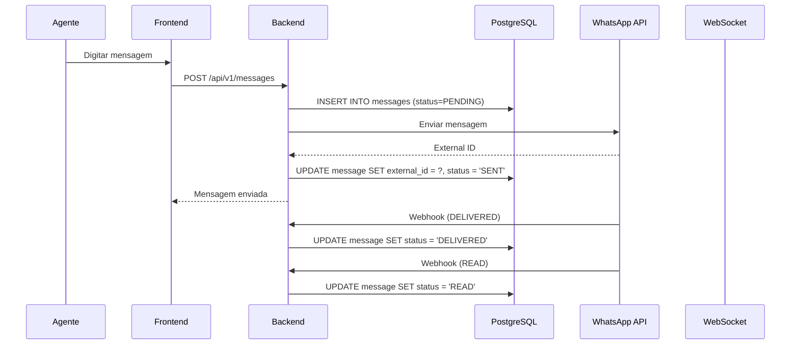
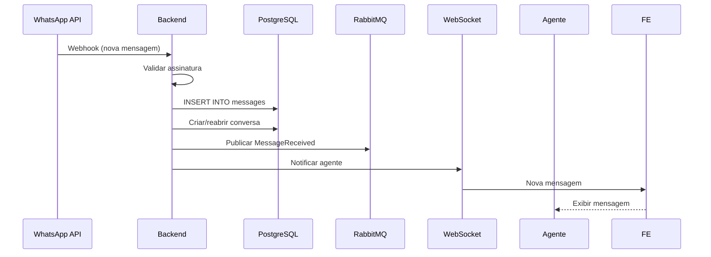
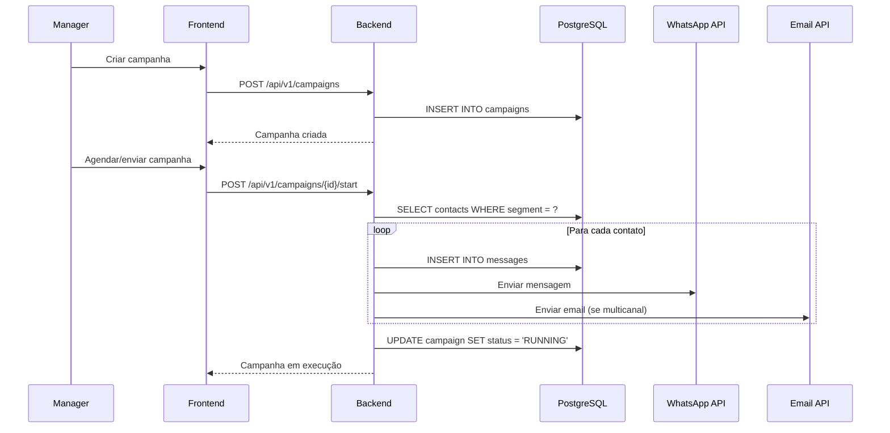
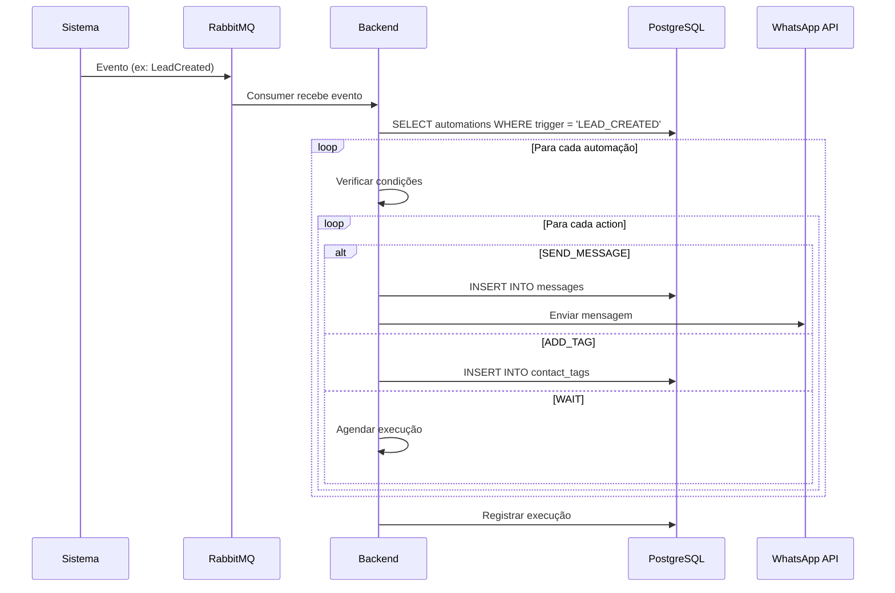
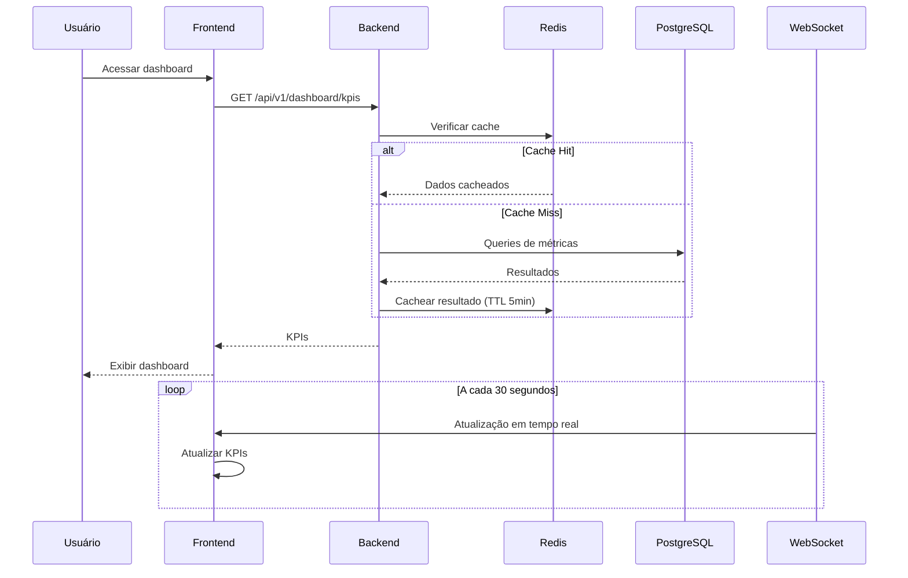

# DATA_FLOW — Mapa de Fluxo dos Dados

## Objetivo

Documentar o fluxo dos dados em cada funcionalidade principal do sistema, desde a entrada até a persistência e notificação.

## Índice

- [1. Fluxo de Login](#1-fluxo-de-login)
- [2. Fluxo de Lead](#2-fluxo-de-lead)
- [3. Fluxo de Cliente (Conversão Lead → Cliente)](#3-fluxo-de-cliente-conversão-lead--cliente)
- [4. Fluxo de Pipeline (Movimentação Kanban)](#4-fluxo-de-pipeline-movimentação-kanban)
- [5. Fluxo de Mensagem](#5-fluxo-de-mensagem)
- [6. Fluxo de Campanha](#6-fluxo-de-campanha)
- [7. Fluxo de Automação](#7-fluxo-de-automação)
- [8. Fluxo de Dashboard](#8-fluxo-de-dashboard)
- [Referências](#referências)
- [Histórico de Revisão](#histórico-de-revisão)

---

## 1. Fluxo de Login

**Fonte:** [01-backend/Auth.md](./01-backend/Auth.md)

---

## 2. Fluxo de Lead

**Fonte:** [01-backend/Leads.md](./01-backend/Leads.md), [05-business-rules/Lead.md](./05-business-rules/Lead.md)

---

## 3. Fluxo de Cliente (Conversão Lead → Cliente)

**Fonte:** [01-backend/Customers.md](./01-backend/Customers.md), [01-backend/Pipeline.md](./01-backend/Pipeline.md)

---

## 4. Fluxo de Pipeline (Movimentação Kanban)

**Fonte:** [01-backend/Kanban.md](./01-backend/Kanban.md), [01-backend/Pipeline.md](./01-backend/Pipeline.md)

---

## 5. Fluxo de Mensagem

### Envio (Agente → Contato)

### Recebimento (Contato → Agente)

**Fonte:** [01-backend/Messages.md](./01-backend/Messages.md), [01-backend/Chat.md](./01-backend/Chat.md)

---

## 6. Fluxo de Campanha

**Fonte:** [01-backend/Campaigns.md](./01-backend/Campaigns.md), [05-business-rules/Campaign.md](./05-business-rules/Campaign.md)

---

## 7. Fluxo de Automação

**Fonte:** [01-backend/Automations.md](./01-backend/Automations.md)

---

## 8. Fluxo de Dashboard

**Fonte:** [01-backend/Dashboard.md](./01-backend/Dashboard.md)

---

## Referências

| Documento | Caminho |
|---|---|
| Backend Overview | [01-backend/Overview.md](./01-backend/Overview.md) |
| Events | [01-backend/Events.md](./01-backend/Events.md) |
| Auth | [01-backend/Auth.md](./01-backend/Auth.md) |
| Leads | [01-backend/Leads.md](./01-backend/Leads.md) |
| Pipeline | [01-backend/Pipeline.md](./01-backend/Pipeline.md) |
| Messages | [01-backend/Messages.md](./01-backend/Messages.md) |
| Campaigns | [01-backend/Campaigns.md](./01-backend/Campaigns.md) |
| Automations | [01-backend/Automations.md](./01-backend/Automations.md) |
| Dashboard | [01-backend/Dashboard.md](./01-backend/Dashboard.md) |
| SUMMARY | [SUMMARY.md](./SUMMARY.md) |

---

## Histórico de Revisão

| Versão | Data | Autor | Descrição |
|---|---|---|---|
| 1.0.0 | 2026-07-15 | Architect | Criação inicial do mapa de fluxos |
