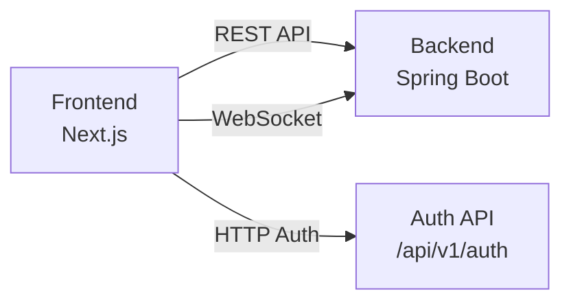
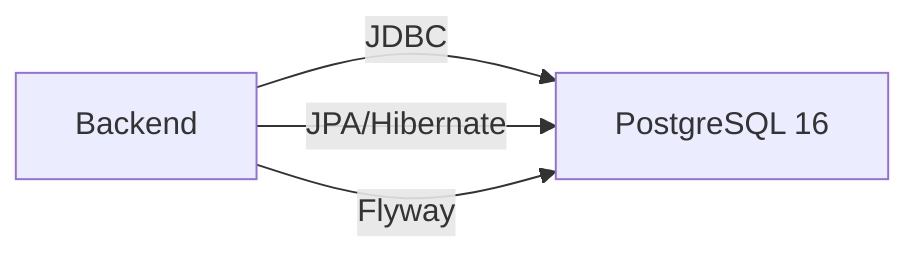
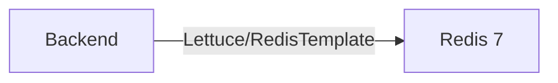
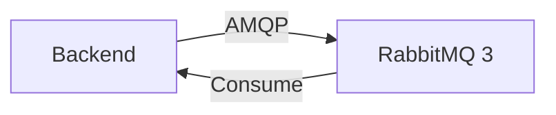
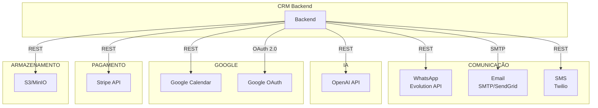
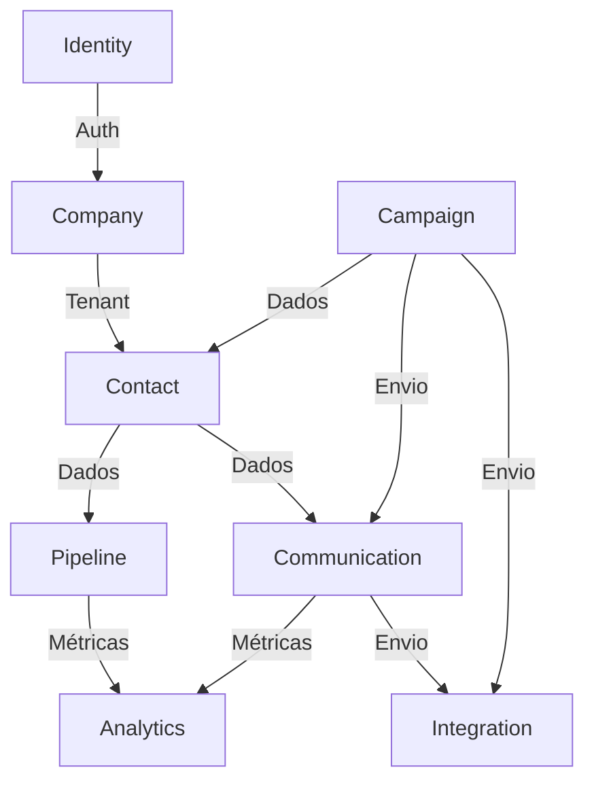
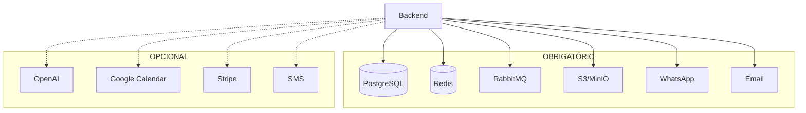

# DEPENDENCIES — Mapa Completo de Dependências

## Objetivo

Mapear todas as dependências entre componentes do sistema, incluindo internas, externas e opcionais.

## Índice

- [1. Dependências Frontend → Backend](#1-dependências-frontend--backend)
- [2. Dependências Backend → Banco de Dados](#2-dependências-backend--banco-de-dados)
- [3. Dependências Backend → Cache](#3-dependências-backend--cache)
- [4. Dependências Backend → Mensageria](#4-dependências-backend--mensageria)
- [5. Dependências Backend → Integrações Externas](#5-dependências-backend--integrações-externas)
- [6. Dependências Internas (Módulos)](#6-dependências-internas-módulos)
- [7. Dependências de Infraestrutura](#7-dependências-de-infraestrutura)
- [8. Dependências Opcionais](#8-dependências-opcionais)
- [9. Matriz Resumo](#9-matriz-resumo)
- [Referências](#referências)
- [Histórico de Revisão](#histórico-de-revisão)

---

## 1. Dependências Frontend → Backend

| Frontend | Backend | Protocolo | Endpoint |
|---|---|---|---|
| Login | Auth Service | REST | `/api/v1/auth/login` |
| Refresh | Auth Service | REST | `/api/v1/auth/refresh` |
| Dashboard | Dashboard Service | REST | `/api/v1/dashboard/*` |
| Leads | Lead Service | REST | `/api/v1/leads/*` |
| Contacts | Contact Service | REST | `/api/v1/contacts/*` |
| Pipeline | Pipeline Service | REST | `/api/v1/pipelines/*` |
| Chat | Chat Service | REST + WS | `/api/v1/chat/*`, `/ws/chat` |
| Campaigns | Campaign Service | REST | `/api/v1/campaigns/*` |
| Reports | Report Service | REST | `/api/v1/reports/*` |
| Notifications | Notification Service | WS | `/ws/notifications` |

**Fonte:** [01-backend/Overview.md](./01-backend/Overview.md), [02-frontend/Overview.md](./02-frontend/Overview.md)

---

## 2. Dependências Backend → Banco de Dados

| Componente | Tecnologia | Finalidade |
|---|---|---|
| ORM | Hibernate/JPA 6 | Mapeamento objeto-relacional |
| Connection Pool | HikariCP | Pool de conexões |
| Migration | Flyway 10+ | Versionamento de schema |
| Database | PostgreSQL 16 | Dados transacionais |

**Fonte:** [03-database/Overview.md](./03-database/Overview.md)

---

## 3. Dependências Backend → Cache

| Uso | Key Pattern | TTL |
|---|---|---|
| Cache de dados | `tenant:{id}:lead:{id}` | 15 min |
| Dashboard KPIs | `tenant:{id}:dashboard:kpis` | 5 min |
| Sessões | `tenant:{id}:user:{id}:session` | 24h |
| Rate Limiting | `tenant:{id}:rate:{endpoint}:{userId}` | 1 min |
| Distributed Lock | `lock:scheduler:{jobName}` | 5 min |
| JWT Blacklist | `jwt:blacklist:{tokenId}` | 15 min |

**Fonte:** [01-backend/Cache.md](./01-backend/Cache.md)

---

## 4. Dependências Backend → Mensageria

| Evento | Producer | Consumer | Queue |
|---|---|---|---|
| `LeadCreated` | Lead Service | Cache, Notification, Audit | `lead.events` |
| `ContactCreated` | Contact Service | Cache, Notification | `contact.events` |
| `OpportunityMoved` | Pipeline Service | Analytics, Notification | `pipeline.events` |
| `MessageSent` | Message Service | Cache, Webhook | `message.events` |
| `CampaignCompleted` | Campaign Service | Analytics, Notification | `campaign.events` |

**Fonte:** [01-backend/Events.md](./01-backend/Events.md)

---

## 5. Dependências Backend → Integrações Externas

| Integração | Dependência Obrigatória | Dependência Opcional |
|---|---|---|
| WhatsApp (Evolution API) | Sim (canal primário) | — |
| Email (SMTP) | Sim (transacional) | — |
| Redis | Sim (cache) | — |
| RabbitMQ | Sim (eventos) | — |
| PostgreSQL | Sim (dados) | — |
| OpenAI | Não | Funcionalidades de IA |
| Google Calendar | Não | Sincronização de agenda |
| Google Contacts | Não | Sincronização de contatos |
| Stripe | Não | Billing e pagamentos |
| SMS (Twilio) | Não | Canal alternativo |
| S3/MinIO | Sim (arquivos) | — |

**Fonte:** [04-integrations/README.md](./04-integrations/README.md)

---

## 6. Dependências Internas (Módulos)

| Módulo | Depende de | Natureza |
|---|---|---|
| Identity | — | Raiz |
| Company | Identity | Obrigatória |
| Contact | Company, Identity | Obrigatória |
| Pipeline | Company, Contact | Obrigatória |
| Communication | Company, Contact, Integration | Obrigatória |
| Campaign | Company, Contact, Communication, Integration | Obrigatória |
| Analytics | Todos (read-only) | Obrigatória |
| Integration | Company | Obrigatória |

---

## 7. Dependências de Infraestrutura

| Componente | Tecnologia | Obrigatório |
|---|---|---|
| Runtime Java | JDK 25 | Sim |
| Build Tool | Maven | Sim |
| Node.js | Node 20+ | Sim (frontend) |
| Docker | Docker 24+ | Sim |
| Kubernetes | K8s (futuro) | Não |
| CI/CD | GitHub Actions | Sim |
| Monitoring | Prometheus + Grafana | Sim |
| Logs | Loki + Promtail | Sim |

---

## 8. Dependências Opcionais

| Dependência | Finalidade | Pode ser removida? |
|---|---|---|
| OpenAI | IA features | Sim |
| Google Calendar | Sync agenda | Sim |
| Google Contacts | Sync contatos | Sim |
| Stripe | Pagamentos | Sim (sem billing) |
| SMS (Twilio) | Canal alternativo | Sim |
| Kubernetes | Orquestração | Sim (Docker suffice) |

---

## 9. Matriz Resumo

---

## Referências

| Documento | Caminho |
|---|---|
| TechStack | [00-core/TechStack.md](./00-core/TechStack.md) |
| Architecture | [00-core/Architecture.md](./00-core/Architecture.md) |
| Backend Overview | [01-backend/Overview.md](./01-backend/Overview.md) |
| Integrações | [04-integrations/README.md](./04-integrations/README.md) |
| Database | [03-database/Overview.md](./03-database/Overview.md) |
| SUMMARY | [SUMMARY.md](./SUMMARY.md) |

---

## Histórico de Revisão

| Versão | Data | Autor | Descrição |
|---|---|---|---|
| 1.0.0 | 2026-07-15 | Architect | Criação inicial do mapa de dependências |
