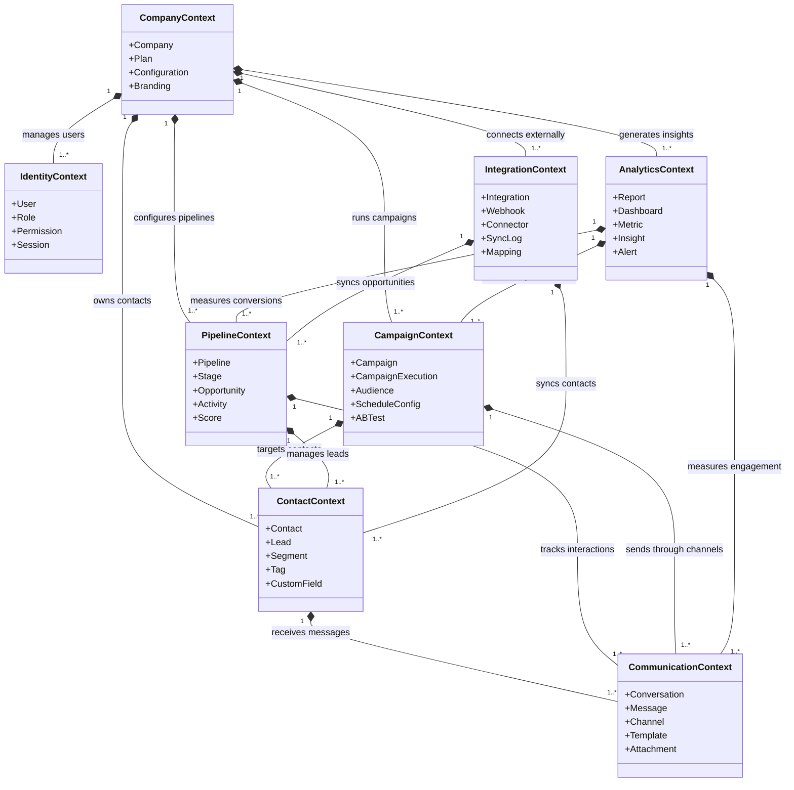

# Domain Model

## Objetivo

Definir o modelo de domínio completo do CRM SaaS Omnichannel, identificando bounded contexts, agregados, entidades, value objects e eventos de domínio que compõem a arquitetura do sistema.

## Escopo

Abrange todos os 8 bounded contexts do sistema: Identity, Company, Contact, Pipeline, Communication, Campaign, Analytics e Integration. Cada contexto possui seus próprios agregados e regras de negócio.

## Responsabilidades

| Bounded Context | Responsabilidade Principal |
|---|---|
| **Identity** | Autenticação, autorização, gerenciamento de usuários, perfis e papéis |
| **Company** | Cadastro de tenants, configurações organizacionais, planos |
| **Contact** | Gestão de contatos, leads, segmentação e dados pessoais |
| **Pipeline** | Funil de vendas, oportunidades, estágios e previsões |
| **Communication** | Canais omnichannel (chat, e-mail, SMS, WhatsApp, telefone) |
| **Campaign** | Criação, agendamento e execução de campanhas de marketing |
| **Analytics** | Relatórios, dashboards, métricas e inteligência de dados |
| **Integration** | Integrações externas (APIs, webhooks, conectores de terceiros) |

## Fluxos

### Diagrama de Classes — Relacionamentos entre Agregados

### Agregados e Entidades por Bounded Context

#### Identity

| Elemento | Tipo | Descrição |
|---|---|---|
| User | Agregado raiz | Representa um usuário autenticado no sistema |
| Role | Entidade | Papel atribuído a um usuário (admin, manager, agent) |
| Permission | Value Object | Permissão granular (resource:action) |
| Session | Entidade | Sessão ativa com token JWT e metadados |
| Email | Value Object | Endereço de e-mail validado |
| Password | Value Object | Senha com hash bcrypt e política de segurança |
| MFAConfig | Value Object | Configuração de autenticação multi-fator |

#### Company

| Elemento | Tipo | Descrição |
|---|---|---|
| Company | Agregado raiz | Tenant do sistema |
| Plan | Entidade | Plano contratado com limites e funcionalidades |
| Configuration | Value Object | Configurações organizacionais (fuso horário, moeda, idioma) |
| Branding | Value Object | Personalização visual (logo, cores, domínio customizado) |
| TenantSchema | Value Object | Nome do schema PostgreSQL isolado para o tenant |
| Invitation | Entidade | Convite pendente para novos membros da equipe |

#### Contact

| Elemento | Tipo | Descrição |
|---|---|---|
| Contact | Agregado raiz | Registro completo de um contato |
| Lead | Entidade | Lead qualificado com score eorigem |
| Segment | Entidade | Segmentação dinâmica baseada em critérios |
| Tag | Value Object | Etiqueta para categorização flexível |
| CustomField | Value Object | Campo personalizado definido pela empresa |
| Address | Value Object | Endereço completo com validação |
| SocialProfile | Value Object | Links e IDs de redes sociais |
| InteractionHistory | Value Object | Histórico resumido de interações |

#### Pipeline

| Elemento | Tipo | Descrição |
|---|---|---|
| Pipeline | Agregado raiz | Funil de vendas com estágios configuráveis |
| Stage | Entidade | Estágio do funil com regras de transição |
| Opportunity | Agregado raiz | Oportunidade de negócio associada a um contato |
| Activity | Entidade | Registro de atividade (chamada, reunião, nota, tarefa) |
| Score | Value Object | Pontuação quantitativa da oportunidade |
| Probability | Value Object | Percentual de chance de conversão |
| ValueRange | Value Object | Faixa de valor estimado (mínimo, máximo, esperado) |

#### Communication

| Elemento | Tipo | Descrição |
|---|---|---|
| Conversation | Agregado raiz | Thread de comunicação multi-canal |
| Message | Entidade | Mensagem individual com conteúdo e metadados |
| Channel | Entidade | Canal de comunicação (WhatsApp, e-mail, chat, SMS, telefone) |
| Template | Entidade | Template de mensagem reutilizável |
| Attachment | Value Object | Arquivo anexo com tipo MIME e tamanho |
| DeliveryStatus | Value Object | Status de entrega (pendente, enviado, entregue, lido, falha) |
| RoutingRule | Value Object | Regra de roteamento de conversas para agentes |

#### Campaign

| Elemento | Tipo | Descrição |
|---|---|---|
| Campaign | Agregado raiz | Campanha de marketing ou nutrição |
| CampaignExecution | Entidade | Execução individual de uma campanha para um contato |
| Audience | Entidade | Audiência-alvo definida por segmentos e filtros |
| ScheduleConfig | Value Object | Configuração de agendamento e recorrência |
| ABTest | Value Object | Variante de teste A/B com distribuição percentual |
| Budget | Value Object | Orçamento alocado com limite e controle de gasto |
| ConversionGoal | Value Object | Meta de conversão definida para a campanha |

#### Analytics

| Elemento | Tipo | Descrição |
|---|---|---|
| Report | Agregado raiz | Relatório gerado com filtros e período |
| Dashboard | Agregado raiz | Painel com widgets e configurações visuais |
| Metric | Value Object | Métrica calculada (taxa de conversão, CAC, LTV) |
| Insight | Entidade | Análise automática gerada por regras ou IA |
| Alert | Entidade | Alerta disparado quando thresholds são atingidos |
| Period | Value Object | Período de análise (diário, semanal, mensal) |
| Widget | Entidade | Componente visual do dashboard (gráfico, tabela, KPI) |

#### Integration

| Elemento | Tipo | Descrição |
|---|---|---|
| Integration | Agregado raiz | Integração com sistema externo |
| Webhook | Entidade | Endpoint configurado para receber/enviar eventos |
| Connector | Entidade | Conector pré-configurado (Salesforce, HubSpot, etc.) |
| SyncLog | Entidade | Registro de sincronizações com status e erros |
| FieldMapping | Value Object | Mapeamento de campos entre sistemas |
| OAuthConfig | Value Object | Credenciais OAuth para autenticação externa |
| RateLimit | Value Object | Controle de taxa de requisições por integração |

### Eventos de Domínio

| Evento | Bounded Context | Descrição |
|---|---|---|
| UserRegistered | Identity | Novo usuário registrado |
| UserAuthenticated | Identity | Usuário autenticado com sucesso |
| UserRoleChanged | Identity | Papel do usuário alterado |
| CompanyCreated | Company | Nova empresa criada (onboarding) |
| PlanUpgraded | Company | Plano da empresa atualizado |
| ContactCreated | Contact | Novo contato cadastrado |
| ContactMerged | Contact | Contatos duplicados mesclados |
| LeadScoreChanged | Contact | Score do lead recalculado |
| OpportunityCreated | Pipeline | Nova oportunidade aberta |
| StageChanged | Pipeline | Oportunidade movida para novo estágio |
| OpportunityWon | Pipeline | Oportunidade ganha (fechamento positivo) |
| OpportunityLost | Pipeline | Oportunidade perdida |
| ConversationStarted | Communication | Nova conversa iniciada |
| MessageReceived | Communication | Mensagem recebida de canal externo |
| MessageDelivered | Communication | Mensagem confirmada como entregue |
| CampaignCreated | Campaign | Nova campanha criada |
| CampaignStarted | Campaign | Campanha iniciada |
| CampaignConverted | Campaign | Conversão registrada na campanha |
| ReportGenerated | Analytics | Relatório finalizado |
| ThresholdExceeded | Analytics | Indicador ultrapassou limite configurado |
| IntegrationSynced | Integration | Sincronização com externo concluída |
| WebhookReceived | Integration | Webhook recebido de sistema externo |

## Dependências

- **PostgreSQL 16**: Armazenamento relacional com schemas isolados por tenant
- **Redis 7**: Cache de sessões, rate limiting e dados temporários
- **RabbitMQ 3**: Broker de mensagens para eventos de domínio e integração
- **Flyway 10**: Gerenciamento de migrações de banco de dados por schema
- **JWT**: Token de autenticação e propagação de tenant context

## Boas práticas

- Cada bounded context deve ser dono exclusivo de seus dados — não há compartilhamento direto de tabelas
- Eventos de domínio são publicados via RabbitMQ para desacoplamento entre contextos
- Value objects devem ser imutáveis e implementar `equals()`, `hashCode()` e `toString()`
- Aggregates devem ter uma única raiz de identidade e garantir consistência transacional interna
- Entidades fora do aggregate root não devem ser acessadas diretamente por outros contextos
- Nomes de eventos seguem o padrão `PastTense Verb` em inglês (ex: `ContactCreated`)
- Tags e campos personalizados são armazenados em tabelas JSONB para flexibilidade

## Referências

- Domain-Driven Design: Tackling Complexity in the Heart of Software — Eric Evans
- Implementing Domain-Driven Design — Vaughn Vernon
- Event Sourcing — Martin Fowler
- Spring Boot Reference Documentation — spring.io
- PostgreSQL 16 Documentation — postgresql.org

## Histórico de Revisão

| Versão | Data | Autor | Descrição |
|---|---|---|---|
| 1.0 | 2026-07-15 | Equipe de Arquitetura | Versão inicial do modelo de domínio |
