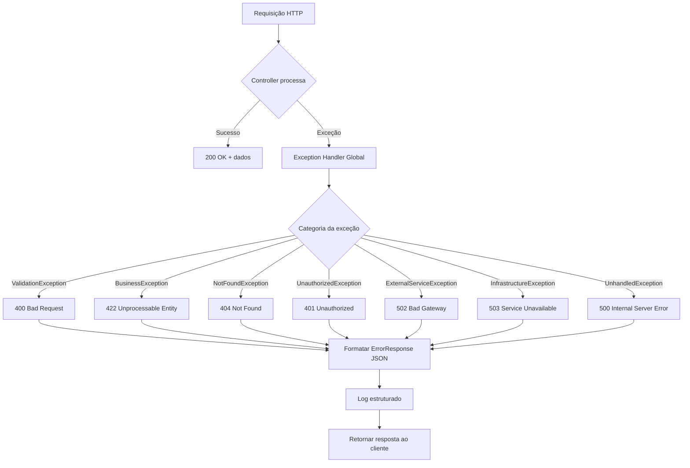
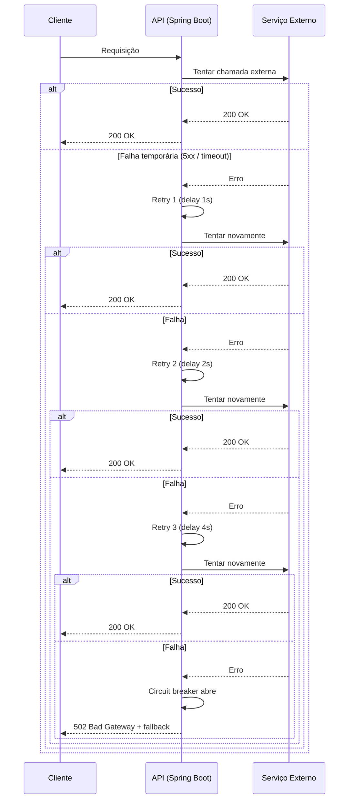
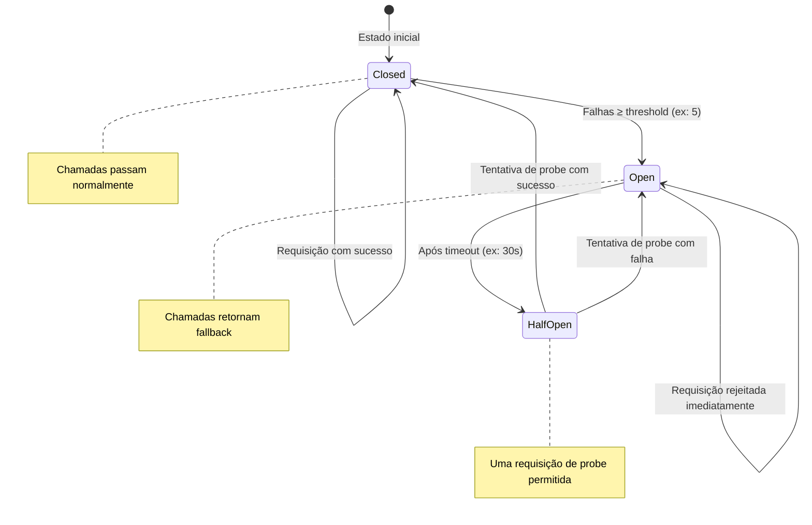
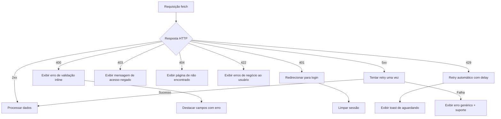
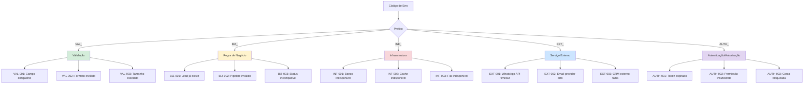

# Tratamento de Erros

## Objetivo

Definir a estratégia centralizada de tratamento de erros do CRM SaaS Omnichannel, garantindo respostas consistentes, informativas e seguras em todos os cenários de falha. A estratégia deve cobrir erros de validação, regras de negócio, infraestrutura e serviços externos, com mecanismos de retry, circuit breaker e fallback para resiliência.

## Escopo

- Categorias de erro: Validação, Regra de Negócio, Infraestrutura, Externo
- Formato padronizado de resposta de erro (JSON)
- Mapeamento de códigos HTTP para categorias de erro
- Registro centralizado de códigos de erro (error codes)
- Políticas de retry com backoff exponencial
- Circuit breaker com Resilience4j
- Fallback e degradação graciosa
- Tratamento de erros globais via `@ControllerAdvice` (Spring Boot)
- Tratamento de erros no frontend (Next.js 14)

## Responsabilidades

| Área | Responsabilidade |
|---|---|
| Backend (Spring Boot) | Implementar exception handlers, categorizar erros, registrar códigos |
| Frontend (Next.js) | Tratar erros HTTP, exibir mensagens amigáveis, retry de requisições |
| Arquitetura | Definir catálogo de códigos de erro, políticas de resiliência |
| SRE / Infraestrutura | Monitorar taxas de erro, configurar alertas |
| QA | Testar cenários de erro, validar formatos de resposta |

## Fluxos

### Fluxo de Tratamento Global de Erros

### Fluxo de Retry com Backoff Exponencial

### Fluxo de Circuit Breaker

### Fluxo de Tratamento de Erros no Frontend

### Registro Central de Códigos de Erro

## Dependências

| Dependência | Versão | Uso |
|---|---|---|
| Spring Boot | 3 | `@ControllerAdvice`, `@ExceptionHandler` |
| Resilience4j | latest | Circuit breaker, retry, rate limiter |
| Next.js | 14 | Error boundaries, tratamento de fetch errors |
| React | 18 | Error boundaries, fallback UI |

## Boas Práticas

- **Formato JSON padronizado**: Toda resposta de erro deve seguir o formato `ErrorResponse` com campos `code`, `message`, `details`, `timestamp`, `traceId`
- **Nunca expor stack traces**: Em produção, respostas de erro não devem conter detalhes internos da exceção
- **Códigos de erro estáveis**: Códigos como `VAL-001` não podem ser alterados; são contratos públicos
- **Mensagens amigáveis**: Mensagens de erro devem ser claras para o usuário final e em português
- **Log completo**: O log estruturado deve conter stack trace completa, mas a resposta HTTP não
- **Correlation ID**: Incluir `traceId` em toda resposta de erro para facilitar diagnóstico
- **Rate limiting**: Utilizar Resilience4j RateLimiter para proteger endpoints contra abuso
- **Fallback graceful**: Quando um serviço dependente falhar, retornar dados parciais quando possível
- **Monitoramento de taxas de erro**: Alertar quando a taxa de erro 5xx exceder 1% em 5 minutos
- **Tratamento assíncrono**: Erros em filas (RabbitMQ) devem ter dead-letter queue e retry configurado

## Referências

- [Spring Boot - Exception Handling](https://docs.spring.io/spring-framework/reference/web/webmvc/mvc-ann-controller-advise.html)
- [Resilience4j Documentation](https://resilience4j.readme.io/)
- [RFC 7807 - Problem Details for HTTP APIs](https://www.rfc-editor.org/rfc/rfc7807)
- [Microsoft REST API Guidelines - Errors](https://github.com/microsoft/api-guidelines/blob/vNext/Guidelines.md#7102-error-handling)

## Histórico de Revisão

| Data | Versão | Autor | Descrição |
|---|---|---|---|
| 15/07/2026 | 1.0 | Equipe de Arquitetura | Versão inicial da documentação de tratamento de erros |
