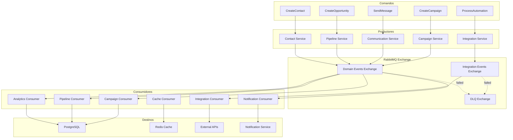

# Event Map

## Objetivo

Mapear todos os eventos de domínio, eventos de integração e comandos do sistema CRM SaaS Omnichannel, definindo productores, consumidores, regras de roteamento e convenções de nomenclatura.

## Escopo

Cobre a totalidade do fluxo de eventos entre os 8 bounded contexts, incluindo eventos publicados via RabbitMQ, comandos internos e integrações com sistemas externos.

## Responsabilidades

| Componente | Responsabilidade |
|---|---|
| **Event Bus (RabbitMQ)** | Broker central para publicação e consumo de eventos |
| **Event Store** | Persistência de eventos para auditoria e replay |
| **Command Handlers** | Processamento de comandos que disparam eventos |
| **Event Consumers** | Reação a eventos para atualizar estado ou disparar ações |
| **Dead Letter Queue** | Recebe eventos que falharam após retries |

## Fluxos

### Diagrama de Fluxo de Eventos



## Dependências

### Eventos de Domínio (Domain Events)

| Evento | Producer | Routing Key | Consumers |
|---|---|---|---|
| UserRegistered | Identity Service | `identity.user.registered` | Analytics, Notification |
| UserAuthenticated | Identity Service | `identity.user.authenticated` | Analytics, Cache |
| UserDeactivated | Identity Service | `identity.user.deactivated` | Notification |
| UserRoleChanged | Identity Service | `identity.user.role_changed` | Analytics |
| CompanyCreated | Company Service | `company.created` | Analytics, Integration, Notification |
| CompanyUpdated | Company Service | `company.updated` | Cache, Integration |
| PlanChanged | Company Service | `company.plan_changed` | Analytics, Notification |
| ContactCreated | Contact Service | `contact.created` | Pipeline, Campaign, Analytics, Integration |
| ContactUpdated | Contact Service | `contact.updated` | Cache, Integration, Campaign |
| ContactMerged | Contact Service | `contact.merged` | Analytics, Pipeline, Integration |
| ContactDeleted | Contact Service | `contact.deleted` | Cache, Campaign |
| LeadScoreChanged | Contact Service | `contact.lead.score_changed` | Pipeline, Campaign, Analytics |
| SegmentEntry | Contact Service | `contact.segment.entry` | Campaign, Analytics |
| SegmentExit | Contact Service | `contact.segment.exit` | Campaign, Analytics |
| OpportunityCreated | Pipeline Service | `pipeline.opportunity.created` | Analytics, Communication, Integration |
| OpportunityUpdated | Pipeline Service | `pipeline.opportunity.updated` | Analytics, Cache |
| StageChanged | Pipeline Service | `pipeline.stage.changed` | Analytics, Notification, Communication |
| OpportunityWon | Pipeline Service | `pipeline.opportunity.won` | Analytics, Notification, Campaign |
| OpportunityLost | Pipeline Service | `pipeline.opportunity.lost` | Analytics, Notification |
| ActivityLogged | Pipeline Service | `pipeline.activity.logged` | Analytics, Communication |
| ConversationStarted | Communication Service | `communication.conversation.started` | Pipeline, Analytics, Notification |
| ConversationAssigned | Communication Service | `communication.conversation.assigned` | Notification, Analytics |
| ConversationResolved | Communication Service | `communication.conversation.resolved` | Pipeline, Analytics, Campaign |
| MessageSent | Communication Service | `communication.message.sent` | Analytics, Integration |
| MessageReceived | Communication Service | `communication.message.received` | Pipeline, Analytics, Campaign, Notification |
| MessageDelivered | Communication Service | `communication.message.delivered` | Analytics |
| MessageRead | Communication Service | `communication.message.read` | Analytics |
| MessageFailed | Communication Service | `communication.message.failed` | Notification, Analytics |
| CampaignCreated | Campaign Service | `campaign.created` | Analytics |
| CampaignStarted | Campaign Service | `campaign.started` | Analytics, Communication, Notification |
| CampaignPaused | Campaign Service | `campaign.paused` | Analytics, Notification |
| CampaignCompleted | Campaign Service | `campaign.completed` | Analytics, Notification |
| CampaignConverted | Campaign Service | `campaign.converted` | Analytics, Pipeline |
| CampaignBudgetExceeded | Campaign Service | `campaign.budget_exceeded` | Notification, Analytics |
| ReportGenerated | Analytics Service | `analytics.report.generated` | Notification, Integration |
| ThresholdExceeded | Analytics Service | `analytics.threshold.exceeded` | Notification, Campaign |
| InsightCreated | Analytics Service | `analytics.insight.created` | Notification, Communication |
| IntegrationSynced | Integration Service | `integration.sync.completed` | Analytics, Notification |
| IntegrationFailed | Integration Service | `integration.sync.failed` | Notification, Analytics |
| WebhookReceived | Integration Service | `integration.webhook.received` | Pipeline, Contact, Communication |

### Comandos (Commands)

| Comando | Producer | Handler | Evento Gerado |
|---|---|---|---|
| RegisterUser | API Gateway | Identity Service | UserRegistered |
| AuthenticateUser | API Gateway | Identity Service | UserAuthenticated |
| CreateCompany | API Gateway | Company Service | CompanyCreated |
| UpdateCompany | API Gateway | Company Service | CompanyUpdated |
| ChangePlan | API Gateway | Company Service | PlanChanged |
| CreateContact | API Gateway / Integration | Contact Service | ContactCreated |
| UpdateContact | API Gateway / Integration | Contact Service | ContactUpdated |
| MergeContacts | API Gateway | Contact Service | ContactMerged |
| CalculateLeadScore | Automation | Contact Service | LeadScoreChanged |
| CreateOpportunity | API Gateway | Pipeline Service | OpportunityCreated |
| MoveStage | API Gateway | Pipeline Service | StageChanged |
| WinOpportunity | API Gateway | Pipeline Service | OpportunityWon |
| LoseOpportunity | API Gateway | Pipeline Service | OpportunityLost |
| LogActivity | API Gateway | Pipeline Service | ActivityLogged |
| StartConversation | API Gateway / Channel | Communication Service | ConversationStarted |
| AssignConversation | Automation / Manual | Communication Service | ConversationAssigned |
| ResolveConversation | Agent | Communication Service | ConversationResolved |
| SendMessage | Agent / Automation | Communication Service | MessageSent |
| CreateCampaign | API Gateway | Campaign Service | CampaignCreated |
| StartCampaign | API Gateway / Scheduler | Campaign Service | CampaignStarted |
| PauseCampaign | API Gateway | Campaign Service | CampaignPaused |
| CompleteCampaign | Scheduler | Campaign Service | CampaignCompleted |
| GenerateReport | API Gateway / Scheduler | Analytics Service | ReportGenerated |
| ProcessIntegration | Integration | Integration Service | IntegrationSynced |
| HandleWebhook | Integration | Integration Service | WebhookReceived |

### Eventos de Integração (Integration Events)

| Evento | Origem | Destino | Routing Key |
|---|---|---|---|
| SalesforceContactSynced | Salesforce Connector | Contact Service | `integration.salesforce.contact.synced` |
| SalesforceOpportunitySynced | Salesforce Connector | Pipeline Service | `integration.salesforce.opportunity.synced` |
| HubSpotContactSynced | HubSpot Connector | Contact Service | `integration.hubspot.contact.synced` |
| WhatsAppMessageReceived | WhatsApp API | Communication Service | `integration.whatsapp.message.received` |
| WhatsAppMessageStatus | WhatsApp API | Communication Service | `integration.whatsapp.message.status` |
| TwilioCallCompleted | Twilio Connector | Communication Service | `integration.twilio.call.completed` |
| StripePaymentReceived | Stripe Connector | Pipeline Service | `integration.stripe.payment.received` |
| SendGridEmailDelivered | SendGrid Connector | Communication Service | `integration.sendgrid.email.delivered` |

## Boas práticas

- Todos os eventos seguem o padrão **PastTense Verb** em inglês (ex: `ContactCreated`, `OpportunityWon`)
- Routing keys seguem o padrão `{context}.{entity}.{action}` em snake_case
- Payloads dos eventos são imutáveis e versionados (campo `eventVersion`)
- Cada evento contém obrigatoriamente: `eventId`, `eventType`, `aggregateId`, `tenantId`, `timestamp`, `correlationId`
- Eventos com falha são encaminhados para a Dead Letter Queue após 3 tentativas
- Retry com backoff exponencial: 1s, 5s, 30s antes de ir para DLQ
- Consumidores devem ser idempotentes — o mesmo evento pode ser processado mais de uma vez
- Event store mantém histórico completo para auditoria e capacidade de replay
- Partições por `tenantId` garantem isolamento no processamento

### Estrutura Padrão de Payload

```json
{
  "eventId": "uuid-v4",
  "eventType": "ContactCreated",
  "eventVersion": "1.0",
  "aggregateId": "contact-uuid",
  "tenantId": "tenant-uuid",
  "correlationId": "correlation-uuid",
  "timestamp": "2026-07-15T10:30:00Z",
  "metadata": {
    "userId": "user-uuid",
    "source": "api|automation|integration"
  },
  "data": {
  }
}
```

### Regras de Roteamento

| Exchange | Tipo | Binding Pattern | Descrição |
|---|---|---|---|
| domain-events | topic | `#` | Eventos de domínio internos |
| domain-events | topic | `pipeline.*` | Eventos de pipeline |
| domain-events | topic | `contact.*` | Eventos de contatos |
| domain-events | topic | `communication.*` | Eventos de comunicação |
| domain-events | topic | `campaign.*` | Eventos de campanhas |
| integration-events | topic | `integration.*` | Eventos de integração externa |
| dead-letter | fanout | `#` | Todos os eventos que falharam |

## Referências

- RabbitMQ Tutorials — rabbitmq.com
- Enterprise Integration Patterns — Gregor Hohpe
- Event-Driven Architecture — Martin Fowler
- Spring AMQP Reference Documentation

## Histórico de Revisão

| Versão | Data | Autor | Descrição |
|---|---|---|---|
| 1.0 | 2026-07-15 | Equipe de Arquitetura | Versão inicial do mapa de eventos |
