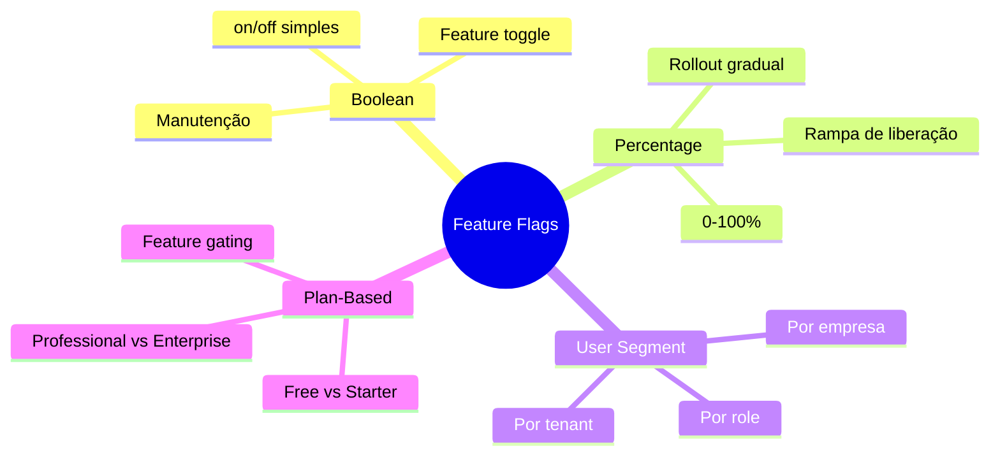
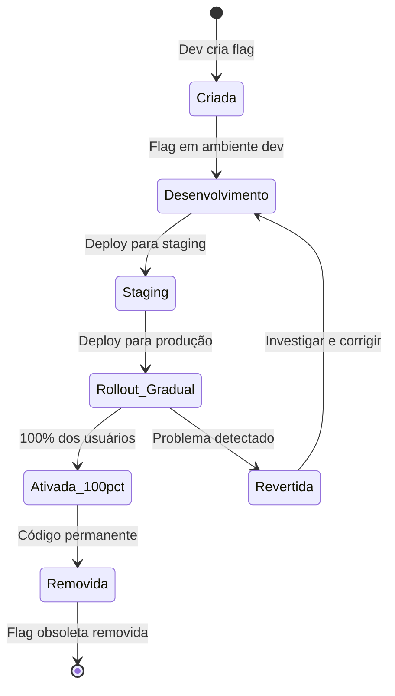
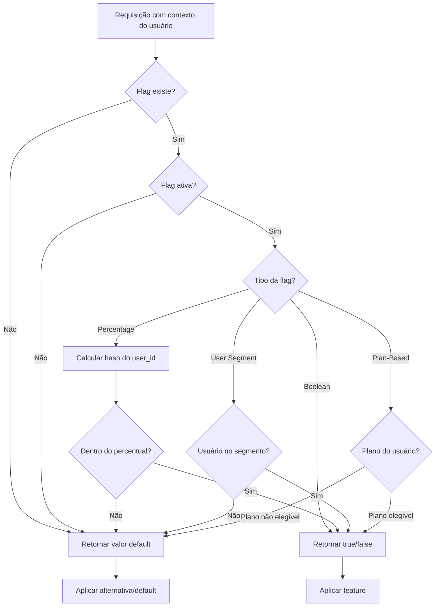
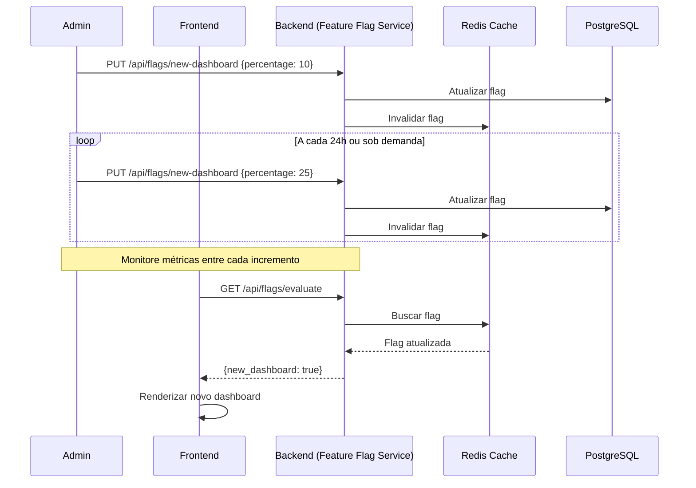
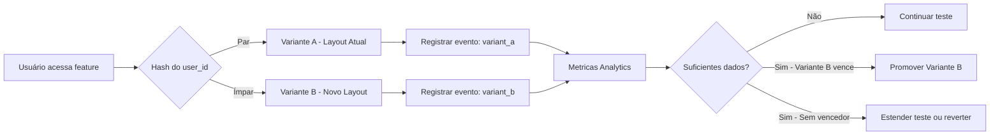
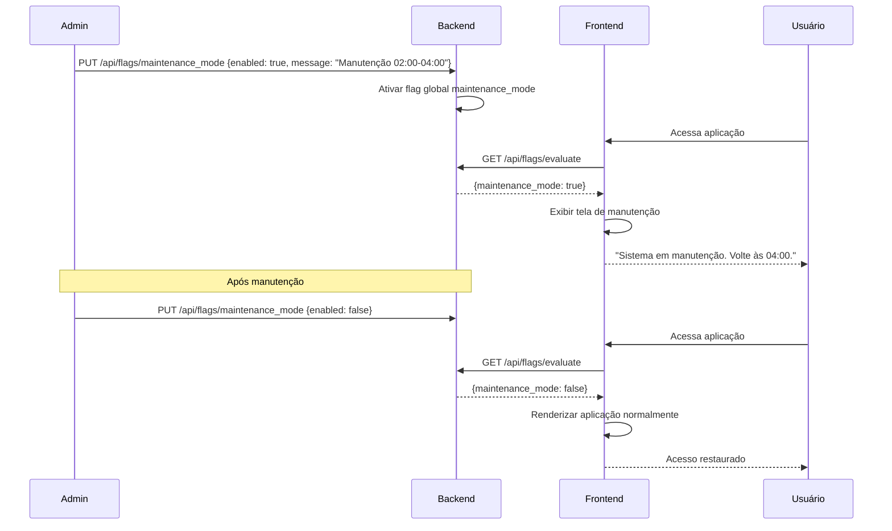

# Feature Flags

## Objetivo

Documentar o sistema de feature flags do CRM SaaS Omnichannel, definindo tipos, configuração, fluxo de avaliação e casos de uso para rollout gradual, testes A/B e modo de manutenção.

## Escopo

- Tipos de feature flags (boolean, percentage, user segment, plan-based)
- Configuração e armazenamento das flags
- Fluxo de avaliação das flags
- Casos de uso: rollout gradual, testes A/B, modo de manutenção
- Ciclo de vida das flags (criação, ativação, desativação, remoção)
- Interface de administração

## Responsabilidades

| Papel | Responsabilidade |
|---|---|
| Product Owner | Definir quais features terão flags e critérios de rollout |
| Backend Developer | Implementar engine de avaliação e API de gestão |
| Frontend Developer | Consumir flags na UI e implementar alternativas visuais |
| DevOps | Gerenciar configuração das flags em produção |
| QA | Testar comportamento com flags ativadas e desativadas |

## Fluxos

### Tipos de Feature Flags

### Ciclo de Vida de uma Feature Flag

### Fluxo de Avaliação

### Rollout Gradual

### Testes A/B

### Modo de Manutenção

## Dependências

| Dependência | Tipo | Uso |
|---|---|---|
| PostgreSQL | Infra | Armazenamento persistente das flags e regras |
| Redis | Infra | Cache de flags para avaliação de baixa latência |
| RabbitMQ | Infra | Eventos de mudança de flags para invalidação distribuída |
| Admin Dashboard (Next.js) | Interna | Interface de gestão das feature flags |
| Analytics Service | Interna | Métricas de uso por variante em testes A/B |

## Boas Práticas

- **Naming convention**: Usar formato `namespace.action.target` (ex: `dashboard.new_layout.rollout`).
- **Default seguro**: Sempre definir um valor default que mantém o comportamento anterior.
- **Documentação**: Cada flag deve ter descrição, responsável, data de criação e data de expiração esperada.
- **Cleanup**: Remover flags obsoletas do código e do banco periodicamente.
- **Monitoramento**: Acompanhar métricas de erro e uso antes, durante e após rollout.
- **Rollback rápido**: Ter processo documentado para desativar uma flag em caso de problema.
- **Ambientes separados**: Flags devem poder ter valores diferentes por ambiente (dev, staging, production).
- **Auditoria**: Registrar todas as mudanças de flags com timestamp e responsável.
- **Segmentação estável**: Usar hash determinístico do user_id para segmentação, não randomização.

## Referências

- [Feature Flags Best Practices](https://launchdarkly.com/blog/feature-flag-best-practices/)
- [Martin Fowler - Feature Toggles](https://martinfowler.com/bliki/FeatureToggle.html)
- [Unleash Feature Flag Documentation](https://docs.getunleash.io/)

## Histórico de Revisão

| Versão | Data | Autor | Descrição |
|---|---|---|---|
| 1.0 | 15/07/2026 | Paulo Alves | Criação inicial do documento |
