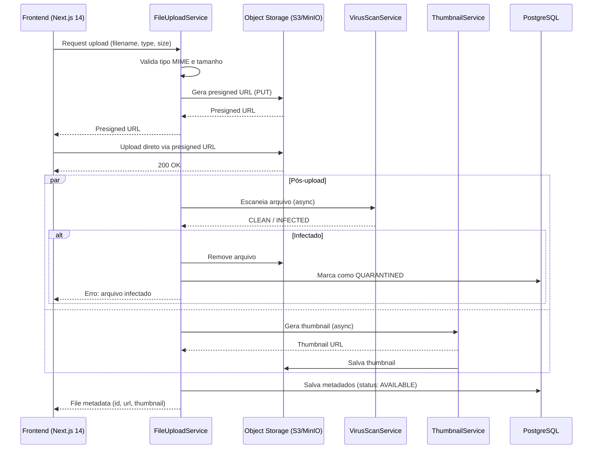
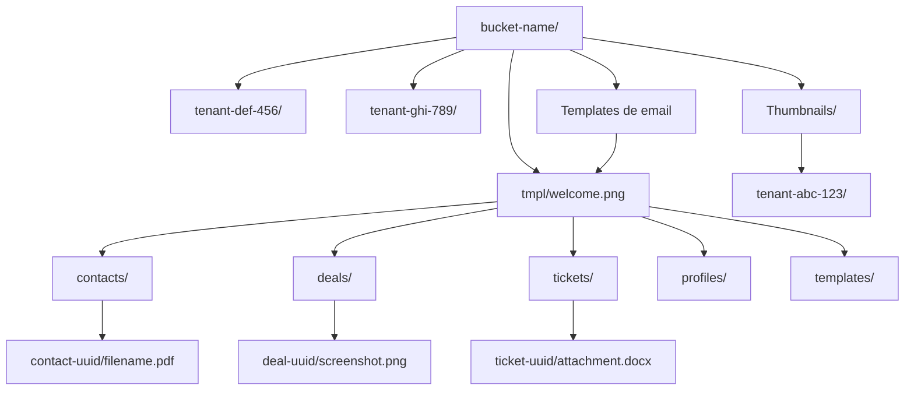
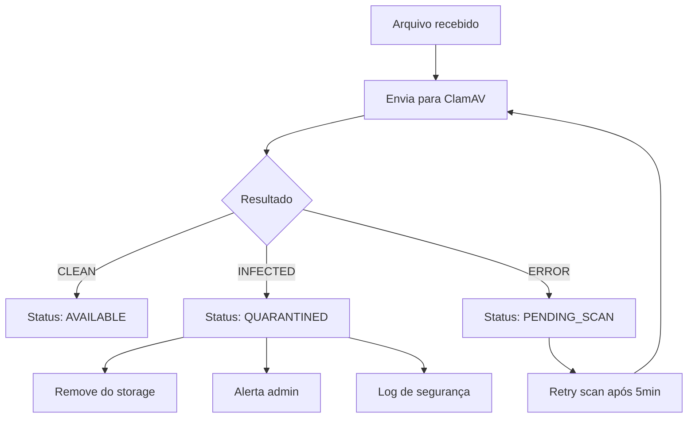
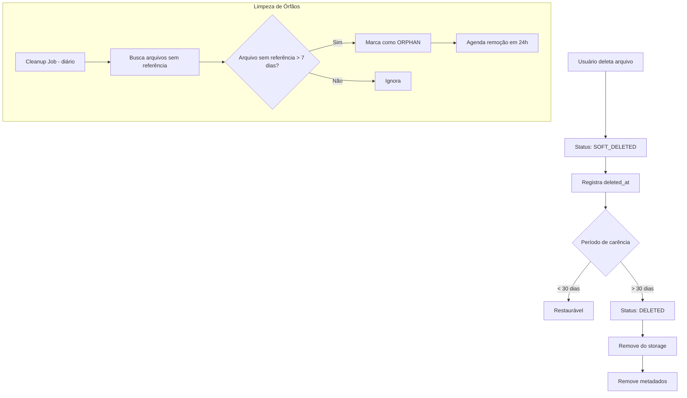
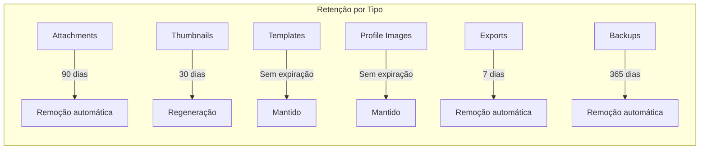

# File Lifecycle

## Objetivo

Documentar o ciclo de vida completo dos arquivos no CRM SaaS Omnichannel, desde o upload até a exclusão, incluindo organização de armazenamento, validação de tipos e tamanhos, geração de thumbnails, verificação de vírus, soft delete, limpeza de órfãos e políticas de retenção.

## Escopo

- Upload flow (presigned URL, multipart, streaming)
- Organização de armazenamento por tenant e contexto
- Tipos de arquivo permitidos e limites de tamanho
- Geração de thumbnails para imagens e PDFs
- Verificação de vírus (ClamAV)
- Soft delete e recuperação
- Limpeza de arquivos órfãos
- Políticas de retenção por tipo de arquivo
- Integração com object storage (S3/MinIO)
- Metadados de arquivo no PostgreSQL

## Responsabilidades

| Responsável | Responsabilidade |
|---|---|
| FileUploadService | Orquestração do upload: validação, presigning, persistência de metadados |
| FileStorageService | Abstração de storage: S3/MinIO; organização de paths por tenant |
| ThumbnailService | Geração de thumbnails para imagens (JPEG/PNG/WebP) e primeira página de PDFs |
| VirusScanService | Verificação de vírus via ClamAV; bloqueio de arquivos infectados |
| FileMetadataRepository | Persistência de metadados (nome, tipo, tamanho, path, tenant) no PostgreSQL |
| CleanupScheduler | Job agendado para limpeza de arquivos órfãos e expirados |
| RetentionPolicyService | Aplicação de políticas de retenção por tipo de arquivo e tenant |

## Fluxos

### Fluxo de Upload

### Organização de Armazenamento

### Verificação de Vírus

### Soft Delete e Limpeza

### Políticas de Retenção

## Dependências

| Dependência | Finalidade |
|---|---|
| PostgreSQL 16 | Metadados de arquivo (nome, tipo, tamanho, path, status, tenant) |
| Redis 7 | Cache de presigned URLs; controle de upload rate limiting |
| S3/MinIO | Object storage para arquivos e thumbnails |
| ClamAV | Verificação de vírus |
| Spring Boot 3 | Framework de orquestração |
| Java 25 | Linguagem de implementação |
| Apache Tika | Detecção de tipo MIME real (bypass de extensão) |
| Thumbnailator / imgscalr | Geração de thumbnails |
| Next.js 14 (frontend) | Interface de upload e preview de arquivos |

## Boas Práticas

- **Validação server-side**: sempre validar tipo MIME real via Apache Tika, não apenas extensão do arquivo
- **Presigned URLs**: usar presigned URLs para upload direto ao S3; não passar arquivos pelo backend
- **Tenant isolation**: cada tenant deve ter um prefixo separado no bucket; nunca compartilhar paths entre tenants
- **Soft delete**: arquivos nunca devem ser removidos imediatamente; sempre usar soft delete com período de carência
- **Idempotência**: upload com mesmo hash (SHA-256) deve reutilizar arquivo existente (deduplicação)
- **Thumbnails sob demanda**: gerar thumbnails no primeiro acesso, não no upload; cachear no Redis
- **Scan async**: verificação de vírus deve ser assíncrona; não bloquear o upload; marcar como PENDING_SCAN até conclusão
- **Cleanup job**: executar limpeza diariamente; remover arquivos ORPHAN após 24h; remover SOFT_DELETED após 30 dias
- **Rate limiting**: limitar upload por tenant (ex: 100MB/hora para planos free)
- **Logging**: registrar todas as operações de arquivo com tenant_id, user_id, action; não logar conteúdo
- **Backup de metadados**: metadados no PostgreSQL devem ser backupados; arquivos no S3 devem ter versionamento ativado
- **Max file size**: limitar por tipo (attachments: 25MB, profile images: 5MB, exports: 50MB)

## Referências

- AWS S3 Presigned URLs: https://docs.aws.amazon.com/AmazonS3/latest/userguide/PresignedUrl.html
- Apache Tika MIME Detection: https://tika.apache.org/
- ClamAV: https://www.clamav.net/
- LGPD - Art. 15 (eliminação de dados após finalidade)

## Histórico de Revisão

| Versão | Data | Autor | Descrição |
|---|---|---|---|
| 1.0 | 2026-07-15 | Paulo Alves | Criação inicial do documento |
