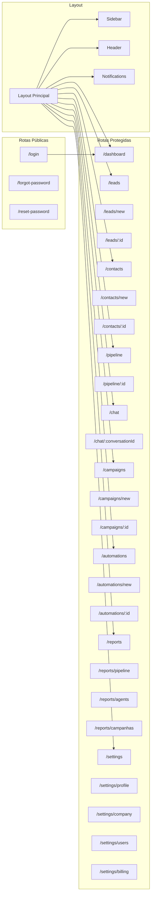
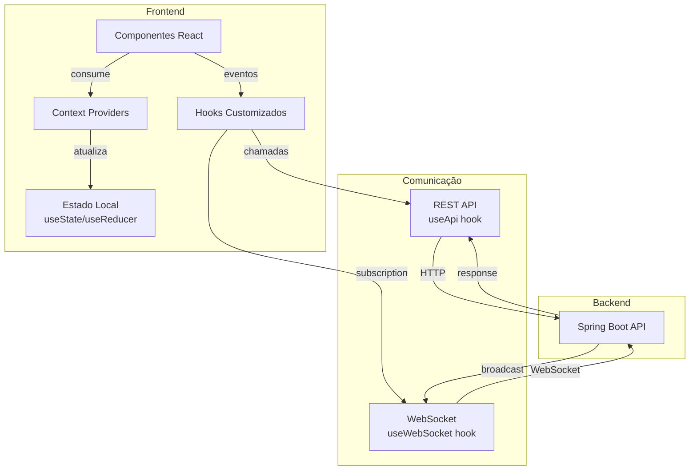

# FRONTEND_MAP — Mapa do Frontend

## Objetivo

Fornecer uma visão consolidada do frontend Next.js com rotas, componentes, hooks, contextos e fluxo de dados.

## Índice

- [Rotas](#rotas)
- [Componentes Principais](#componentes-principais)
- [Hooks](#hooks)
- [Contextos](#contextos)
- [Fluxo de Dados](#fluxo-de-dados)
- [Referências](#referências)
- [Histórico de Revisão](#histórico-de-revisão)

---

## Rotas

| Rota | Componente | Permissão |
|---|---|---|
| `/login` | LoginPage | Público |
| `/forgot-password` | ForgotPasswordPage | Público |
| `/reset-password` | ResetPasswordPage | Público |
| `/dashboard` | DashboardPage | AGENT+ |
| `/leads` | LeadsListPage | AGENT+ |
| `/leads/new` | LeadCreatePage | AGENT+ |
| `/leads/:id` | LeadDetailPage | AGENT+ |
| `/contacts` | ContactsListPage | AGENT+ |
| `/contacts/new` | ContactCreatePage | AGENT+ |
| `/contacts/:id` | ContactDetailPage | AGENT+ |
| `/pipeline` | PipelinePage | AGENT+ |
| `/pipeline/:id` | PipelineDetailPage | AGENT+ |
| `/chat` | ChatPage | AGENT+ |
| `/chat/:conversationId` | ConversationPage | AGENT+ |
| `/campaigns` | CampaignsListPage | MANAGER+ |
| `/campaigns/new` | CampaignCreatePage | MANAGER+ |
| `/campaigns/:id` | CampaignDetailPage | MANAGER+ |
| `/automations` | AutomationsListPage | MANAGER+ |
| `/automations/new` | AutomationCreatePage | MANAGER+ |
| `/automations/:id` | AutomationDetailPage | MANAGER+ |
| `/reports` | ReportsPage | MANAGER+ |
| `/settings` | SettingsPage | ADMIN+ |

**Fonte:** [02-frontend/Routing.md](./02-frontend/Routing.md)

---

## Componentes Principais

### Layout

| Componente | Localização | Descrição |
|---|---|---|
| `AppLayout` | `components/layout/` | Layout principal (sidebar + header + content) |
| `Sidebar` | `components/layout/` | Menu lateral colapsável |
| `Header` | `components/layout/` | Barra superior (busca, notificações, perfil) |
| `PageHeader` | `components/layout/` | Cabeçalho de cada página |

### UI (Shadcn UI)

| Componente | Descrição |
|---|---|
| `Button` | Botões (variantes: default, destructive, outline, ghost) |
| `Input` | Campos de entrada |
| `Select` | Dropdowns |
| `Dialog` | Modais |
| `Table` | Tabelas com paginação |
| `Card` | Cards de conteúdo |
| `Badge` | Badges/etiquetas |
| `Tabs` | Abas |
| `Toast` | Notificações temporárias |
| `Skeleton` | Loading states |

### Feature Components

| Componente | Módulo | Descrição |
|---|---|---|
| `KanbanBoard` | Pipeline | Quadro kanban com drag-and-drop |
| `KanbanColumn` | Pipeline | Coluna do kanban |
| `KanbanCard` | Pipeline | Card da oportunidade |
| `ChatWindow` | Chat | Janela de conversa |
| `MessageBubble` | Chat | Balão de mensagem |
| `ConversationList` | Chat | Lista de conversas |
| `ContactCard` | Contacts | Card de contato |
| `LeadScore` | Leads | Indicador de score |
| `PipelineMetrics` | Pipeline | Métricas do pipeline |
| `CampaignStats` | Campaigns | Estatísticas da campanha |

**Fonte:** [02-frontend/Components.md](./02-frontend/Components.md)

---

## Hooks

| Hook | Descrição |
|---|---|
| `useAuth` | Autenticação (login, logout, user) |
| `useApi` | Requisições HTTP (GET, POST, PUT, DELETE) |
| `useWebSocket` | Conexão WebSocket |
| `usePagination` | Paginação de listas |
| `useDebounce` | Debounce para buscas |
| `useLocalStorage` | Persistência local |
| `useToast` | Notificações toast |
| `useConfirm` | Confirmações de ação |
| `useMediaQuery` | Responsividade |
| `useClickOutside` | Fechar dropdowns/modais |

**Fonte:** [02-frontend/Hooks.md](./02-frontend/Hooks.md)

---

## Contextos

| Contexto | Provider | Descrição |
|---|---|---|
| `AuthContext` | `AuthProvider` | Estado de autenticação global |
| `ThemeContext` | `ThemeProvider` | Tema (light/dark) |
| `NotificationContext` | `NotificationProvider` | Notificações em tempo real |
| `WebSocketContext` | `WebSocketProvider` | Conexão WebSocket |

**Fonte:** [02-frontend/Context.md](./02-frontend/Context.md)

---

## Fluxo de Dados

### Fluxo de Login

1. `LoginPage` → `useAuth().login(email, senha)`
2. `AuthContext` → `POST /api/v1/auth/login`
3. Response → `AuthContext` armazena tokens
4. `AuthContext` → Redireciona para `/dashboard`

### Fluxo de Lista

1. `Page` → `useApi().get('/endpoint')`
2. `useApi` → `GET /api/v1/endpoint`
3. Response → Estado do componente
4. Componente renderiza `Table` com dados

### Fluxo de Chat

1. `ChatPage` → `useWebSocket().subscribe('chat')`
2. `WebSocketProvider` → Conecta ao WS
3. Nova mensagem → `NotificationContext` atualiza
4. Componente renderiza nova mensagem

---

## Referências

| Documento | Caminho |
|---|---|
| Overview | [02-frontend/Overview.md](./02-frontend/Overview.md) |
| Layout | [02-frontend/Layout.md](./02-frontend/Layout.md) |
| Components | [02-frontend/Components.md](./02-frontend/Components.md) |
| Hooks | [02-frontend/Hooks.md](./02-frontend/Hooks.md) |
| Context | [02-frontend/Context.md](./02-frontend/Context.md) |
| Routing | [02-frontend/Routing.md](./02-frontend/Routing.md) |
| Theme | [02-frontend/Theme.md](./02-frontend/Theme.md) |
| Forms | [02-frontend/Forms.md](./02-frontend/Forms.md) |
| Validation | [02-frontend/Validation.md](./02-frontend/Validation.md) |
| SUMMARY | [SUMMARY.md](./SUMMARY.md) |

---

## Histórico de Revisão

| Versão | Data | Autor | Descrição |
|---|---|---|---|
| 1.0.0 | 2026-07-15 | Architect | Criação inicial do mapa do frontend |
