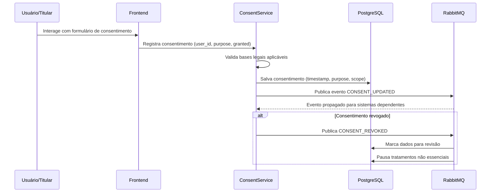
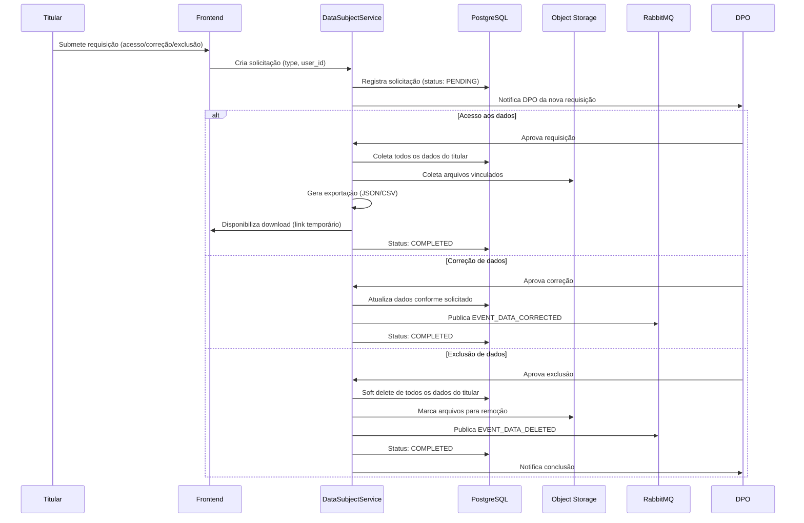
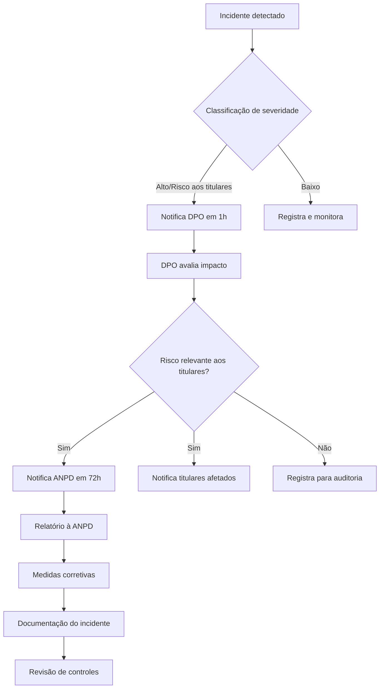
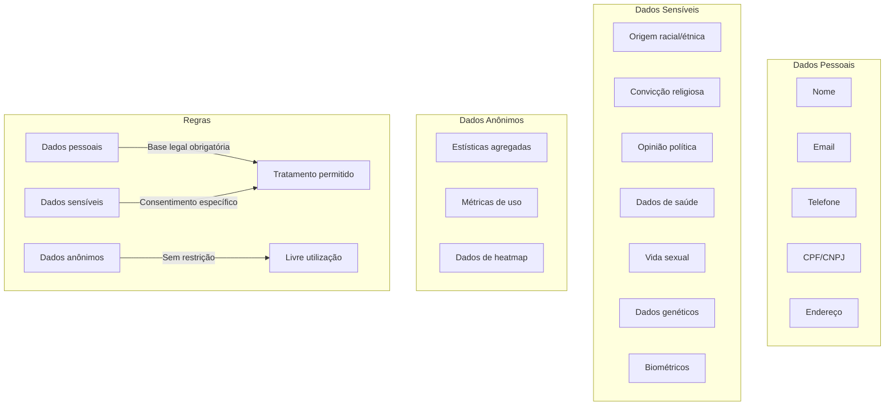
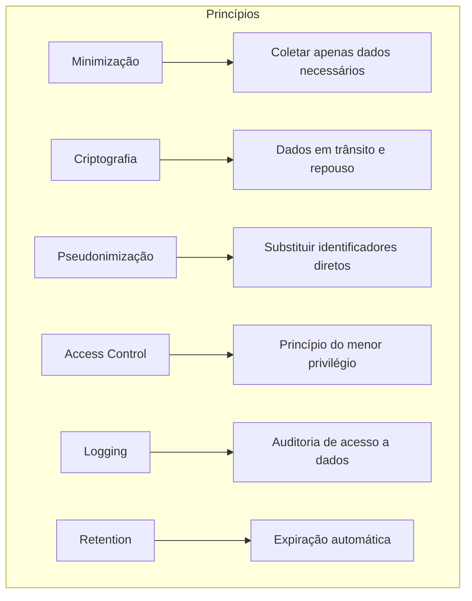

# LGPD

## Objetivo

Documentar o compliance da plataforma CRM SaaS Omnichannel com a Lei Geral de Proteção de Dados (LGPD - Lei 13.709/2018), cobrindo classificação de dados, gestão de consentimento, direitos dos titulares, retenção, responsabilidades do DPO, privacy by design, registros de tratamento e notificação de incidentes.

## Escopo

- Classificação de dados (pessoais, sensíveis, anônimos)
- Gestão de consentimento (obtção, registro, revogação)
- Direitos dos titulares (acesso, correção, exclusão, portabilidade)
- Políticas de retenção e eliminação de dados
- Responsabilidades do Encarregado (DPO)
- Princípios de privacy by design
- Registros de operações de tratamento
- Notificação de incidentes de segurança
- Data Processing Agreements (DPA)
- Transferência internacional de dados
- Consentimento para comunicações de marketing

## Responsabilidades

| Responsável | Responsabilidade |
|---|---|
| DPO (Encarregado) | Supervisão de compliance LGPD; ponto de contato com ANPD e titulares |
| DataClassificationService | Classificação automática de dados; aplicação de labels de sensibilidade |
| ConsentService | CRUD de consentimentos; registro de bases legais; verificação antes de tratamento |
| DataSubjectService | Processamento de requisições de titulares (acesso, correção, exclusão, portabilidade) |
| RetentionPolicyService | Aplicação de políticas de retenção; agendamento de exclusão automática |
| AuditLogService | Registro de todas as operações de tratamento; logs imutáveis |
| BreachNotificationService | Detecção e notificação de incidentes; comunicação com ANPD e titulares |
| PrivacyService | Privacy by design: pseudonimização, minimização, criptografia |
| TenantAdmin | Configuração de consentimento e retenção por tenant |

## Fluxos

### Fluxo de Consentimento

### Fluxo de Requisição de Titular

### Fluxo de Notificação de Incidente

### Classificação de Dados

### Privacy by Design

## Dependências

| Dependência | Finalidade |
|---|---|
| PostgreSQL 16 | Persistência de consentimentos, solicitações, audit logs |
| Redis 7 | Cache de consentimentos para verificação rápida |
| RabbitMQ 3 | Eventos de consentimento e incidentes |
| Spring Boot 3 | Framework de implementação |
| Java 25 | Linguagem de implementação |
| Flyway 10 | Migrações de schema para audit logs e consent records |
| Next.js 14 (frontend) | Interface de consentimento e portal do titular |

## Boas Práticas

- **Consentimento granular**: consentimento deve ser por finalidade (marketing, analytics, comunicação); nunca consentimento único genérico
- **Registro de consentimento**: cada consentimento deve ter timestamp, versão da política, escopo e método de obtenção
- **Revogação fácil**: titular deve poder revogar consentimento com a mesma facilidade que concedeu (máximo 2 cliques)
- **Minimização**: coletar apenas dados estritamente necessários para a finalidade declarada
- **Criptografia**: dados pessoais devem ser criptografados em repouso (AES-256) e em trânsito (TLS 1.3)
- **Pseudonimização**: em logs e analytics, substituir identificadores diretos por tokens pseudônimos
- **Audit trail**: toda operação de tratamento de dados pessoais deve ser logged com timestamp, user_id, action, purpose
- **Backup criptografado**: backups de dados pessoais devem ser criptografados com chaves dedicadas
- **Tenant isolation**: dados de diferentes tenants nunca devem ser misturados; isolation no nível de schema ou row-level security
- **Retention automática**: policy de retenção deve ser aplicada por job agendado; dados expirados devem ser eliminados automaticamente
- **DPO access**: DPO deve ter acesso a todos os dados e logs sem necessidade de aprovação adicional
- **Training**: toda equipe deve ser treinada em práticas de proteção de dados anualmente

## Referências

- LGPD - Lei 13.709/2018: https://www.planalto.gov.br/ccivil_03/_ato2015-2018/2018/lei/l13709.htm
- ANPD - Autoridade Nacional de Proteção de Dados: https://www.gov.br/anpd/
- GDPR (referência complementar): https://gdpr.eu/
- ISO 27001 - Segurança da Informação: https://www.iso.org/standard/27001
- NIST Privacy Framework: https://www.nist.gov/privacy-framework

## Histórico de Revisão

| Versão | Data | Autor | Descrição |
|---|---|---|---|
| 1.0 | 2026-07-15 | Paulo Alves | Criação inicial do documento |
