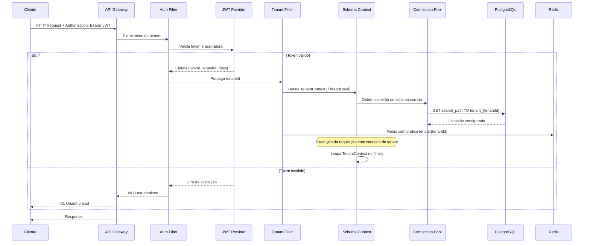
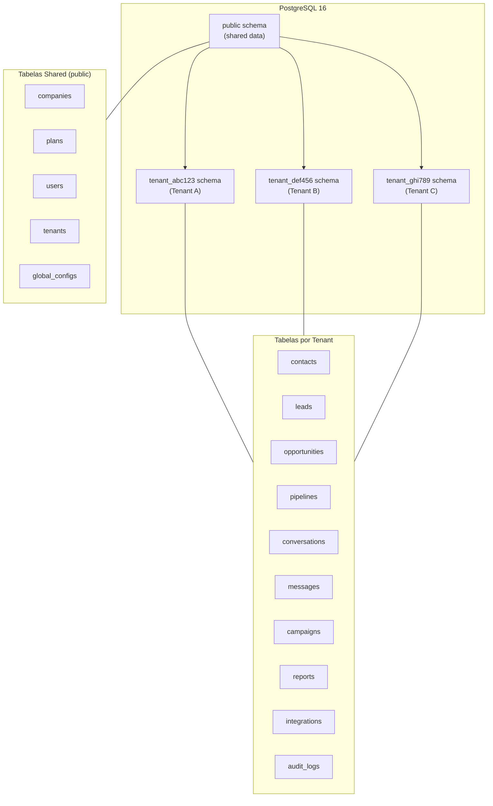
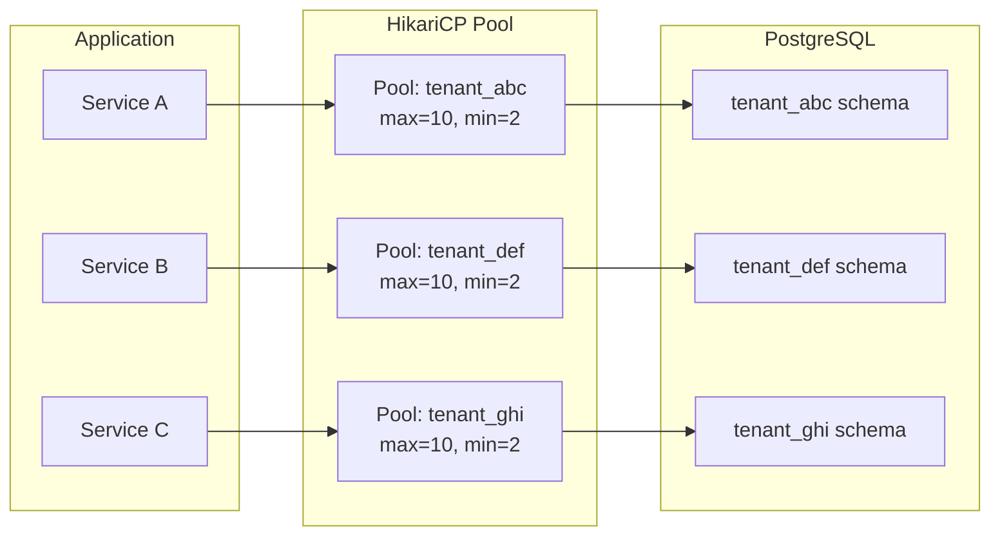
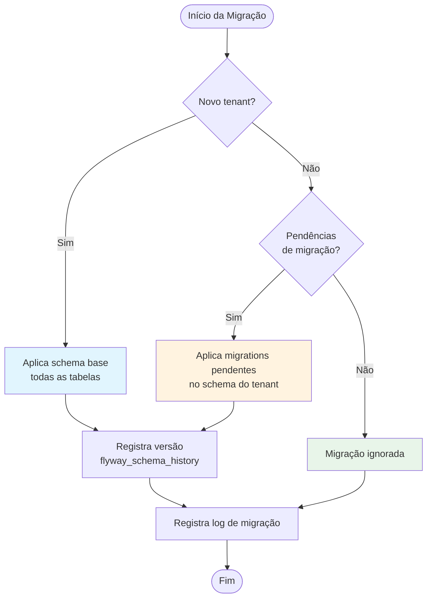

# Multi-Tenancy

## Objetivo

Documentar a arquitetura de multi-tenancy do CRM SaaS Omnichannel, definindo isolamento de dados por schema, resolução de tenant, contexto propagado via JWT, pool de conexões, estratégia de migrações e backup por tenant.

## Escopo

Cobre toda a infraestrutura de isolamento entre tenants, desde a camada de API até o banco de dados, incluindo Redis, RabbitMQ e camadas de cache.

## Responsabilidades

| Componente | Responsabilidade |
|---|---|
| **Tenant Filter** | Intercepta requisições e extrai tenantId do JWT |
| **Schema Router** | Redireciona conexões PostgreSQL para o schema correto |
| **JWT Provider** | Emite e valida tokens com claim `tenantId` |
| **Flyway Migrator** | Aplica migrações individualmente por schema de tenant |
| **Connection Pooler** | Gerencia pool de conexões com isolamento por tenant |
| **Redis Prefixer** | Adiciona prefixo de tenant nas chaves Redis |
| **Backup Service** | Executa backups individualizados por tenant |

## Fluxos

### Diagrama de Resolução de Tenant



### Diagrama de Estrutura de Schemas



## Dependências

### Resolução de Tenant

O tenant é resolvido em cada requisição através do seguinte fluxo:

1. **JWT Header**: Token contém claim `tenantId` no payload
2. **Tenant Filter (OncePerRequestFilter)**: Intercepts every request
3. **TenantContext (ThreadLocal)**: Armazena tenantId para toda a duração da requisição
4. **Schema Router**: Configura `search_path` na conexão PostgreSQL

### Estrutura do JWT

```json
{
  "sub": "user-uuid",
  "tenantId": "tenant-uuid",
  "roles": ["admin", "agent"],
  "schema": "tenant_abc123",
  "iat": 1752595800,
  "exp": 1752682200
}
```

### Tenant Context Filter

```
Request → JWT Validation → Extract tenantId → Set TenantContext → Process → Clear TenantContext
```

O TenantContext é implementado como ThreadLocal com limpeza automática no finally block para evitar vazamento entre threads.

## Fluxos (continuação)

### Pool de Conexões por Tenant



| Configuração | Valor | Descrição |
|---|---|---|
| maximumPoolSize | 10 por tenant | Máximo de conexões simultâneas por tenant |
| minimumIdle | 2 por tenant | Mínimo de conexões em idle |
| connectionTimeout | 30000ms | Tempo máximo para obter conexão |
| idleTimeout | 600000ms | Tempo para liberar conexão idle |
| maxLifetime | 1800000ms | Vida máxima de uma conexão |
| leakDetectionThreshold | 60000ms | Alerta de leak de conexão |

### Migrações por Tenant (Flyway)



| Etapa | Descrição |
|---|---|
| 1. Migrations compartilhadas | Arquivos em `db/migration/shared/` aplicados a todos os schemas |
| 2. Migrations por tenant | Flyway itera sobre cada schema de tenant e aplica pendências |
| 3. Novo tenant | Schema criado a partir de migrations completas ( bootstrap ) |
| 4. Rollback | Operação manual com script de reversão; não automático |
| 5. Versionamento | Tabela `flyway_schema_history` isolada por schema |

### Estrutura de Diretórios Flyway

```
db/
  migration/
    shared/
      V1__create_plans_table.sql
      V2__create_companies_table.sql
      V3__create_users_table.sql
    tenant/
      V1__create_contacts_table.sql
      V2__create_leads_table.sql
      V3__create_pipelines_table.sql
      V4__create_opportunities_table.sql
      V5__create_conversations_table.sql
      V6__create_messages_table.sql
      V7__create_campaigns_table.sql
      V8__create_reports_table.sql
      V9__create_integrations_table.sql
      V10__create_audit_logs_table.sql
```

### Isolamento de Dados

| Camada | Estratégia de Isolamento |
|---|---|
| **PostgreSQL** | Schema separado por tenant (`tenant_{id}`) |
| **Redis** | Prefixo de chave: `tenant:{tenantId}:{key}` |
| **RabbitMQ** | Vhost exclusivo por tenant OU prefixo na routing key |
| **File Storage** | Diretório: `/{tenantId}/attachments/` |
| **Cache (Application)** | Key prefix `cache:{tenantId}:{entity}:{id}` |
| **Logs** | Campo `tenantId` em todas as linhas de log estruturado |
| **Audit Trail** | Tabela `audit_logs` isolada no schema do tenant |
| **Metrics** | Tag `tenant_id` em todas as métricas Micrometer |

### Backup por Tenant

```mermaid
flowchart TB
    SCHEDULE[Cron: 02:00 AM UTC] --> LIST[Lista todos os tenants ativos]

    LIST --> LOOP{Para cada tenant}

    LOOP --> SNAPSHOT[pg_dump schema tenant_{id}]
    SNAPSHOT --> COMPRESS[Comprime com gzip]
    COMPRESS --> UPLOAD[Upload para S3 bucket privado]
    UPLOAD --> VERIFY[Verifica integridade SHA-256]
    VERIFY --> RETAIN[Aplica política de retenção<br/>30 dias]

    RETAIN --> NEXT{Próximo tenant?}
    NEXT -->|Sim| LOOP
    NEXT -->|Não| NOTIFY[Notifica time de ops]
    NOTIFY --> END([Fim])
```

| Configuração | Valor |
|---|---|
| Frequência | Diária às 02:00 UTC |
| Retenção | 30 dias (configurável por tenant) |
| Storage | S3 bucket com AES-256 encryption |
| Compressão | gzip (redução média de 70%) |
| Verificação | SHA-256 checksum após upload |
| Restauração | Script automatizado com target_schema |
| Snapshot compartilhado | Backup do schema `public` separadamente |

### Checklist de Isolamento

| Critério | Implementação |
|---|---|
| Um tenant não acessa dados de outro | Schema isolation + TenantContext filter |
| Tenant ausente na requisição bloqueia acesso | TenantFilter rejeita requests sem tenantId |
| Migrations não afetam outros schemas | Flyway itera por schema independentemente |
| Redis não vaza dados entre tenants | Prefixo obrigatório em todas as operações |
| Logs permitem rastreabilidade por tenant | tenantId em todas as linhas estruturadas |
| Backup é granular e restaurável | pg_dump por schema + verificação de integridade |
| Rate limiting é por tenant | Redis key: `ratelimit:{tenantId}:{endpoint}` |
| File uploads são isolados | Path: `{tenantId}/attachments/{fileId}` |

## Boas práticas

- Nunca executar queries sem `search_path` configurado — usar o TenantContext sempre
- TenantContext deve ser limpo no finally block para evitar vazamento entre threads
- Migrações devem ser testadas individualmente para cada schema antes de produção
- Backups devem ser testados periodicamente com restauração em ambiente de staging
- Rate limiting configurado por tenant para evitar noisy neighbor
- Monitoring com dashboards segregados por tenant para detecção de anomalias
- PII (dados pessoais) isolado com criptografia adicional no schema do tenant
- Hard delete proibido — usar soft delete com `deleted_at` timestamp
- Conexões com search_path devem ser validadas no startup do application
- Pool de conexões dimensionado conforme tier do plano do tenant

## Referências

- PostgreSQL Schema Documentation — postgresql.org
- Multi-Tenancy with Spring Boot — spring.io
- SaaS Multi-Tenancy Patterns — Microsoft Azure Architecture Center
- Flyway Teams Edition — Documentation

## Histórico de Revisão

| Versão | Data | Autor | Descrição |
|---|---|---|---|
| 1.0 | 2026-07-15 | Equipe de Arquitetura | Versão inicial da arquitetura multi-tenancy |
