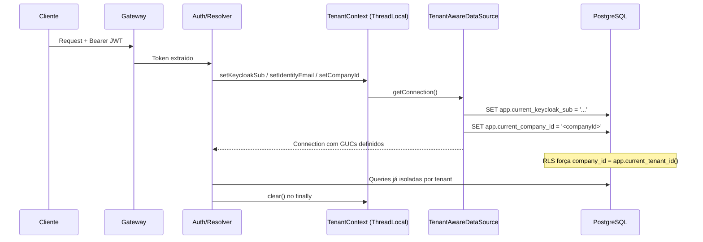

# Multi-Tenancy

## Objetivo

Documentar a arquitetura de multi-tenancy do CRM SaaS Omnichannel: **schema compartilhado (shared schema) com Row Level Security (RLS) FORCE**, sem separação física por schema. O isolamento é garantido por coluna `company_id` em todas as tabelas tenant-scoped, por policies RLS atreladas a um contexto de aplicação (GUCs do PostgreSQL) e por `FORCE ROW LEVEL SECURITY` que impede desvios mesmo para o usuário de aplicação.

> **Nota histórica.** O design inicial previa schema-por-tenant (`tenant_{id}`) com `search_path`. Este modelo foi **substituído** pelo shared schema + RLS (V013/V019 em diante). Este documento descreve exclusivamente a arquitetura real vigente.

## Escopo

Cobre o isolamento entre tenants na camada de aplicação (ThreadLocal → datasource → GUC → RLS), as tabelas tenant-scoped versus globais, membresias (1:N usuário→empresa), empresas ativas, switcher, convites por token, quotas por plano, uso e auditoria.

## Termos

| Termo | Definição |
|---|---|
| **Tenant** | Empresa do CRM representada pela tabela `companies` (tabela global). |
| **company_id** | Coluna de isolamento presente em todas as tabelas tenant-scoped. |
| **GUC** | *Grand Unified Configuration* do PostgreSQL: variáveis de sessão setadas a cada conexão. |
| **RLS FORCE** | `ALTER TABLE ... FORCE ROW LEVEL SECURITY`: RLS vale para todos, inclusive tables owners/usuário de app. |
| **Membership** | Relação usuário↔empresa (1:N), fonte de verdade de associação. |
| **Company Switcher** | Fluxo de troca da empresa ativa de um usuário multi-empresa. |

## Componentes e responsabilidades

| Componente | Responsabilidade |
|---|---|
| **`TenantContext`** (ThreadLocal) | Guarda `companyId`, `keycloakSub`, `identityEmail`, `identityPhone`, `resetToken` por requisição; limpo no `finally`. |
| **`TenantAwareDataSource`** | A cada `getConnection()`, emite `SET`/`RESET` dos GUCs de contexto a partir do ThreadLocal. |
| **`app.current_tenant_id()`** | Função SQL STABLE que lê `app.current_company_id` e devolve UUID (ou NULL). |
| **`app.is_super_admin()`** | Função SQL que verifica role `SUPER_ADMIN` na empresa ativa. |
| **Policies RLS** | `tenant_isolation_policy` (and colleagues) filtrando por `company_id = app.current_tenant_id()`. |
| **`CurrentUser` resolver** | Resolve o usuário autenticado e define `TenantContext` + GUCs (sub/e-mail antes do company). |
| **`AuditContext`** | Atores/IP/User-Agent da auditoria (interceptor HTTP). |
| **`TenantAuditRecorder`** | Registra auditoria de tenant com fallback de ator, setando/restaurando o tenant no escopo. |

## Mecanismo de contexto (ThreadLocal → GUC → RLS)

### Fluxo por requisição

### GUCs relevantes

| GUC | Preenchido por | Uso (policy) |
|---|---|---|
| `app.current_keycloak_sub` | `TenantContext` | Bootstrap de identidade (V022/V025): ler a própria linha em `users`. |
| `app.current_identity_email` | `TenantContext` | Bootstrap por e-mail (V024/V025). |
| `app.current_identity_phone` | `TenantContext` | Bootstrap por telefone/OTP (V024/V026). |
| `app.current_reset_token` | `TenantContext` | Reset de senha anônimo (V028). |
| `app.current_company_id` | `TenantContext` | Isolamento de tenant nas policies. |
| `app.invitation_token_hash` | `set_invitation_token_context` | Acesso por token a `invitations` (V036). |

### Isolamento de dados

| Camada | Estratégia |
|---|---|
| **PostgreSQL** | Shared schema + RLS FORCE por `company_id`. |
| **Aplicação** | `TenantContext` ThreadLocal, limpo no `finally`. |
| **Audit Trail** | Tabela `audit_logs` tenant-scoped (RLS FORCE). |
| **Storage** | Tabela `storage_objects` tenant-scoped (RLS FORCE, V037). |

## Tabelas tenant-scoped vs globais

Tabelas **tenant-scoped** (RLS FORCE por `company_id`): `users`, `roles`, `user_roles`, `audit_logs`, `company_settings`, `subscriptions`, `pipelines`, `stages`, `opportunities`, `opportunity_history` (via join com opportunities), `contacts`, `leads`, `memberships`, `invitations`, `storage_objects`.

Tabelas **globais** (SEM RLS): `companies` (tabela de tenants), `permissions`, `role_permissions`, `refresh_tokens`, `password_reset_tokens`.

## Membresias e empresa ativa

- `memberships` (V030) é a **fonte de verdade** da relação usuário↔empresa (1:N): `user_id`, `company_id`, `role`, `status` (`ACTIVE`/`PENDING`/`REMOVED`).
- `users.company_id` permanece NOT NULL como **empresa ativa** denormalizada, mantido consistente pelo trigger `app.membership_sync_active_company` (define `company_id` apenas quando a membership inserida é a ÚNICA ativa do usuário).
- Duas camadas de policy:
  - `membership_own_policy` (SELECT): usuário vê apenas as PRÓPRIAS memberships (cross-company, para `/me/memberships`).
  - `membership_tenant_policy` (ALL): dentro do tenant, membros/gestores operam memberships da própria empresa.
- Remoção de membro perde acesso via remoção de `user_roles` + gate de membership ativa na resolução do `CurrentUser`.

### Company Switcher

A troca de empresa ativa (multi-empresa) é feita pelo fluxo de switch (Sprint 8.4), que valida a membership `ACTIVE` na empresa de destino e re-resolve roles/`company_id`; registrada em auditoria (action `TENANTS UPDATE`).

## Convites (Sprint 8.5) — RLS por token

- `invitations` (V036) rastreáveis por e-mail, com `token_hash` (SHA-256 hex) — o token **nunca** é persistido em texto puro.
- Roles fixas no convite: `ADMIN | MANAGER | AGENT | VIEWER`; `SUPER_ADMIN` jamais concedível; `OWNER` exclusivo do onboarding.
- Policies:
  - `invitations_admin_select_policy` / `invitations_admin_write_policy` — acesso administrativo por `company_id` (RBAC exige ADMIN/OWNER no serviço).
  - `invitations_token_select_policy` / `invitations_token_update_policy` — aceite/recusa por `token_hash = app.current_invitation_token_hash()`, independente de membership (cross-tenant não vaza).

## Quotas por plano e uso (Sprint 8.6)

- Cada `company` carrega limites do plano: `maxUsers`, `maxContacts`, `maxStorageMb`.
- Defaults (`CompanyService`): `maxUsers = 5`, `maxContacts = 500`, `maxStorageMb = 1024`.
- `CompanyQuotaService` expõe `usage(...)` e asserts (`assertCanAddContact`, `assertCanAddSpace`), contando ativos e pendentes (convites), contatos e bytes de storage.
- Enforcement lança `QuotaExceededException` → HTTP **422** (`QUOTA_EXCEEDED`) — ex.: bloqueia convite/aceite quando `activeMembers + pendingInvites >= maxUsers`.
- `GET /companies/{id}/usage` retorna `CompanyUsageResponse` (users/contacts/storage) para consumo (frontend).

## Auditoria de tenant (Sprint 8.6)

- `TenantAuditRecorder` lê o `AuditContext` (ator/IP/UA), com fallback de `actorUserId`, e **seta/restaura** o tenant (GUC `app.current_company_id`) no escopo para gravar `audit_logs` mesmo fora do contexto normal da requisição.
- Eventos auditados nesta sprint: criação/aceite/revogação de convite, membership removida (`DELETE` da membership), empresa ativa trocada (`TENANTS UPDATE`).

## Boas práticas

- Nunca rodar queries sem o GUC de tenant definido quando a tabela for tenant-scoped.
- `TenantContext` limpo no `finally` para evitar vazamento entre threads.
- Migrações estruturais usam `pg_catalog` para verificação (imune a RLS).
- Backfill de dados sob RLS FORCE é best-effort quando roda como usuário de app; sincronização garantida é feita em startup por seeders (ex.: `MembershipDataSeeder`).
- Hard delete proibido para dados de negócio — usar soft delete com `deleted_at`.

## Histórico de Revisão

| Versão | Data | Autor | Descrição |
|---|---|---|---|
| 1.0 | 2026-07-15 | Equipe de Arquitetura | Versão inicial (schema-per-tenant) — **superada** |
| 2.0 | 2026-08-12 | Equipe de Arquitetura | Reescrita para o modelo real: shared schema + RLS FORCE, memberships, switcher, invitations, quotas, auditoria |