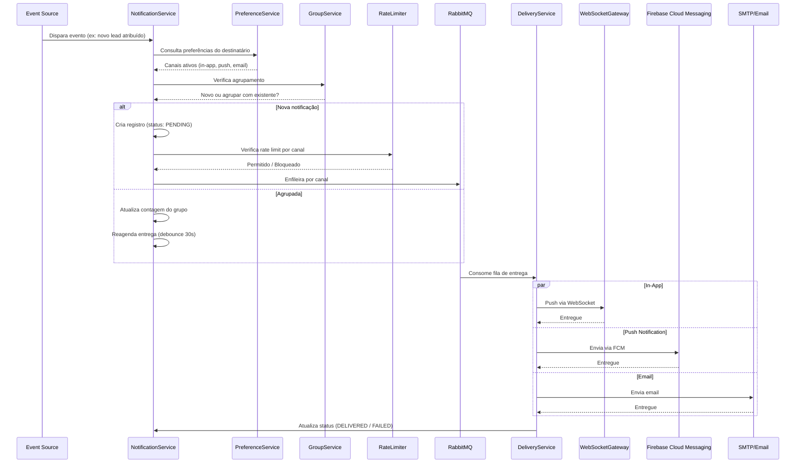
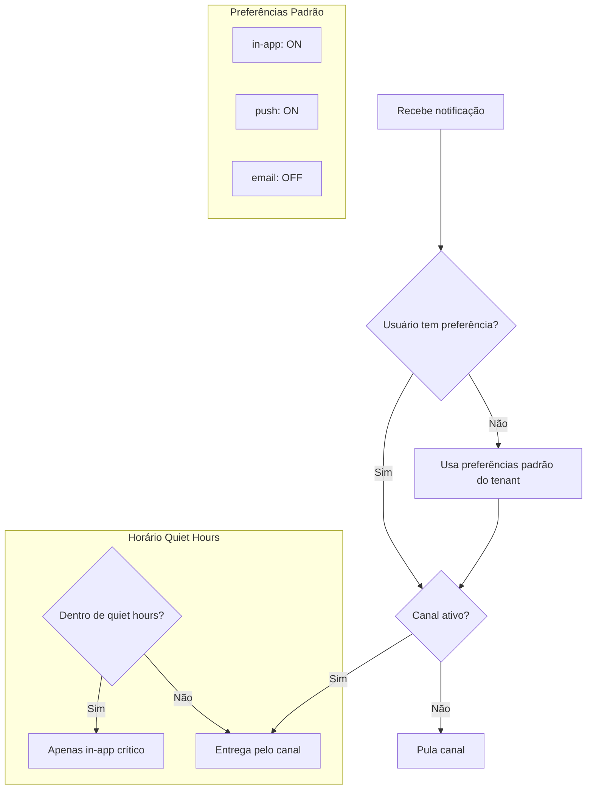
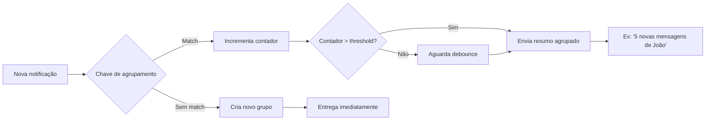
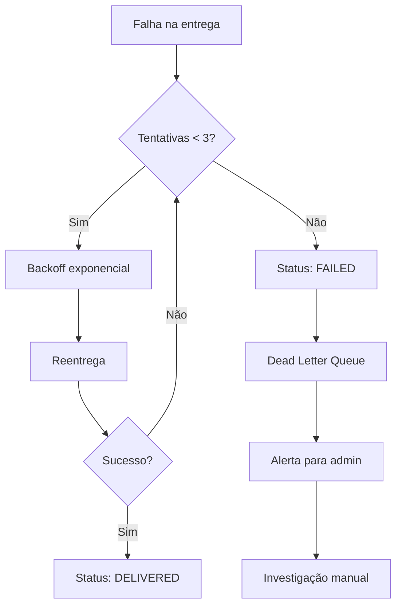

# Notification Architecture

## Objetivo

Definir a arquitetura do sistema de notificações do CRM SaaS Omnichannel, cobrindo todos os canais de entrega (in-app, push, email), preferências do usuário, agrupamento, throttling, garantias de entrega e o sistema de templates.

## Escopo

- Notificações in-app via WebSocket (push do navegador)
- Notificações push via Firebase Cloud Messaging (FCM)
- Notificações por email via SMTP/SES
- Preferências de notificação por usuário e por tenant
- Agrupamento e deduplicação de notificações
- Throttling e rate limiting por canal
- Sistema de templates com variáveis
- Garantias de entrega (at-least-once)
- Retry policy com backoff exponencial
- Filas de processamento assíncrono via RabbitMQ

## Responsabilidades

| Responsável | Responsabilidade |
|---|---|
| NotificationService | Orquestração central: recebe evento, seleciona canais, aplica preferências, despacha para filas |
| NotificationPreferenceService | CRUD de preferências do usuário; determina canais ativos |
| TemplateService | Renderização de templates com variáveis; versionamento de templates |
| DeliveryService | Envio efetivo por canal (WebSocket push, FCM, SMTP) |
| NotificationGroupService | Agrupamento e deduplicação de notificações semelhantes |
| RateLimiter | Throttling por canal, por usuário e por tenant |
| NotificationRepository | Persistência de notificações (PostgreSQL); status de entrega |
| WebSocketGateway | Push de notificações in-app para clientes conectados |

## Fluxos

### Fluxo Geral de Notificação

### Preferências de Notificação

### Agrupamento de Notificações

### Retry e Dead Letter

## Dependências

| Dependência | Finalidade |
|---|---|
| PostgreSQL 16 | Persistência de notificações, preferências e templates |
| Redis 7 | Cache de preferências; rate limiting; controle de agrupamento |
| RabbitMQ 3 | Filas assíncronas de entrega por canal |
| Firebase Cloud Messaging | Entrega de push notifications para dispositivos móveis e web |
| SMTP/Amazon SES | Envio de emails transacionais |
| WebSocket (STOMP/SockJS) | Push de notificações in-app em tempo real |
| Spring Boot 3 | Framework de orquestração |
| Java 25 | Linguagem de implementação |

## Boas Práticas

- **Preferências primeiro**: sempre consultar as preferências do usuário antes de enviar; nunca notificar por canais desativados
- **Quiet Hours**: respeitar horários de silêncio configurados; apenas notificações críticas (SLA, segurança) devem ignorar quiet hours
- **Agrupamento inteligente**: agrupar notificações repetitivas (ex: "novo lead", "mensagem recebida") para evitar spam; debounce de 30 segundos para agrupamento
- **Idempotência**: cada notificação deve ter um `idempotency_key` para evitar envios duplicados
- **Rate limiting**: aplicar limites por canal, por usuário e por tenant; usar sliding window com Redis
- **Templates versionados**: manter versão de templates; nunca alterar templates em produção sem migração
- **Dead letter queue**: monitorar DLQ; alertar quando notificações falham após retries
- **Métricas**: instrumentar taxa de entrega, latência por canal, taxa de falha; integrar com Prometheus/Grafana
- **Payload mínimo**: enviar apenas dados essenciais nos templates; não expor dados sensíveis em notificações push
- **Soft delete**: notificações deletadas pelo usuário devem ser marcadas como REMOVED, não removidas fisicamente
- **Tenant isolation**: notificações e preferências devem ser sempre filtradas por `tenant_id`

## Referências

- Firebase Cloud Messaging: https://firebase.google.com/docs/cloud-messaging
- Spring WebSocket: https://docs.spring.io/spring-framework/reference/web/websocket.html
- RabbitMQ Quorum Queues: https://www.rabbitmq.com/docs/quorum-queues
- LGPD - Art. 7º (bases legais para tratamento de dados)
- LGPD - Art. 9º (direito de informação ao titular)

## Histórico de Revisão

| Versão | Data | Autor | Descrição |
|---|---|---|---|
| 1.0 | 2026-07-15 | Paulo Alves | Criação inicial do documento |
