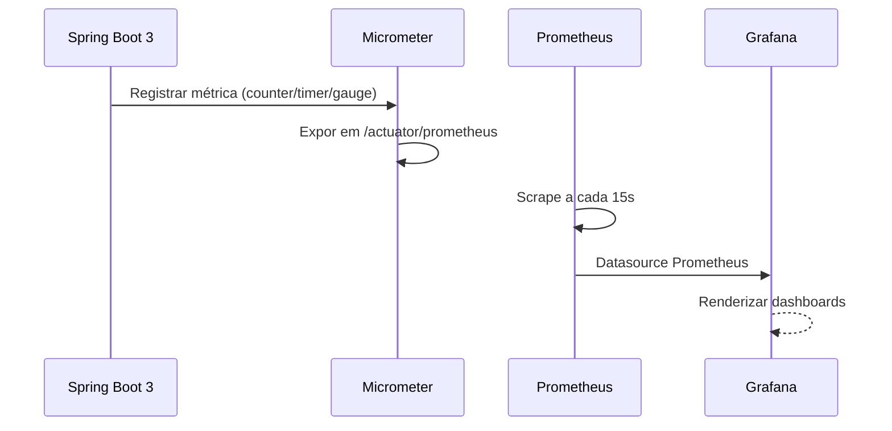
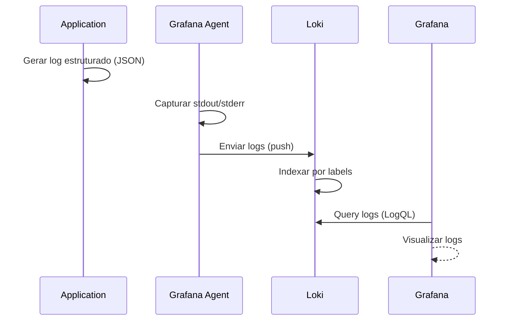
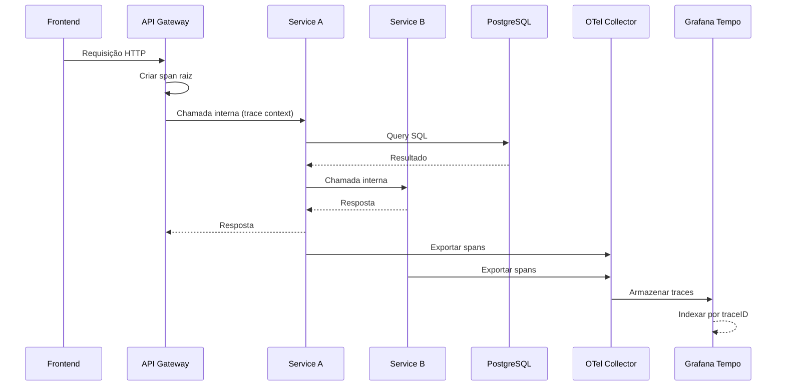
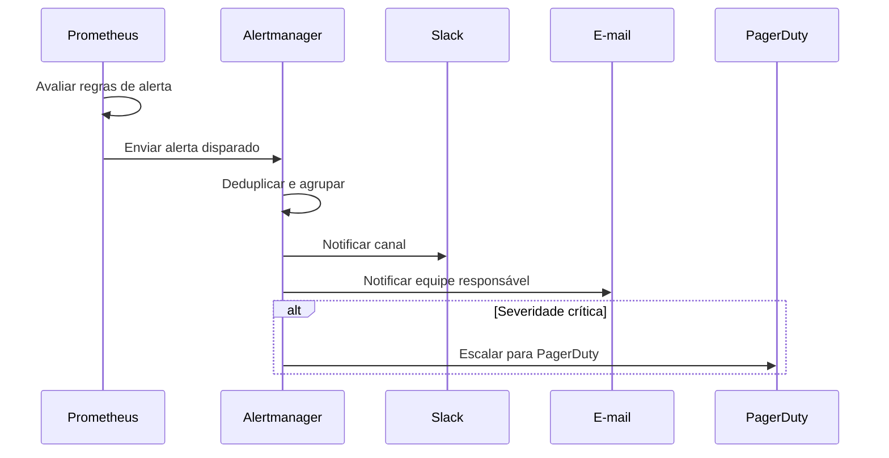
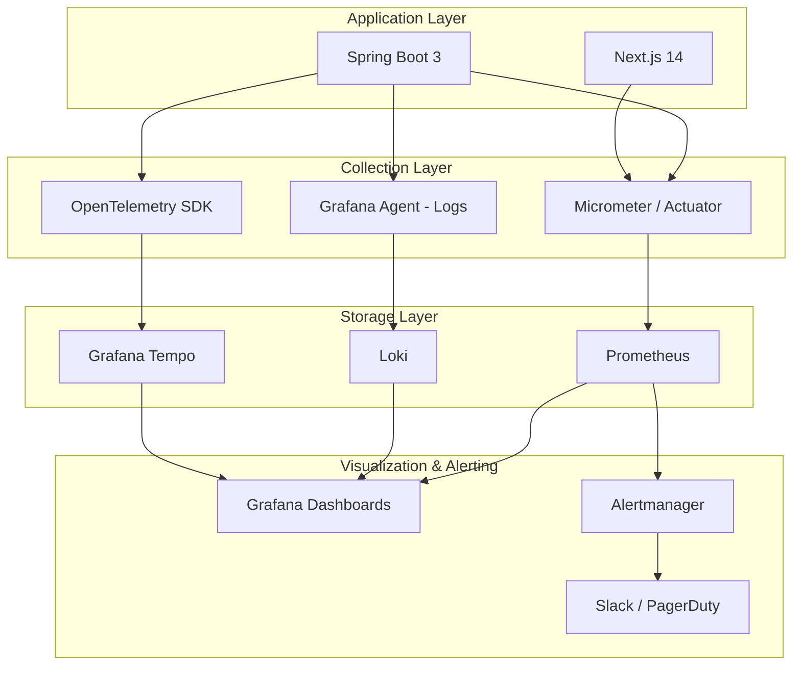

# Observabilidade

## Objetivo

Definir a estratégia de observabilidade do CRM SaaS Omnichannel, cobrindo métricas, logs, traces e alertas, para garantir visibilidade completa sobre a saúde, performance e comportamento do sistema em produção. A observabilidade deve permitir detecção proativa de incidentes, diagnóstico rápido de falhas e tomada de decisão baseada em dados (SLOs/SLIs).

## Escopo

- Métricas via Prometheus com exportação por Micrometer (Spring Boot 3)
- Logs estruturados via Loki com coleta por Grafana Agent
- Traces distribuídos via OpenTelemetry
- Dashboards operacionais e de negócio via Grafana
- Alertas via Alertmanager integrado com Slack, e-mail e PagerDuty
- Definição de SLOs e SLIs para serviços críticos
- Health checks, readiness e liveness probes no Kubernetes/Docker

## Responsabilidades

| Área | Responsabilidade |
|---|---|
| Backend (Spring Boot) | Exportar métricas Micrometer, logs estruturados JSON, traces OpenTelemetry |
| Frontend (Next.js) | Web Vitals, erros de cliente via Sentry, métricas de performance |
| Infraestrutura | Configurar Prometheus, Loki, Grafana, Alertmanager, Grafana Agent |
| SRE / Operações | Definir SLOs, configurar alertas, responder incidentes |
| Desenvolvimento | Criar dashboards, instrumentar código, escrever logs de negócio |

## Fluxos

### Fluxo de Coleta de Métricas

### Fluxo de Coleta de Logs

### Fluxo de Traces Distribuídos

### Fluxo de Alertas

### Arquitetura Geral de Observabilidade

## Dependências

| Dependência | Versão | Uso |
|---|---|---|
| Prometheus | latest | Coleta e armazenamento de métricas (time-series) |
| Grafana | latest | Dashboards, visualização de métricas, logs e traces |
| Loki | latest | Armazenamento e indexação de logs estruturados |
| Grafana Tempo | latest | Backend de traces distribuídos |
| OpenTelemetry | latest | Instrumentação de traces e spans |
| Grafana Agent | latest | Coleta e forward de logs e métricas |
| Alertmanager | latest | Gerenciamento e roteamento de alertas |
| Spring Boot | 3 | Micrometer para exportação de métricas |
| Micrometer | via Spring Boot | Abstração de métricas para Prometheus |

## Boas Práticas

- **Métricas de Four Golden Signals**: Monitorar latência, tráfego, erros e saturação para cada serviço
- **SLOs mensuráveis**: Definir disponibilidade ≥ 99,9% e latência p99 < 200ms para APIs críticas
- **Logs estruturados**: Utilizar JSON com campos padronizados (`timestamp`, `level`, `service`, `traceId`, `spanId`)
- **Correlation ID**: Propagar `traceId` em todos os logs e respostas HTTP para rastreabilidade
- **Health checks**: Implementar `/actuator/health` com checks para PostgreSQL, Redis e RabbitMQ
- **Liveness vs Readiness**: `liveness` deve verificar apenas se o processo está vivo; `readiness` deve verificar dependências externas
- **Alertas acionáveis**: Cada alerta deve ter um runbook vinculado e uma pessoa/equipe responsável
- **Dashboard por camada**: Criar dashboards separados para infraestrutura, aplicação e negócio
- **Retenção de dados**: Prometheus (15 dias hot + 90 dias em Thanos/Cortex), Loki (30 dias), Tempo (7 dias)

## Referências

- [Prometheus - Getting Started](https://prometheus.io/docs/prometheus/latest/getting_started/)
- [Grafana Loki Documentation](https://grafana.com/docs/loki/latest/)
- [OpenTelemetry - Java SDK](https://opentelemetry.io/docs/instrumentation/java/)
- [Spring Boot - Actuator](https://docs.spring.io/spring-boot/docs/current/reference/html/actuator.html)
- [Google SRE Book - SLOs](https://sre.google/sre-book/service-level-objectives/)

## Histórico de Revisão

| Data | Versão | Autor | Descrição |
|---|---|---|---|
| 15/07/2026 | 1.0 | Equipe de Arquitetura | Versão inicial da documentação de observabilidade |
