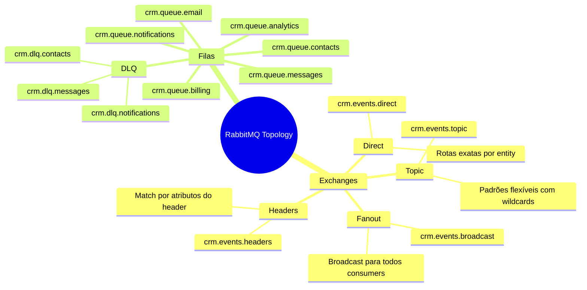
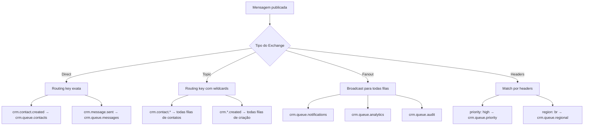
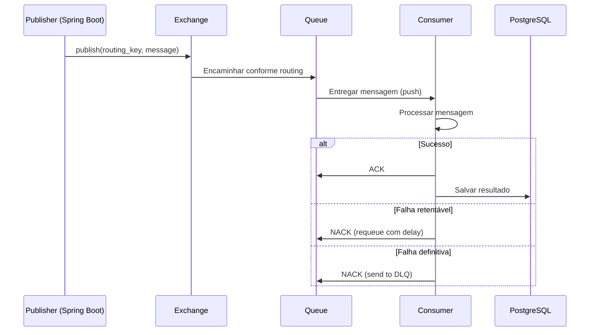
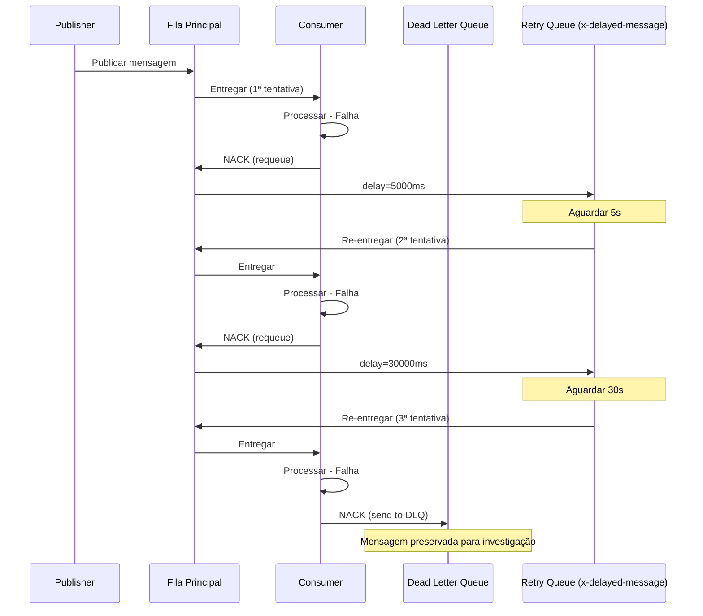
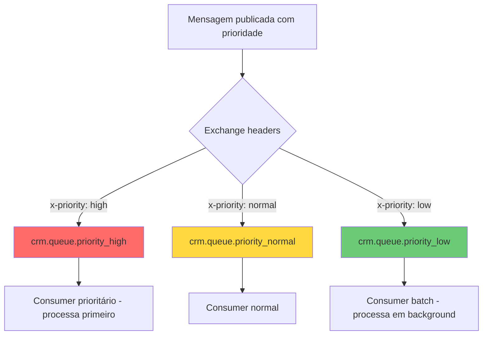
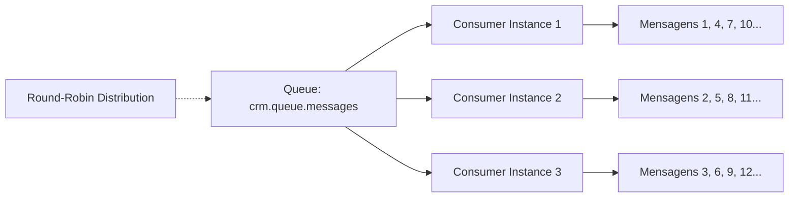
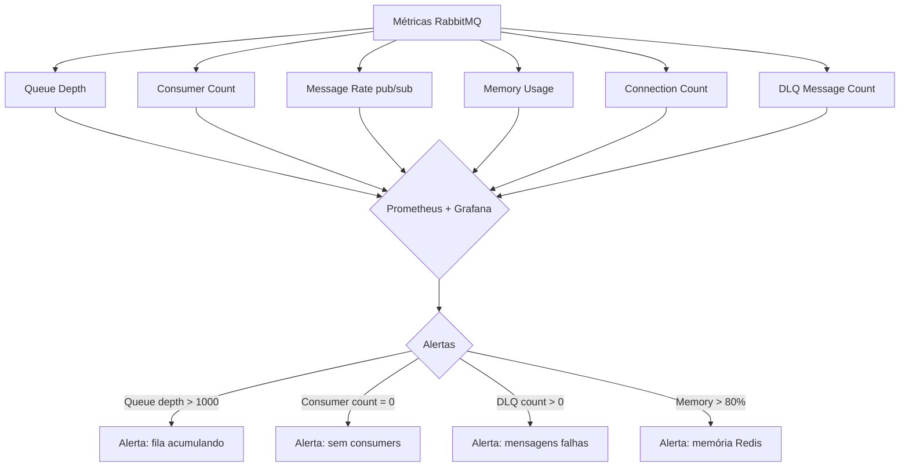

# Queue Architecture

## Objetivo

Documentar a arquitetura de filas do CRM SaaS Omnichannel utilizando RabbitMQ, incluindo tipos de exchanges, convenções de nomenclatura, routing keys, dead letter queues, mecanismos de retry, filas de prioridade, grupos de consumers e monitoramento.

## Escopo

- Tipos de exchanges (direct, topic, fanout, headers)
- Convenções de nomenclatura de filas e routing keys
- Dead letter queues (DLQ) e tratamento de mensagens falhas
- Mecanismos de retry com backoff exponencial
- Filas de prioridade
- Grupos de consumers e balanceamento de carga
- Monitoramento e alertas

## Responsabilidades

| Papel | Responsabilidade |
|---|---|
| Backend Developer | Definir publishers e consumers das filas |
| Architect | Projetar topologia de exchanges e filas |
| DevOps | Instalar, configurar e monitorar RabbitMQ |
| QA | Testar cenários de retry, DLQ e prioridade |

## Fluxos

### Visão Geral da Topologia



### Tipos de Exchange e Uso



### Convenções de Nomenclatura

```
Exchange:
  crm.events.{type}
  Exemplos:
    crm.events.direct     → Eventos com routing exato
    crm.events.topic      → Eventos com padrões flexíveis
    crm.events.broadcast  → Eventos broadcast

Queue:
  crm.queue.{domain}
  Exemplos:
    crm.queue.contacts      → Processamento de contatos
    crm.queue.messages      → Envio de mensagens
    crm.queue.notifications → Notificações push/email
    crm.queue.billing       → Processamento de cobrança
    crm.queue.analytics     → Métricas e analytics
    crm.queue.email         → Envio de emails transacionais

Routing Key:
  crm.{entity}.{action}
  Exemplos:
    crm.contact.created
    crm.contact.updated
    crm.message.sent
    crm.invoice.paid

Dead Letter Queue:
  crm.dlq.{domain}
  Exemplos:
    crm.dlq.contacts
    crm.dlq.messages
```

### Fluxo de Publicação e Consumo



### Dead Letter Queue e Retry

```mermaid
flowchart TD
    A[Mensagem na fila principal] --> B[Tenta processar]
    B --> C{Sucesso?}
    C -->|Sim| D[ACK - Mensagem removida]
    C -->|Não| E{Tentativas < 3?}
    E -->|Sim| F[NACK com delay exponencial]
    F --> F1[Retry 1: 5 segundos]
    F1 --> F2[Retry 2: 30 segundos]
    F2 --> F3[Retry 3: 2 minutos]
    F3 --> B
    E -->|Não| G[NACK - Enviar para DLQ]
    G --> H[crm.dlq.{domain}]
    H --> I{Mensagem na DLQ}
    I -->|Investigação manual| J[Reprocessar manualmente]
    I -->|Descartar| K[ACK na DLQ]
    I -->|Reenviar para fila| L[Replay para fila principal]
```

### Mecanismo de Retry com Backoff Exponencial



### Filas de Prioridade



### Consumer Groups e Load Balancing



### Monitoramento



## Dependências

| Dependência | Tipo | Uso |
|---|---|---|
| RabbitMQ 3 | Infra | Broker de mensageria |
| PostgreSQL 16 | Infra | Persistência dos dados processados |
| Redis 7 | Infra | Cache e controle de deduplicação |
| Spring AMQP | Lib | Integração RabbitMQ com Spring Boot |
| Prometheus | Infra | Coleta de métricas do RabbitMQ |
| Grafana | Infra | Dashboards de monitoramento |

## Boas Práticas

- **Idempotência**: Todos os consumers devem ser idempotentes. Usar message ID para deduplicação.
- **DLQ sempre presente**: Toda fila deve ter uma DLQ associada.
- **Dead lettering com TTL**: Configurar TTL nas filas DLQ para evitar acumulação infinita.
- **Prefetch limit**: Configurar prefetch count adequado por consumer para não sobrecarregar.
- **Ack/Nack explícito**: Sempre confirmar processamento explicitamente. Nunca auto-ack.
- **Message TTL**: Definir TTL nas mensagens para evitar processamento de dados obsoletos.
- **Durable queues**: Todas as filas e exchanges devem ser duráveis (durable=true).
- **Monitoring ativo**: Monitorar depth de filas, taxa de mensagens e DLQ em tempo real.
- **Batch para alta volumetria**: Usar batch consumers para filas de analytics e métricas.
- **Segregação por domínio**: Cada domínio do negócio deve ter suas filas dedicadas.

## Referências

- [RabbitMQ Documentation](https://www.rabbitmq.com/docs)
- [RabbitMQ Dead Letter Exchanges](https://www.rabbitmq.com/docs/dlx)
- [Spring AMQP Documentation](https://docs.spring.io/spring-amqp/reference/)
- [RabbitMQ Monitoring](https://www.rabbitmq.com/docs/monitoring)

## Histórico de Revisão

| Versão | Data | Autor | Descrição |
|---|---|---|---|
| 1.0 | 15/07/2026 | Paulo Alves | Criação inicial do documento |
