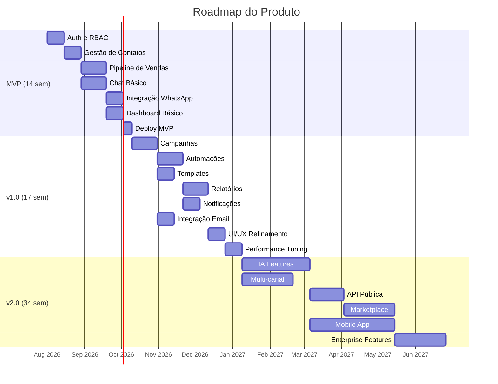
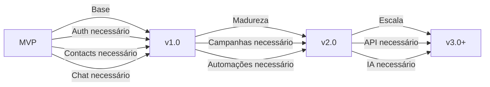

# ROADMAP_SUMMARY — Resumo do Roadmap

## Objetivo

Consolidar o roadmap do produto em uma única página com timeline, fases, entregas e dependências.

## Índice

- [Timeline Geral](#timeline-geral)
- [Fase 1 — MVP](#fase-1--mvp)
- [Fase 2 — v1.0](#fase-2--v10)
- [Fase 3 — v2.0](#fase-3--v20)
- [Fase 4 — v3.0+](#fase-4--v30)
- [Dependências entre Fases](#dependências-entre-fases)
- [Métricas de Sucesso](#métricas-de-sucesso)
- [Referências](#referências)
- [Histórico de Revisão](#histórico-de-revisão)

---

## Timeline Geral

---

## Fase 1 — MVP

**Duração:** 14 semanas
**Objetivo:** Produto viável com funcionalidades core

### Entregas

| Semana | Entrega | Status |
|---|---|---|
| 1-2 | Auth + RBAC + Multi-tenancy | Planejado |
| 3-4 | Gestão de contatos | Planejado |
| 5-7 | Pipeline de vendas | Planejado |
| 5-7 | Chat básico | Planejado |
| 8-9 | Integração WhatsApp | Planejado |
| 8-9 | Chat em tempo real | Planejado |
| 10-11 | Dashboard básico | Planejado |
| 12-13 | Testes + QA | Planejado |
| 14 | Deploy MVP | Planejado |

### Funcionalidades MVP

- Login/logout com JWT
- Gestão de usuários (CRUD)
- Roles: ADMIN, MANAGER, AGENT, VIEWER
- Multi-tenancy (schema isolation)
- Gestão de contatos
- Tags e busca
- Pipeline com estágios
- Oportunidades
- Kanban board
- Chat via WhatsApp
- Mensagens em tempo real
- Dashboard com KPIs básicos
- Deploy em Docker

---

## Fase 2 — v1.0

**Duração:** 17 semanas (após MVP)
**Objetivo:** Funcionalidades de marketing e automação

### Entregas

| Semana | Entrega | Status |
|---|---|---|
| 1-3 | Campanhas | Planejado |
| 1-2 | Templates | Planejado |
| 4-6 | Automações | Planejado |
| 4-5 | Integração Email | Planejado |
| 7-9 | Relatórios avançados | Planejado |
| 7-8 | Notificações | Planejado |
| 10-11 | UI/UX refinamento | Planejado |
| 12-13 | Performance tuning | Planejado |
| 14-15 | Testes de carga | Planejado |
| 16-17 | Deploy v1.0 | Planejado |

### Funcionalidades v1.0

- Campanhas multicanal
- Automações visuais
- Templates de mensagens
- Relatórios de pipeline
- Relatórios de agentes
- Relatórios de campanhas
- Notificações in-app
- Email transacional
- Otimização de performance
- Cache avançado

---

## Fase 3 — v2.0

**Duração:** 34 semanas (após v1.0)
**Objetivo**: IA, multi-canal e API pública

### Entregas

| Semana | Entrega | Status |
|---|---|---|
| 1-8 | IA (resumo, sugestões, scoring) | Planejado |
| 1-6 | Multi-canal (Instagram, Facebook) | Planejado |
| 9-12 | API pública | Planejado |
| 9-14 | Mobile App (React Native) | Planejado |
| 13-18 | Marketplace | Planejado |
| 19-24 | Enterprise features | Planejado |

### Funcionalidades v2.0

- IA: Resumo de conversas
- IA: Sugestões de resposta
- IA: Lead scoring avançado
- Instagram DM integration
- Facebook Messenger integration
- API pública documentada
- Webhooks avançados
- Mobile App (iOS/Android)
- Marketplace de integrações
- SSO/SAML
- Auditoria avançada
- SLA management

---

## Fase 4 — v3.0+

**Duração:** Contínuo
**Objetivo**: Escala enterprise e expansão

### Funcionalidades Futuras

- Multi-idioma (i18n)
- White-label
- On-premise option
- Advanced analytics (BI)
- Voice/Video calls
- AI Agent autonomously
- Predictive analytics
- Custom dashboards
- Advanced RBAC (ABAC)
- Compliance (SOC 2, ISO 27001)

---

## Dependências entre Fases

---

## Métricas de Sucesso

### MVP

| Métrica | Meta |
|---|---|
| Usuários ativos | 100 |
| Empresas ativas | 10 |
| Uptime | 99% |
| Tempo de resposta | < 500ms |
| Conversão trial→pago | 10% |

### v1.0

| Métrica | Meta |
|---|---|
| Usuários ativos | 1.000 |
| Empresas ativas | 100 |
| Uptime | 99.5% |
| Tempo de resposta | < 200ms |
| NPS | > 50 |

### v2.0

| Métrica | Meta |
|---|---|
| Usuários ativos | 10.000 |
| Empresas ativas | 1.000 |
| Uptime | 99.9% |
| Tempo de resposta | < 100ms |
| MRR | R$ 500K |

---

## Referências

| Documento | Caminho |
|---|---|
| MVP | [07-roadmap/MVP.md](./07-roadmap/MVP.md) |
| v1.0 | [07-roadmap/v1.md](./07-roadmap/v1.md) |
| v2.0 | [07-roadmap/v2.md](./07-roadmap/v2.md) |
| v3.0 | [07-roadmap/v3.md](./07-roadmap/v3.md) |
| Future | [07-roadmap/Future.md](./07-roadmap/Future.md) |
| SUMMARY | [SUMMARY.md](./SUMMARY.md) |

---

## Histórico de Revisão

| Versão | Data | Autor | Descrição |
|---|---|---|---|
| 1.0.0 | 2026-07-15 | Architect | Criação inicial do resumo do roadmap |
