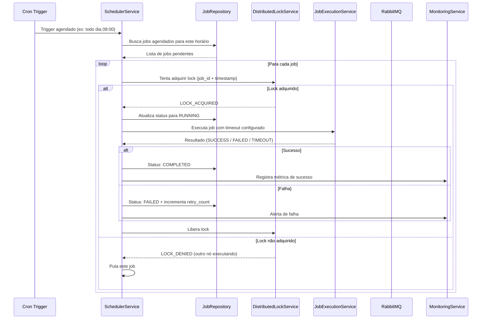
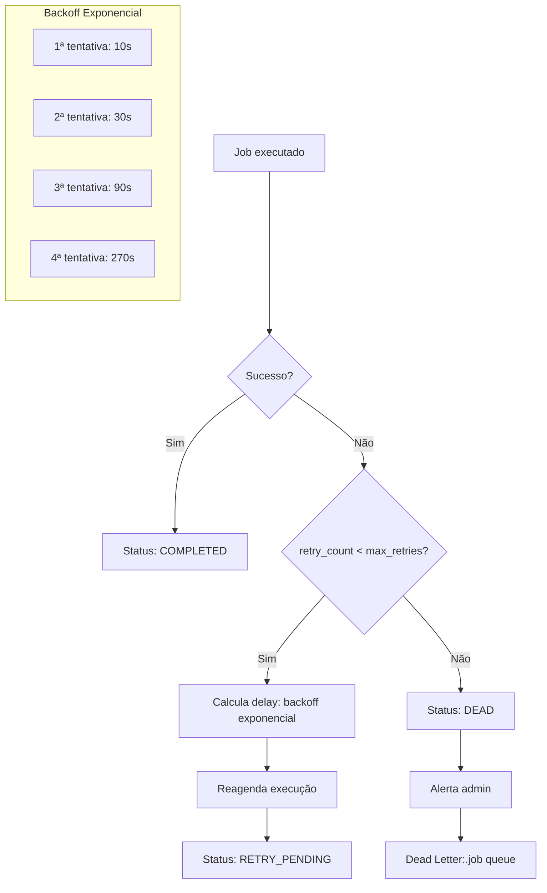
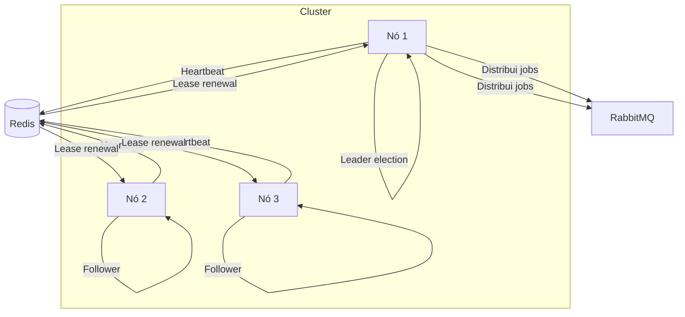
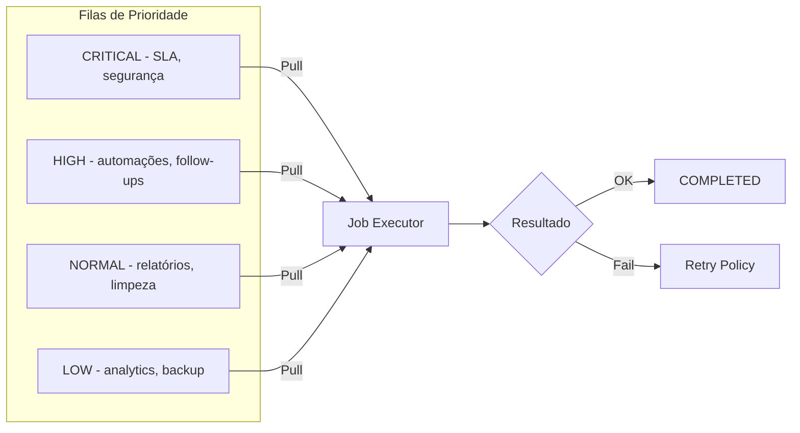
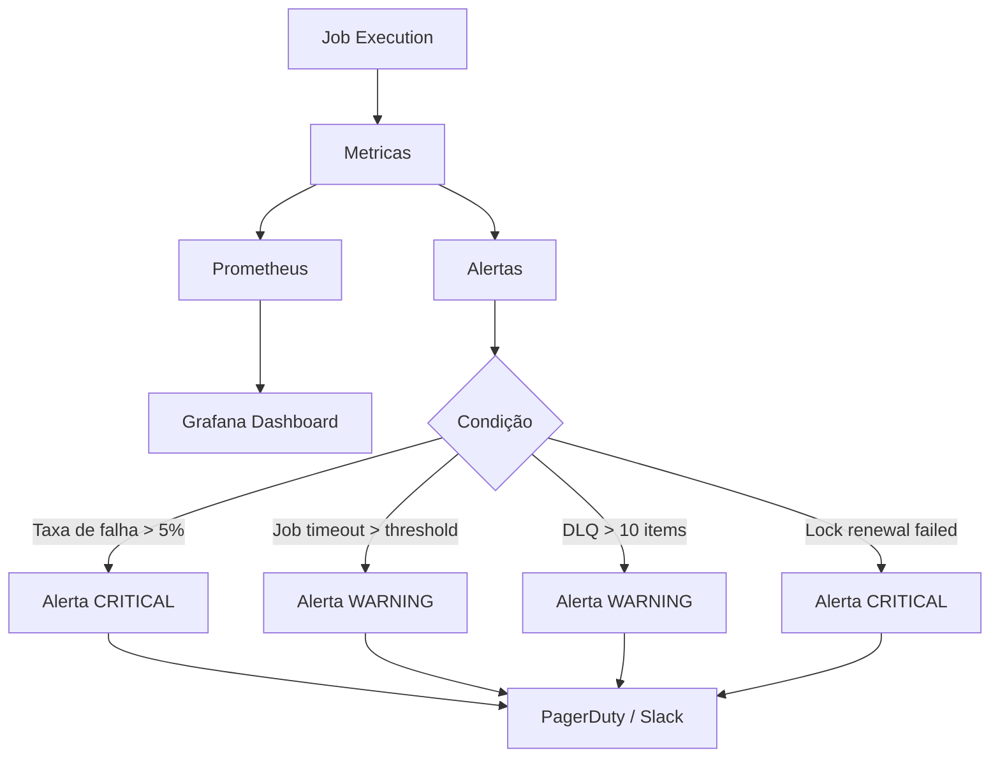

# Scheduler

## Objetivo

Documentar a arquitetura do agendador distribuído do CRM SaaS Omnichannel, responsável pela execução de jobs agendados (cron, one-time, delayed), coordenação em cluster, locking distribuído via Redis, políticas de retry e monitoramento.

## Escopo

- Tipos de jobs: cron (recorrente), one-time (execução única), delayed (execução com atraso)
- Locking distribuído via Redis para execução em cluster
- Fluxo de execução de jobs com idempotência
- Políticas de retry com backoff exponencial
- Priorização de jobs (CRITICAL, HIGH, NORMAL, LOW)
- Coordenação em cluster (leader election)
- Monitoramento e alertas
- Persistência de estado de jobs no PostgreSQL
- Integração com filas RabbitMQ para jobs assíncronos

## Responsabilidades

| Responsável | Responsabilidade |
|---|---|
| SchedulerService | Orquestração central: agendamento, execução, reexecução de jobs |
| JobRepository | Persistência de jobs e execuções no PostgreSQL |
| DistributedLockService | Locking distribuído via Redis; prevenção de execução concorrente |
| JobExecutionService | Execução efetiva do job; tratamento de timeout; registro de resultado |
| RetryPolicyService | Cálculo de próximo retry; aplicação de backoff exponencial |
| ClusterCoordinator | Leader election; distribuição de carga entre nós |
| JobPriorityQueue | Filas de prioridade para jobs pendentes |
| MonitoringService | Métricas de execução; alertas de falha; dashboard de jobs |

## Fluxos

### Fluxo Geral de Execução

### Fluxo de Job com Retry

### Coordenação em Cluster

### Job Prioritization

### Monitoramento

## Dependências

| Dependência | Finalidade |
|---|---|
| PostgreSQL 16 | Persistência de jobs, execuções e configurações de agendamento |
| Redis 7 | Locking distribuído; leader election; rate limiting de jobs |
| RabbitMQ 3 | Filas de jobs assíncronos; dead letter queue |
| Spring Boot 3 | Framework de orquestração e scheduling |
| Java 25 | Linguagem de implementação |
| Spring Scheduler / Quartz | Agendamento de triggers cron e one-time |
| Prometheus + Grafana | Métricas e monitoramento de jobs |

## Boas Práticas

- **Idempotência**: todo job deve ser idempotente; reexecução do mesmo job com mesmo parâmetro não deve causar efeitos colaterais
- **Timeout configurável**: cada job deve ter um timeout máximo de execução; jobs que excedem o timeout devem ser interrompidos e marcados como TIMEOUT
- **Max retries**: definir número máximo de retries por tipo de job; excedido o limite, mover para DLQ
- **Backoff exponencial**: delay entre retries deve crescer exponencialmente (10s, 30s, 90s, 270s) com jitter
- **Distributed locking**: usar Redis SETNX com TTL para prevenir execução concorrente em cluster
- **Leader election**: apenas o nó leader deve executar jobs de manutenção (limpeza, backup, migração)
- **Logging estruturado**: logar job_id, tenant_id, duration, status em cada execução; não logar dados sensíveis
- **Monitoramento ativo**: alertar quando taxa de falha > 5%, DLQ > 10 items, ou lock renewal falhar
- **Priorização**: jobs CRITICAL (SLA, segurança) sempre têm prioridade sobre jobs de manutenção
- **Tenant isolation**: jobs devem ser sempre executados no contexto de um tenant; não executar cross-tenant
- **Cleanup automático**: jobs ONE_TIME completados devem ser removidos após 30 dias; job logs após 90 dias

## Referências

- Quartz Scheduler: https://www.quartz-scheduler.org/
- Redis Distributed Locks: https://redis.io/docs/manual/patterns/distributed-locks/
- Spring Task Scheduling: https://docs.spring.io/spring-framework/reference/integration/scheduling.html
- RabbitMQ Priority Queues: https://www.rabbitmq.com/docs/priority

## Histórico de Revisão

| Versão | Data | Autor | Descrição |
|---|---|---|---|
| 1.0 | 2026-07-15 | Paulo Alves | Criação inicial do documento |
