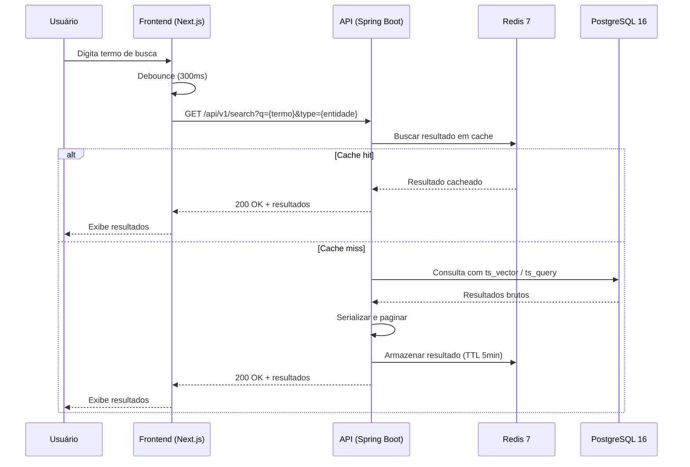
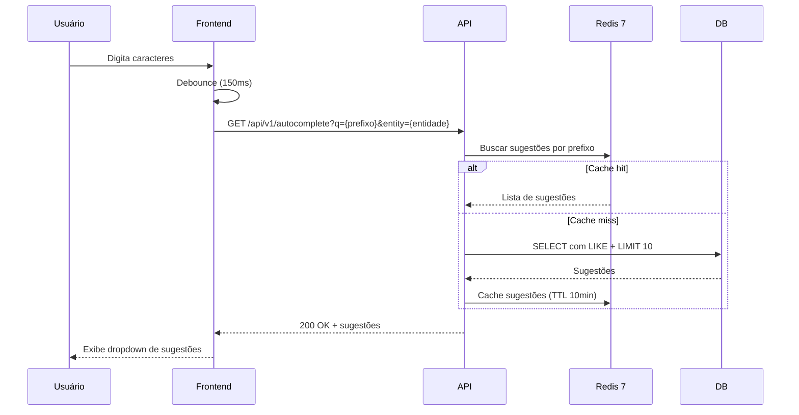
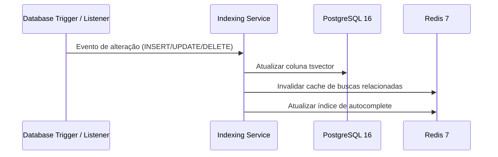
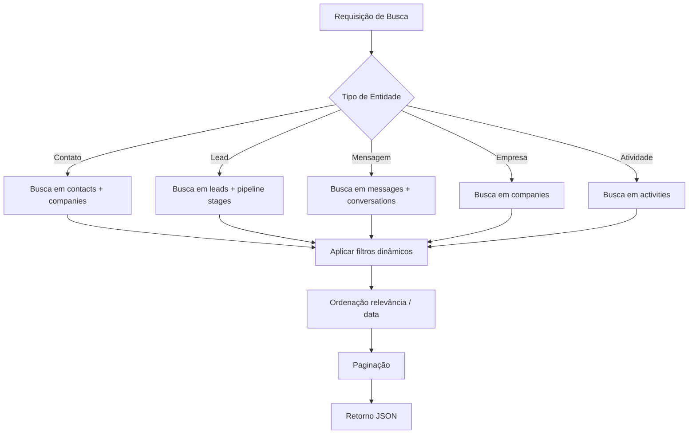

# Arquitetura de Busca

## Objetivo

Definir a arquitetura do sistema de busca do CRM SaaS Omnichannel, garantindo respostas rápidas, relevantes e escaláveis para consultas sobre contatos, leads, mensagens e demais entidades do domínio. A busca deve suportar full-text search, filtros avançados, autocomplete, paginação e ordenação, utilizando PostgreSQL 16 como engine primário de indexação.

## Escopo

- Busca full-text em PostgreSQL 16 com `tsvector` e `tsquery`
- Busca por entidade: Contatos, Leads, Mensagens, Empresas, Atividades
- Filtros dinâmicos (por tags, status, data, responsável, canal)
- Autocomplete com debounce e cache em Redis 7
- Paginação e ordenação em todas as listas de resultados
- Estratégia de indexação e reindexação incremental
- Integração com a API REST (Spring Boot 3) e consumo pelo frontend (Next.js 14)

## Responsabilidades

| Área | Responsabilidade |
|---|---|
| Backend (Spring Boot) | Serviços de busca, construção de queries, paginação, indexação |
| Banco de Dados (PostgreSQL 16) | Indexação full-text, manutenção de `tsvector`, partitions |
| Cache (Redis 7) | Cache de resultados frequentes, armazenamento de sugestões de autocomplete |
| Frontend (Next.js 14) | Componentes de busca, autocomplete UI, debounce, exibição de resultados |
| Infraestrutura | Migrações de indexação via Flyway 10, monitoramento de performance |

## Fluxos

### Fluxo Principal de Busca

### Fluxo de Autocomplete

### Fluxo de Indexação

### Fluxo de Busca por Entidade

## Dependências

| Dependência | Versão | Uso |
|---|---|---|
| PostgreSQL | 16 | Full-text search com `tsvector`, `tsquery`, GIN indexes |
| Redis | 7 | Cache de resultados, autocomplete, invalidação por TTL |
| Spring Boot | 3 | Serviços de busca, repositórios, controladores REST |
| Flyway | 10 | Migrations para indexação e colunas `tsvector` |
| Next.js | 14 | Componentes de busca e autocomplete no frontend |
| React | 18 | Gerenciamento de estado dos resultados |
| TypeScript | 5 | Tipagem dos modelos de busca |

## Boas Práticas

- **Índices GIN**: Criar índices GIN nas colunas `tsvector` para performance em buscas full-text
- **Debounce**: Aplicar debounce no frontend (300ms para busca, 150ms para autocomplete) para reduzir chamadas à API
- **Cache com TTL**: Utilizar TTL curto (5min para resultados, 10min para autocomplete) e invalidar ao detectar alterações
- **Paginação server-side**: Nunca carregar todos os registros; sempre utilizar `LIMIT` e `OFFSET` ou cursor-based pagination
- **Pesos de relevância**: Configurar pesos no `tsvector` (`A`, `B`, `C`, `D`) para priorizar campos relevantes (nome > email > tags)
- **Queries parametrizadas**: Utilizar Spring Data JPA com parâmetros nomeados para prevenir SQL injection
- **Índices parciais**: Criar índices parciais para filtros frequentes (ex: contatos ativos apenas)
- **Monitoramento**: Rastrear latência de queries de busca via Micrometer/Prometheus

## Referências

- [PostgreSQL Full-Text Search Documentation](https://www.postgresql.org/docs/16/textsearch.html)
- [Spring Data JPA - Query Methods](https://docs.spring.io/spring-data/jpa/docs/current/reference/html/#repositories.query-methods)
- [Redis 7 - Cache Patterns](https://redis.io/docs/manual/patterns/)
- [Flyway - Baseline Migrations](https://flywaydb.org/documentation/concepts/migrations)

## Histórico de Revisão

| Data | Versão | Autor | Descrição |
|---|---|---|---|
| 15/07/2026 | 1.0 | Equipe de Arquitetura | Versão inicial da documentação de arquitetura de busca |
