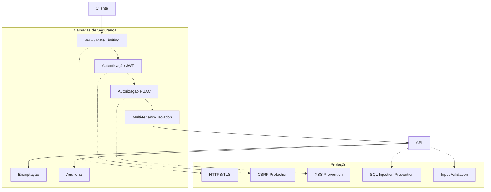
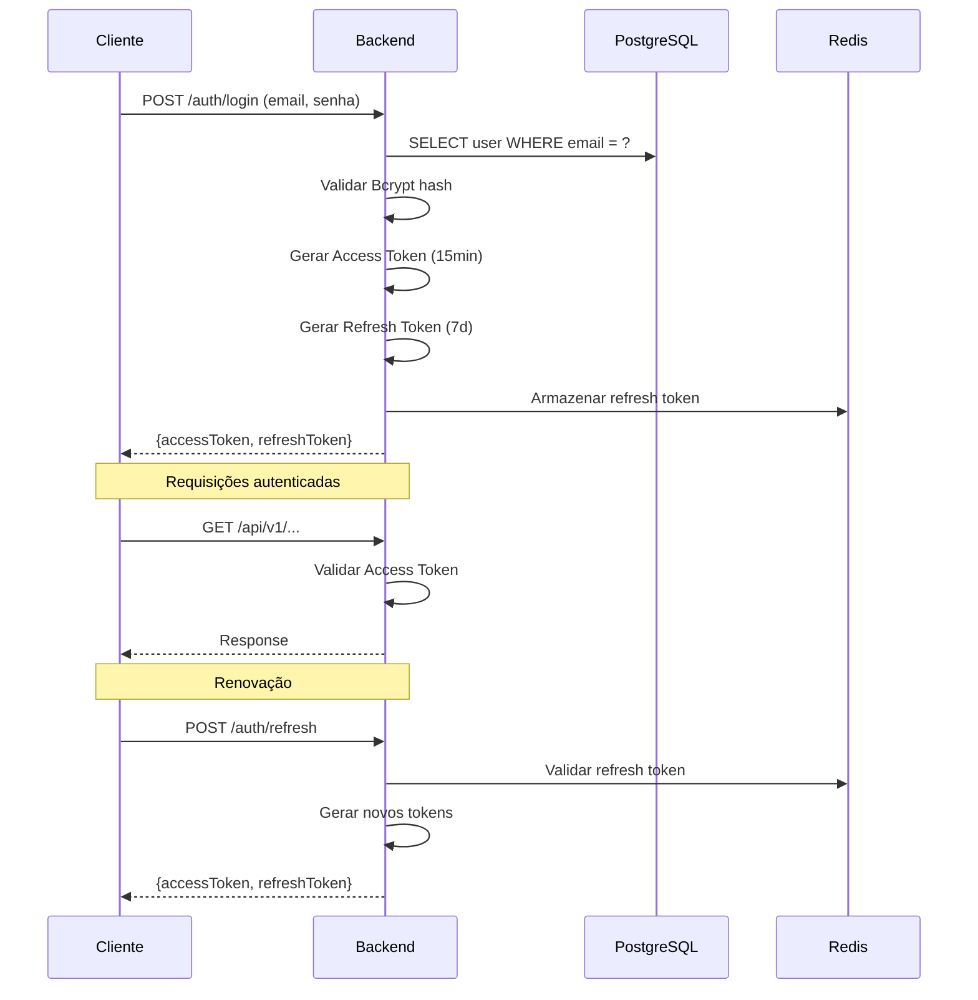
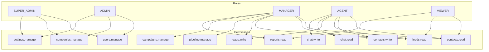

# SECURITY_MAP — Mapa de Segurança

## Objetivo

Fornecer uma visão consolidada de segurança do sistema, incluindo autenticação, autorização, proteção de dados e conformidade LGPD.

## Índice

- [Visão Geral](#visão-geral)
- [Autenticação](#autenticação)
- [Autorização](#autorização)
- [Proteção de Dados](#proteção-de-dados)
- [Segurança de Infraestrutura](#segurança-de-infraestrutura)
- [Conformidade LGPD](#conformidade-lgpd)
- [Checklist de Segurança](#checklist-de-segurança)
- [Referências](#referências)
- [Histórico de Revisão](#histórico-de-revisão)

---

## Visão Geral



---

## Autenticação

### Fluxo JWT



### Configurações

| Configuração | Valor |
|---|---|
| Algoritmo | RS256 (RSA) |
| Access Token TTL | 15 minutos |
| Refresh Token TTL | 7 dias |
| Token Rotation | Sim (a cada refresh) |
| Blacklist | Sim (Redis) |
| Password Hashing | Bcrypt (12 rounds) |
| Max Login Attempts | 5 |
| Lockout Duration | 15 minutos |

### Headers de Segurança

```
Authorization: Bearer <access-token>
X-Tenant-ID: <tenant-uuid>
X-Request-ID: <uuid>
```

**Fonte:** [01-backend/Auth.md](./01-backend/Auth.md)

---

## Autorização

### RBAC (Role-Based Access Control)



### Matriz de Permissões

| Recurso | SUPER_ADMIN | ADMIN | MANAGER | AGENT | VIEWER |
|---|---|---|---|---|---|
| Users | CRUD | CRUD | R | — | — |
| Companies | CRUD | RU | — | — | — |
| Contacts | CRUD | CRUD | CRUD | CRUD | R |
| Leads | CRUD | CRUD | CRUD | CRUD | R |
| Pipeline | CRUD | CRUD | CRUD | R | R |
| Kanban | CRUD | CRUD | CRUD | M | R |
| Chat | CRUD | CRUD | CRUD | CRUD | R |
| Messages | CRUD | CRUD | CRUD | CRUD | R |
| Campaigns | CRUD | CRUD | CRUD | R | — |
| Templates | CRUD | CRUD | CRUD | R | — |
| Automations | CRUD | CRUD | CRUD | R | — |
| Reports | CRUD | CRUD | R | — | R |
| Settings | CRUD | CRUD | R | — | — |
| Billing | CRUD | R | — | — | — |
| Audit | CRUD | R | — | — | — |

**Fonte:** [01-backend/Users.md](./01-backend/Users.md), [01-backend/Auth.md](./01-backend/Auth.md)

---

## Proteção de Dados

### Encriptação

| Dado | Método | Local |
|---|---|---|
| Senhas | Bcrypt (12 rounds) | PostgreSQL |
| Dados sensíveis | AES-256 | PostgreSQL (column-level) |
| Tokens JWT | RS256 (RSA) | Memory |
| Conexões | TLS 1.3 | Transmissão |
| Backups | AES-256 | Armazenamento |

### Validação de Input

| Proteção | Implementação |
|---|---|
| SQL Injection | JPA/Hibernate (parameterized queries) |
| XSS | Output encoding + CSP headers |
| CSRF | Token CSRF em formulários |
| Rate Limiting | Redis-based (100 req/min por usuário) |
| Input Validation | Bean Validation (JSR 380) |
| File Upload | Type validation + size limit (10MB) |

### Headers de Segurança HTTP

```
Strict-Transport-Security: max-age=31536000; includeSubDomains
X-Content-Type-Options: nosniff
X-Frame-Options: DENY
X-XSS-Protection: 1; mode=block
Content-Security-Policy: default-src 'self'
Referrer-Policy: strict-origin-when-cross-origin
Permissions-Policy: camera=(), microphone=(), geolocation=()
```

---

## Segurança de Infraestrutura

| Componente | Medida |
|---|---|
| Docker | Non-root user, read-only filesystem |
| Kubernetes | Network policies, pod security |
| Database | SSL required, limited connections |
| Redis | Password protected, bind localhost |
| RabbitMQ | Username/password, vhost isolation |
| Secrets | Environment variables / Vault |
| Logging | Sem dados sensíveis em logs |
| Monitoring | Alertas de comportamento anômalo |

---

## Conformidade LGPD

### Obrigações

| Obrigação | Implementação |
|---|---|
| Consentimento | Flag `consent_given` em contacts |
| Direito ao esquecimento | Soft delete + anonimização |
| Portabilidade | Exportação CSV/JSON |
| Acesso | Endpoint `/api/v1/privacy/data` |
| Retenção | Policies de retenção configuráveis |
| DPO | Email configurável por empresa |

### Dados Pessoais no Sistema

| Entidade | Dados Pessoais | Retenção |
|---|---|---|
| Contact | Nome, email, telefone | Configurável |
| User | Nome, email | Enquanto ativo |
| Message | Conteúdo | Configurável |
| Audit Log | Ações do usuário | 2 anos |

---

## Checklist de Segurança

- [x] JWT com RS256
- [x] Refresh token rotation
- [x] Token blacklist (Redis)
- [x] Password hashing (Bcrypt 12)
- [x] Rate limiting
- [x] Input validation (Bean Validation)
- [x] SQL injection prevention (JPA)
- [x] XSS prevention (CSP headers)
- [x] HTTPS enforcement
- [x] Multi-tenancy isolation
- [x] Audit logging
- [x] Soft delete
- [ ] WAF (futuro)
- [ ] Penetration testing (futuro)
- [ ] SOC 2 compliance (futuro)

---

## Referências

| Documento | Caminho |
|---|---|
| Auth | [01-backend/Auth.md](./01-backend/Auth.md) |
| Users | [01-backend/Users.md](./01-backend/Users.md) |
| Audit | [01-backend/Audit.md](./01-backend/Audit.md) |
| Permissions | [01-backend/Permissions.md](./01-backend/Permissions.md) — RBAC backend |
| Architecture | [00-core/Architecture.md](./00-core/Architecture.md) |
| TechStack | [00-core/TechStack.md](./00-core/TechStack.md) |
| SUMMARY | [SUMMARY.md](./SUMMARY.md) |

---

## Histórico de Revisão

| Versão | Data | Autor | Descrição |
|---|---|---|---|
| 1.0.0 | 2026-07-15 | Architect | Criação inicial do mapa de segurança |
