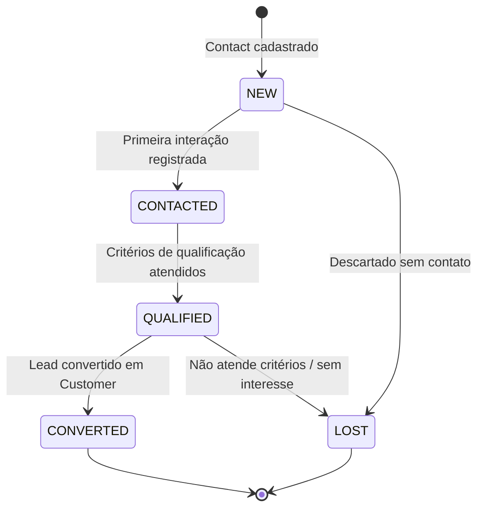
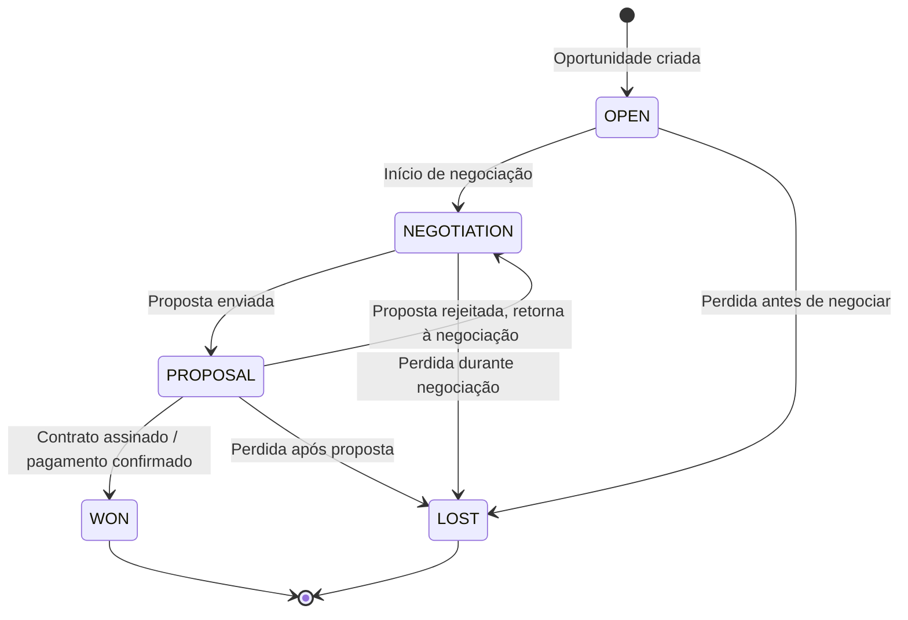
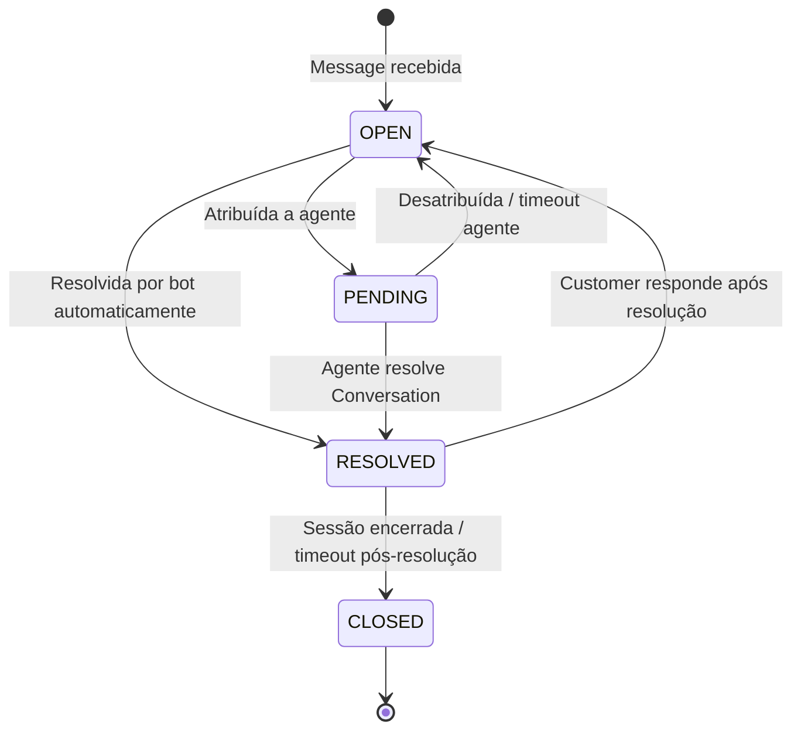
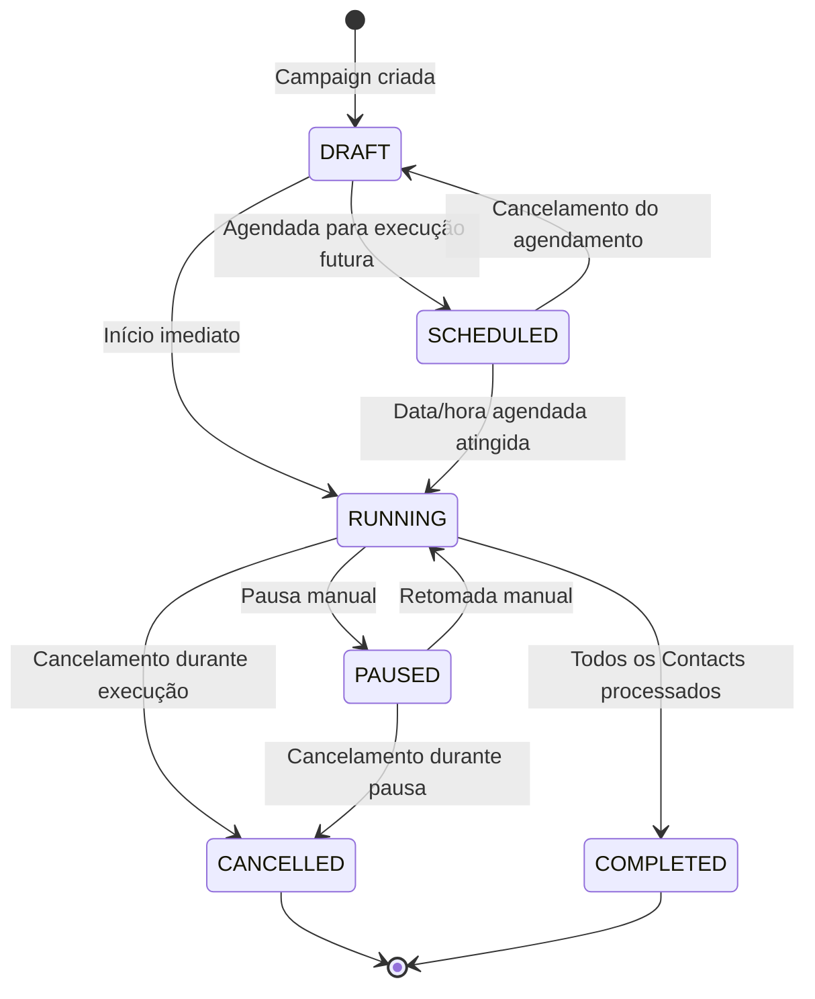
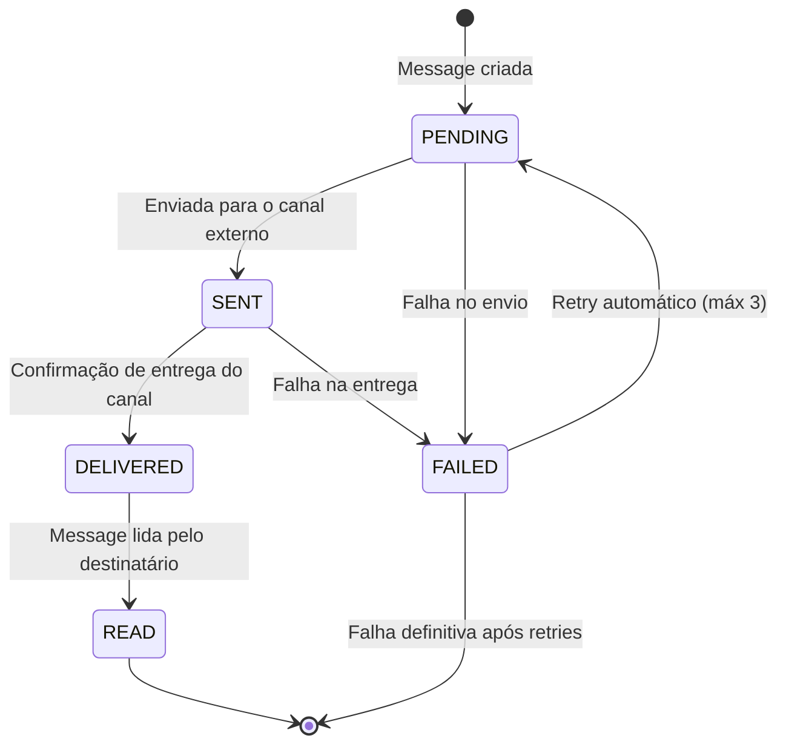

# State Machines

## Objetivo

Definir formalmente as máquinas de estados do CRM SaaS Omnichannel, incluindo todos os estados possíveis, transições válidas, guardas de transição e ações associadas a cada transição.

## Escopo

Cobre as 5 máquinas de estado fundamentais: Lead, Opportunity, Conversation, Campaign e Message.

## Responsabilidades

| Máquina de Estado | Service Owner | Consumidores |
|---|---|---|
| **Lead** | Contact Service | Pipeline, Analytics, Campaign |
| **Opportunity** | Pipeline Service | Communication, Analytics, Integration |
| **Conversation** | Communication Service | Pipeline, Analytics, Notification |
| **Campaign** | Campaign Service | Communication, Analytics, Notification |
| **Message** | Communication Service | Analytics, Integration |

## Fluxos

### 1. Lead State Machine



| Transição | Trigger | Guarda | Ação |
|---|---|---|---|
| NEW → CONTACTED | Primeira interação (e-mail, ligação, chat) | Contact must have at least one interaction | Registra timestamp de primeiro Contact |
| CONTACTED → QUALIFIED | Score mínimo atingido OU qualificação manual | lead.score >= 60 OR manual qualification by agent | Atualiza scored history e notifica pipeline |
| QUALIFIED → CONVERTED | Decisão manual OU Automation | Agent confirmation OR automation rule match | Cria oportunidade vinculada, atualiza métricas |
| QUALIFIED → LOST | Motivo de perda registrado | lossReason required, NOT NULL | Registra motivo, atualiza analytics |
| NEW → LOST | Descarte direto | lossReason required | Registra motivo de descarte precoce |

### 2. Opportunity State Machine



| Transição | Trigger | Guarda | Ação |
|---|---|---|---|
| OPEN → NEGOTIATION | Agente move para negociação | opportunity.value IS NOT NULL | Registra atividade, inicia timer |
| OPEN → LOST | Perda antes de negociação | lossReason required | Registra motivo, fecha pipeline |
| NEGOTIATION → PROPOSAL | Proposta formal enviada | proposalDocument attached | Registra proposta, notifica Customer |
| NEGOTIATION → LOST | Perda durante negociação | lossReason required | Registra motivo, atualiza forecast |
| PROPOSAL → WON | Aprovação da proposta | approvalConfirmed = true | Fecha oportunidade, dispara onboarding |
| PROPOSAL → NEGOTIATION | Negociação retomada | counterProposal exists | Reabre negociação com novos termos |
| PROPOSAL → LOST | Rejeição definitiva | lossReason required | Registra motivo, analisa feedback |

### 3. Conversation State Machine



| Transição | Trigger | Guarda | Ação |
|---|---|---|---|
| OPEN → PENDING | Roteamento para agente | agentAvailable = true | Registra agente, inicia SLA timer |
| OPEN → RESOLVED | Bot resolve automaticamente | botCanResolve = true | Registra resolução bot, coleta feedback |
| PENDING → RESOLVED | Agente fecha a Conversation | agentConfirmResolution = true | Registra tempo de resolução, atualiza CSAT |
| PENDING → OPEN | Timeout ou desatribuição | timeout > 30min OR agentUnassign | Reabre para roteamento novamente |
| RESOLVED → CLOSED | Encerramento automático | timeout > 24h OR clientConfirmed | Fecha Conversation, libera recursos |
| RESOLVED → OPEN | Customer responde pós-resolução | newMessage received | Reabre Conversation, mantém agente anterior |

### 4. Campaign State Machine



| Transição | Trigger | Guarda | Ação |
|---|---|---|---|
| DRAFT → SCHEDULED | Agendamento definido | scheduleDate > now() | Registra agendamento, bloqueia edição |
| DRAFT → RUNNING | Início imediato | audienceSize > 0 AND templates configured | Inicia processamento, notifica equipe |
| SCHEDULED → RUNNING | Cron trigger na data agendada | campaignDate <= now() AND not cancelled | Inicia execução, inicia métricas |
| SCHEDULED → DRAFT | Cancelamento do agendamento | Only before scheduled date | Remove agendamento, libera edição |
| RUNNING → PAUSED | Pausa manual | agentConfirmPause = true | Pausa envios, mantém métricas parciais |
| RUNNING → COMPLETED | Fim natural | allContactsProcessed = true | Gera relatório final, calcula ROI |
| RUNNING → CANCELLED | Cancelamento durante execução | agentConfirmCancel = true | Para envios, registra motivo |
| PAUSED → RUNNING | Retoma execução | agentConfirmResume = true | Retoma envios do ponto onde parou |
| PAUSED → CANCELLED | Cancelamento durante pausa | agentConfirmCancel = true | Cancela permanentemente |

### 5. Message State Machine



| Transição | Trigger | Guarda | Ação |
|---|---|---|---|
| PENDING → SENT | Envio via API do canal | channelAPI.status = 200 | Registra messageId externo, timestamp |
| PENDING → FAILED | Erro na chamada API | retryCount < 3 | Incrementa retry, agenda retry |
| SENT → DELIVERED | Webhook de entrega | externalMessageId matches | Registra timestamp de entrega |
| SENT → FAILED | Timeout de entrega | timeout > 24h OR channelError | Registra falha, notifica remetente |
| DELIVERED → READ | Webhook de leitura | externalMessageId matches | Registra timestamp de leitura |
| FAILED → PENDING | Retry automático | retryCount < 3 AND not permanentlyFailed | Reagenda envio com backoff |
| FAILED → [*] | Esgotou retries | retryCount >= 3 | Marca como failed permanente, loga erro |

## Dependências

- **PostgreSQL 16**: Persistência de estados atuais e histórico de transições
- **Redis 7**: Cache de estadosquentes para consultas rápidas
- **RabbitMQ 3**: Publicação de eventos de transição de estado
- **Flyway 10**: Versionamento das tabelas de estado e enum types

## Boas práticas

- Toda transição de estado deve ser validada antes de ser persistida (guardas)
- Histórico completo de transições deve ser mantido para auditoria (audit log)
- Transições inválidas devem retornar erro claro com a regra de negócio violada
- Estados são representados como enums no banco (PostgreSQL ENUM types via Flyway)
- Eventos de transição são publicados AFTER commit para garantir consistência
- Timeouts automáticos para estados pendentes (ex: PENDING → OPEN após 30min)
- Reentrância prevenida com locks pessimistas para transições concorrentes
- Dashboard em tempo real consome transições via WebSocket para atualização de UI

### Enums PostgreSQL

```sql
-- Exemplo de definição via Flyway
CREATE TYPE lead_status AS ENUM ('NEW', 'CONTACTED', 'QUALIFIED', 'CONVERTED', 'LOST');
CREATE TYPE opportunity_status AS ENUM ('OPEN', 'NEGOTIATION', 'PROPOSAL', 'WON', 'LOST');
CREATE TYPE conversation_status AS ENUM ('OPEN', 'PENDING', 'RESOLVED', 'CLOSED');
CREATE TYPE campaign_status AS ENUM ('DRAFT', 'SCHEDULED', 'RUNNING', 'PAUSED', 'COMPLETED', 'CANCELLED');
CREATE TYPE message_status AS ENUM ('PENDING', 'SENT', 'DELIVERED', 'READ', 'FAILED');
```

## Referências

- State Pattern — Gang of Four (Design Patterns)
- Spring State Machine — spring.io
- Finite State Machines — Wikipedia
- UML State Machine Diagrams — OMG Specification

## Histórico de Revisão

| Versão | Data | Autor | Descrição |
|---|---|---|---|
| 1.0 | 2026-07-15 | Equipe de Arquitetura | Versão inicial das máquinas de estado |
