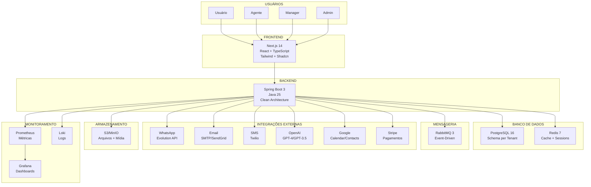
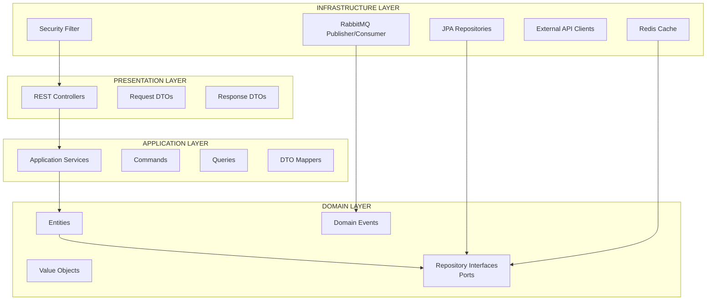
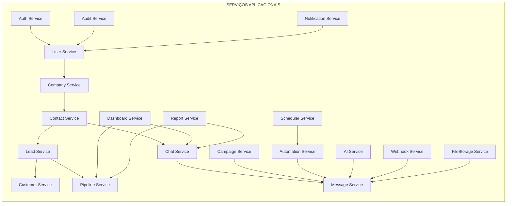
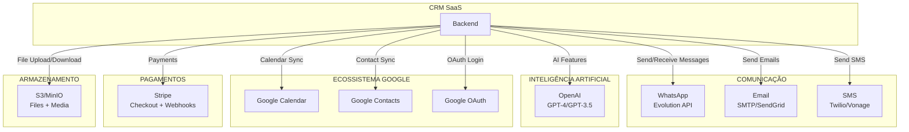
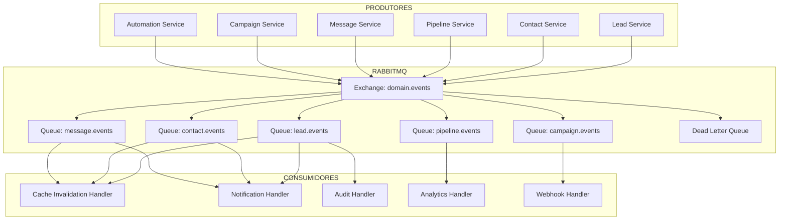
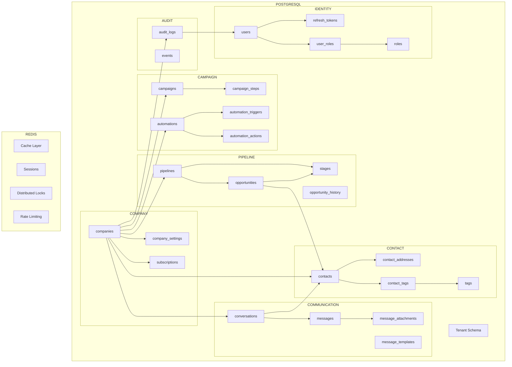
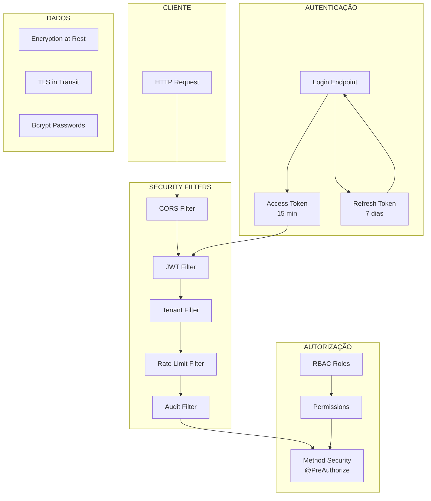
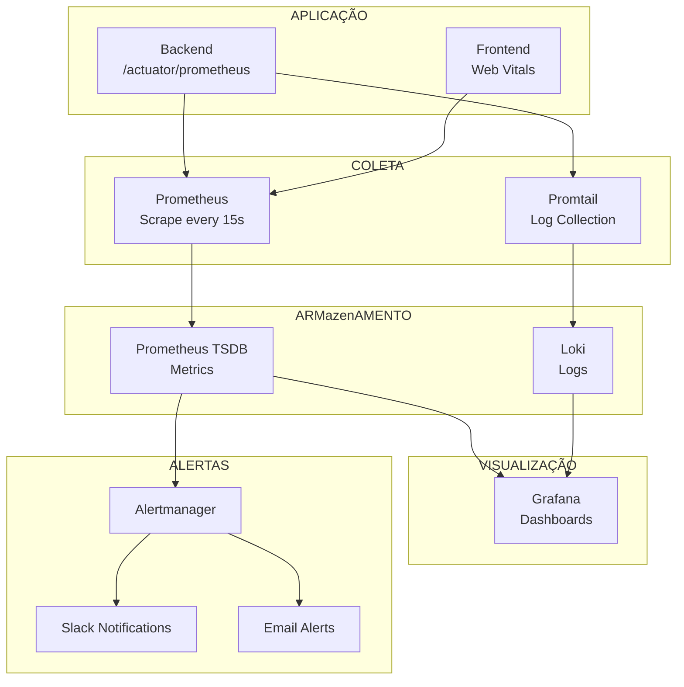

# SYSTEM_MAP — Mapa Completo da Arquitetura

## Objetivo

Apresentar a arquitetura completa do sistema em diagramas, mostrando como todos os componentes se conectam.

## Índice

- [1. Visão de Alto Nível](#1-visão-de-alto-nível)
- [2. Arquitetura de Camadas](#2-arquitetura-de-camadas)
- [3. Mapa de Serviços](#3-mapa-de-serviços)
- [4. Mapa de Integrações](#4-mapa-de-integrações)
- [5. Mapa de Mensageria](#5-mapa-de-mensageria)
- [6. Mapa de Dados](#6-mapa-de-dados)
- [7. Mapa de Segurança](#7-mapa-de-segurança)
- [8. Mapa de Monitoramento](#8-mapa-de-monitoramento)
- [Referências](#referências)
- [Histórico de Revisão](#histórico-de-revisão)

---

## 1. Visão de Alto Nível

**Fonte:** [00-core/Architecture.md](./00-core/Architecture.md), [00-core/TechStack.md](./00-core/TechStack.md)

---

## 2. Arquitetura de Camadas

**Regra de Dependência:** As dependências sempre apontam de fora para dentro. A camada Domain nunca depende de nenhuma outra camada.

**Fonte:** [00-core/Architecture.md](./00-core/Architecture.md)

---

## 3. Mapa de Serviços

**Fonte:** [01-backend/Modules.md](./01-backend/Modules.md)

---

## 4. Mapa de Integrações

**Fonte:** [04-integrations/README.md](./04-integrations/README.md)

---

## 5. Mapa de Mensageria

**Fonte:** [01-backend/Events.md](./01-backend/Events.md)

---

## 6. Mapa de Dados

**Fonte:** [03-database/ERD.md](./03-database/ERD.md), [03-database/Entities.md](./03-database/Entities.md)

---

## 7. Mapa de Segurança

**Fonte:** [01-backend/Auth.md](./01-backend/Auth.md), [05-business-rules/Permissions.md](./05-business-rules/Permissions.md)

---

## 8. Mapa de Monitoramento

**Fonte:** [06-devops/Monitoring.md](./06-devops/Monitoring.md), [06-devops/Metrics.md](./06-devops/Metrics.md)

---

## Referências

| Documento | Caminho |
|---|---|
| Arquitetura | [00-core/Architecture.md](./00-core/Architecture.md) |
| TechStack | [00-core/TechStack.md](./00-core/TechStack.md) |
| Módulos | [01-backend/Modules.md](./01-backend/Modules.md) |
| Integrações | [04-integrations/README.md](./04-integrations/README.md) |
| Events | [01-backend/Events.md](./01-backend/Events.md) |
| Database | [03-database/ERD.md](./03-database/ERD.md) |
| Security | [01-backend/Auth.md](./01-backend/Auth.md) |
| DevOps | [06-devops/Monitoring.md](./06-devops/Monitoring.md) |
| SUMMARY | [SUMMARY.md](./SUMMARY.md) |

---

## Histórico de Revisão

| Versão | Data | Autor | Descrição |
|---|---|---|---|
| 1.0.0 | 2026-07-15 | Architect | Criação inicial do mapa do sistema |
