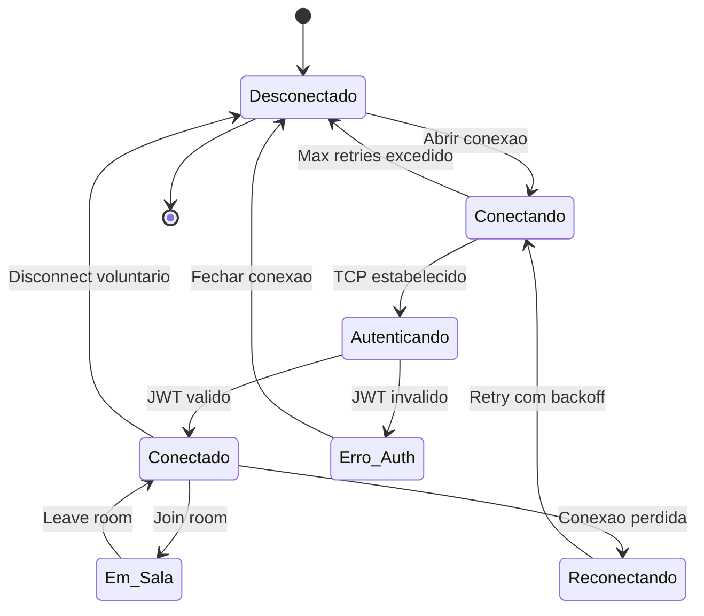
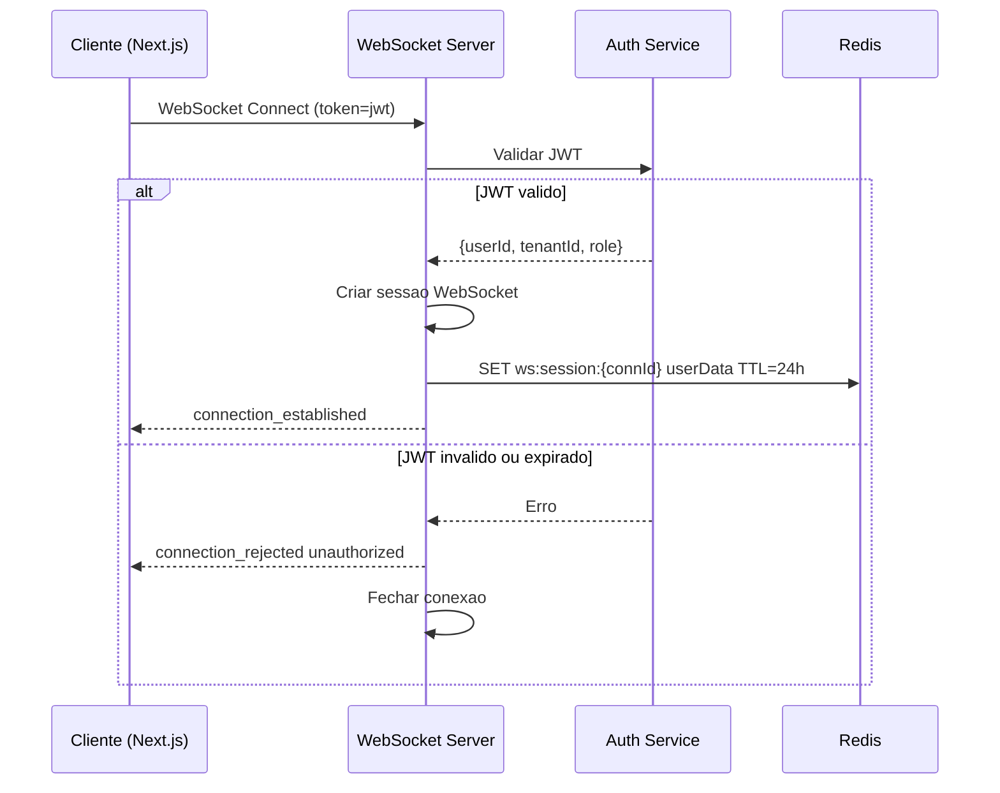
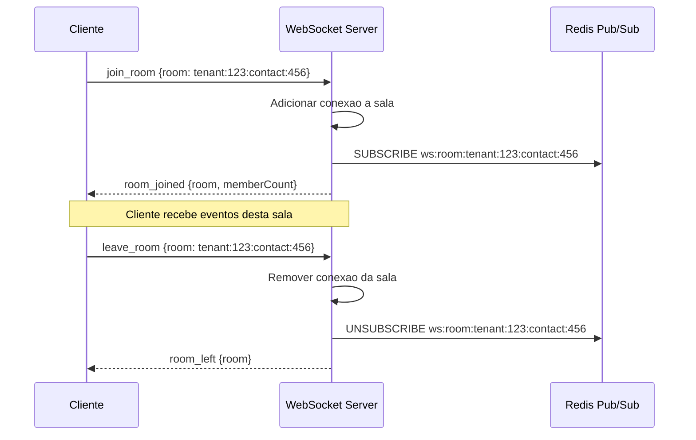
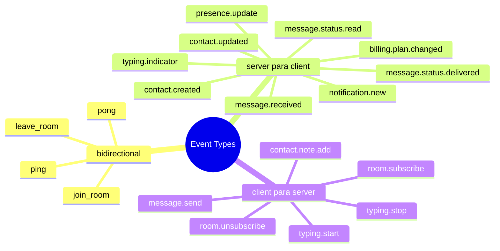
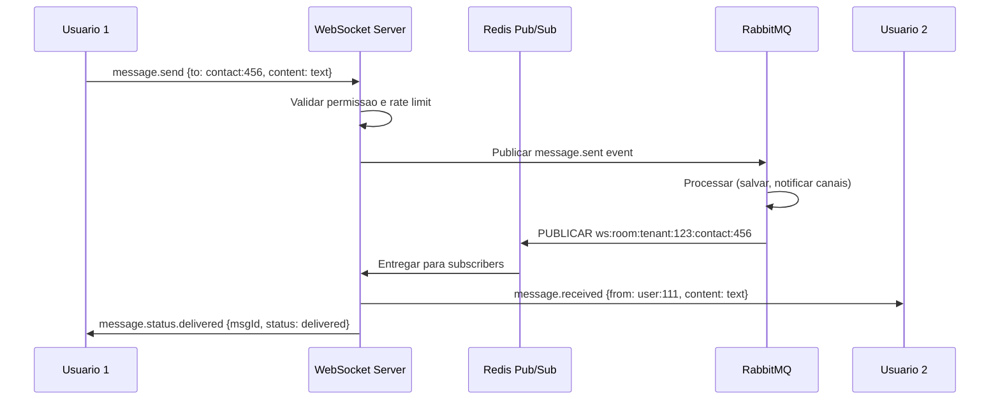
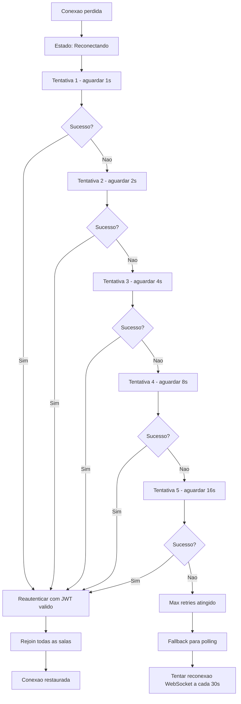
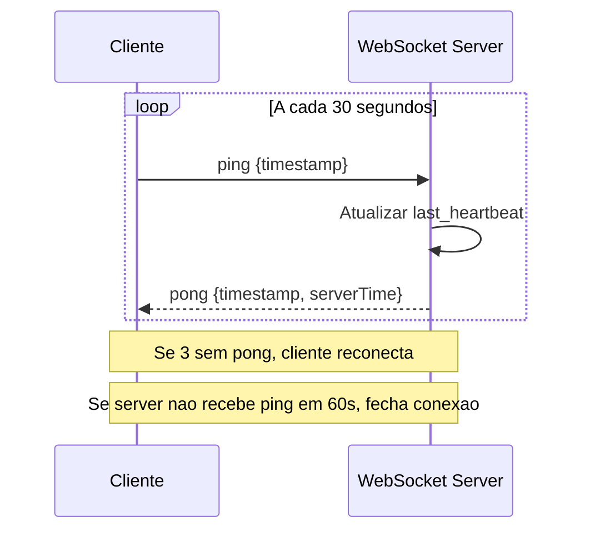
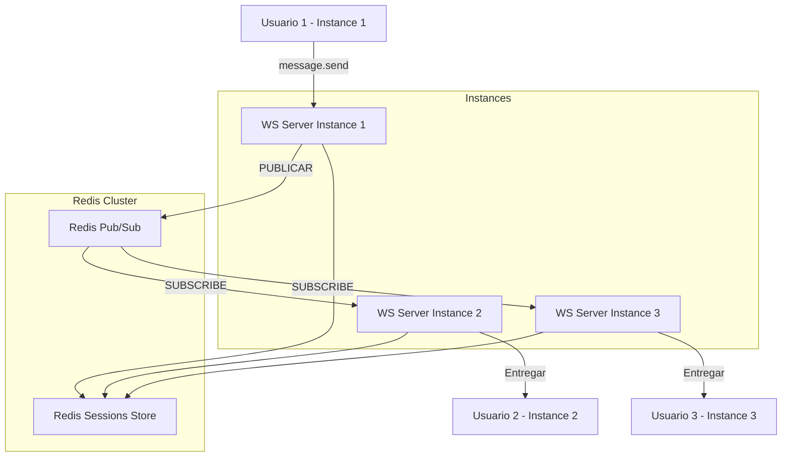
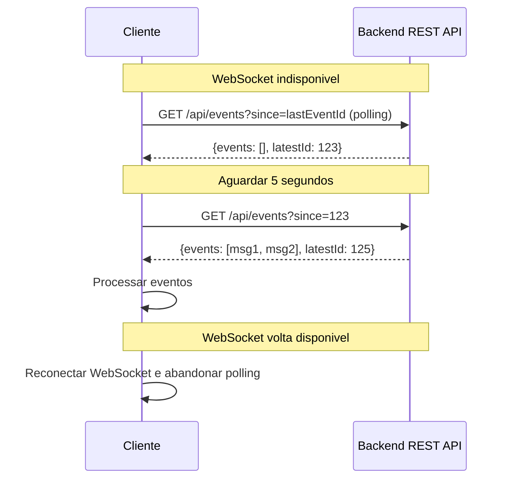
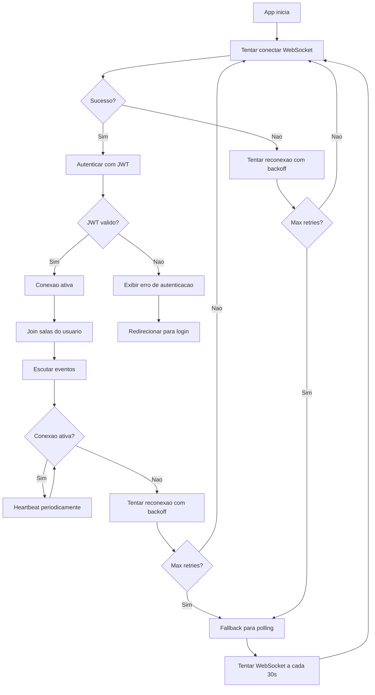

# WebSocket Architecture

## Objetivo

Documentar a arquitetura WebSocket do CRM SaaS Omnichannel, cobrindo ciclo de vida da conexão, autenticação, salas/canais, tipos de eventos, estratégia de reconexão, heartbeat, escalabilidade com Redis Pub/Sub e fallback para polling.

## Escopo

- Ciclo de vida da conexão WebSocket
- Autenticação via JWT
- Rooms/Canais (multi-tenant)
- Tipos de eventos e protocolo de mensagens
- Estratégia de reconexão com backoff
- Heartbeat e detecção de conexões mortas
- Escalabilidade horizontal com Redis Pub/Sub
- Fallback para Server-Sent Events e polling

## Responsabilidades

| Papel | Responsabilidade |
|---|---|
| Backend Developer | Implementar WebSocket server e handler de eventos |
| Frontend Developer | Implementar cliente WebSocket com reconexão |
| DevOps | Configurar infraestrutura para conexões persistentes |
| QA | Testar cenários de reconexão, escalabilidade e fallback |

## Fluxos

### Ciclo de Vida da Conexão



### Fluxo de Autenticacao



### Salas e Canais (Multi-Tenant)

```mermaid
mindmap
  root((WebSocket Rooms))
    Tenant Room
      tenant:{tenantId}:all
      Todos usuarios do tenant
    User Room
      user:{userId}
      Notificacoes pessoais
    Contact Room
      tenant:{tenantId}:contact:{contactId}
      Interacoes de contato
    Channel Room
      tenant:{tenantId}:channel:{channelId}
      Mensagens de canal
    Broadcast Room
      broadcast:system
      Anuncios do sistema
```

### Join e Leave de Sala



### Tipos de Eventos



### Fluxo de Mensagem em Tempo Real



### Estrategia de Reconexao



### Heartbeat



### Escalabilidade com Redis Pub/Sub



### Fallback para Polling



### Fluxo Completo de Conexao



## Dependencias

| Dependencia | Tipo | Uso |
|---|---|---|
| Spring WebSocket | Lib | Servidor WebSocket no backend |
| STOMP | Protocolo | Protocolo de mensageria sobre WebSocket |
| Redis 7 | Infra | Pub/Sub para escalabilidade entre instancias |
| PostgreSQL 16 | Infra | Persistencia de mensagens e estado |
| RabbitMQ 3 | Infra | Eventos assincronos (entrega de mensagens) |
| Next.js WebSocket | Lib | Cliente WebSocket no frontend |
| Redis sessions store | Infra | Sessoes WebSocket para reconexao |

## Boas Praticas

- **JWT no connect**: Enviar JWT como query param ou header na conexao inicial. Nunca confiar em conexao sem autenticacao.
- **Rejoin automatico**: Cliente deve rejoin todas as salas apos reconexao bem-sucedida.
- **Heartbeat bidirecional**: Tanto cliente quanto server devem enviar ping periodicamente.
- **Rate limiting**: Limitar taxa de mensagens por conexao para evitar abuso.
- **Message size limit**: Limitar tamanho das mensagens (ex: 64KB max).
- **Graceful shutdown**: Notificar clientes antes de desligar uma instancia do servidor.
- **Connection pooling**: Limitar numero maximo de conexoes por instancia.
- **Multi-tenant isolation**: Salas sempre namespaceadas por tenant para evitar vazamento de dados.
- **Fallback obrigatorio**: Todo cliente deve ter fallback para polling quando WebSocket falhar.
- **Monitoring**: Monitorar numero de conexoes ativas, latencia de entrega e taxa de reconexao.

## Referencias

- [WebSocket RFC 6455](https://datatracker.ietf.org/doc/html/rfc6455)
- [Spring WebSocket Documentation](https://docs.spring.io/spring-framework/reference/web/websocket.html)
- [STOMP Protocol](https://stomp.github.io/stomp-specification-1.2.html)
- [Redis Pub/Sub](https://redis.io/docs/interact/pubsub/)
- [Socket.IO Fallback](https://socket.io/docs/v4/)

## Historico de Revisao

| Versao | Data | Autor | Descricao |
|---|---|---|---|
| 1.0 | 15/07/2026 | Paulo Alves | Criacao inicial do documento |
