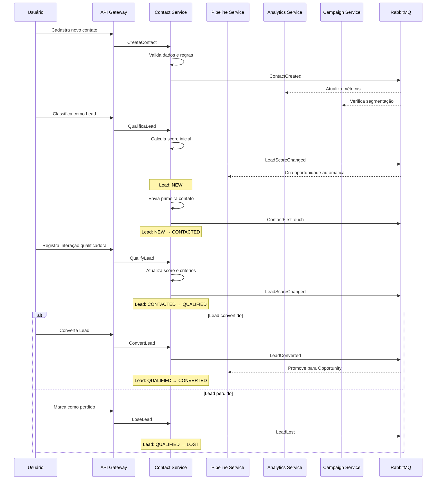
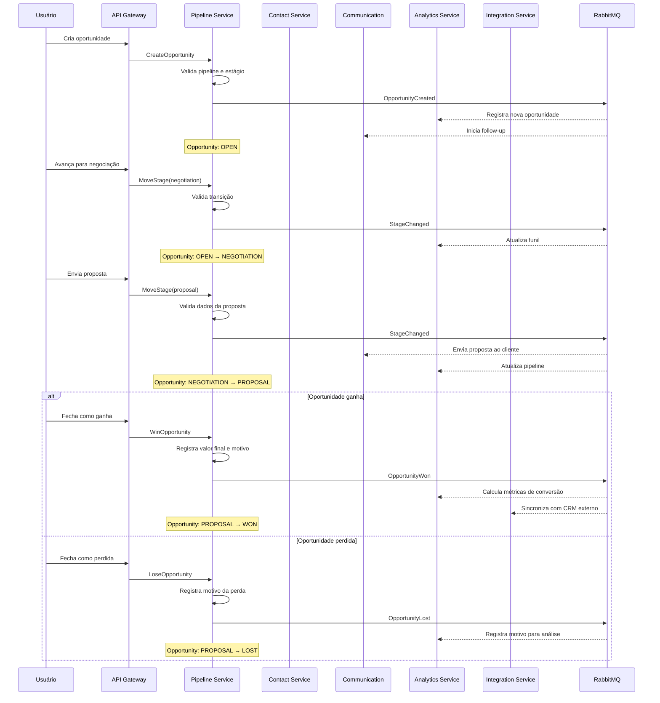
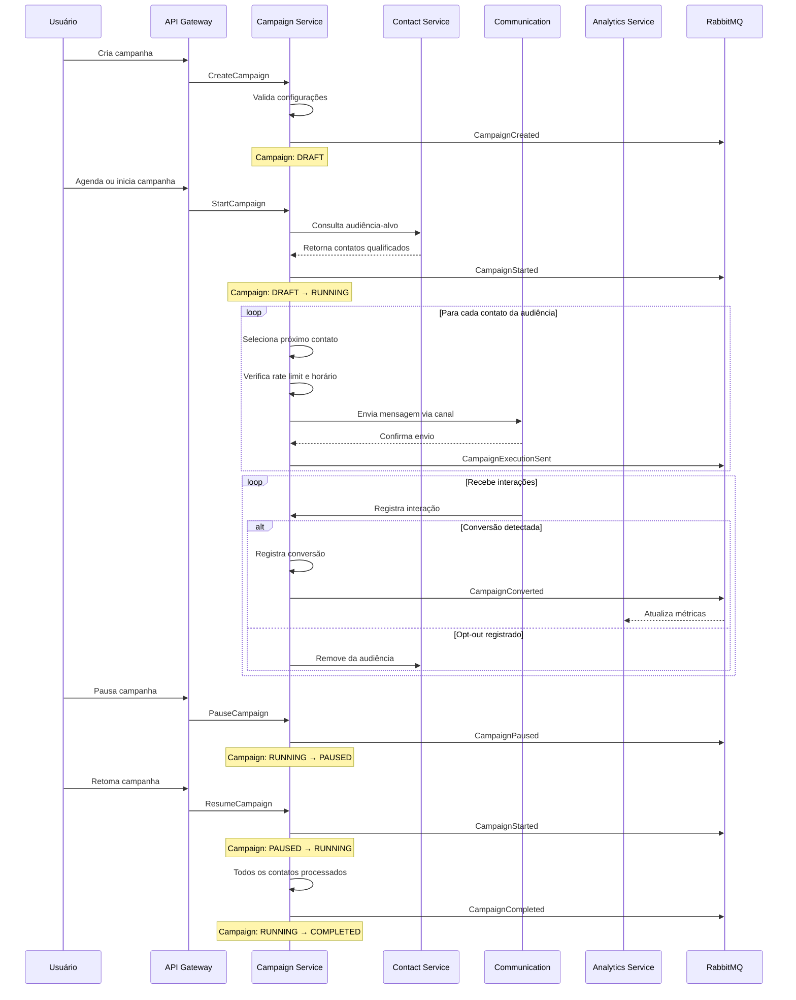
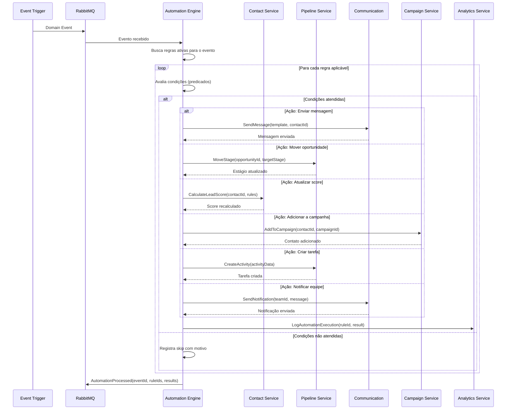
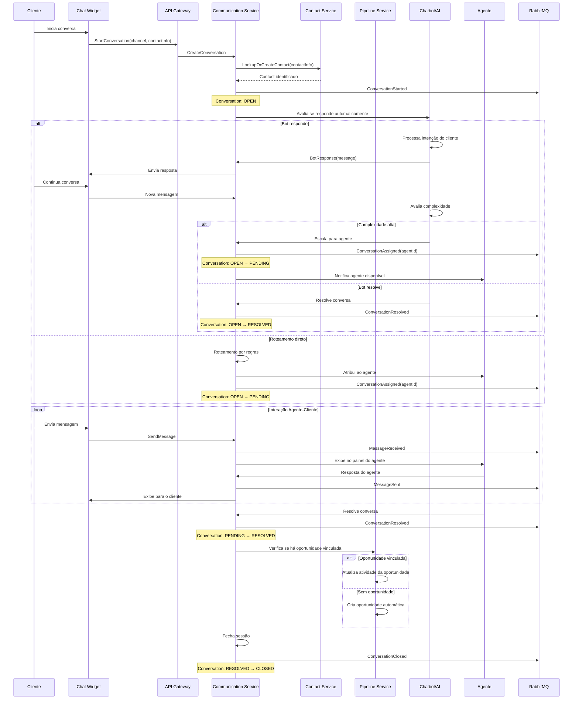

# Workflows

## Objetivo

Documentar os principais fluxos de negócio do CRM SaaS Omnichannel, incluindo o ciclo de vida de Leads, Opportunities, Campaigns, Automations e atendimento ao Customer via chat.

## Escopo

Cobre os 5 workflows fundamentais do sistema: Lead Lifecycle, Opportunity Lifecycle, Campaign Execution, Automation Processing e Chat Flow.

## Responsabilidades

| Workflow | Owner Principal | Participantes |
|---|---|---|
| **Lead Lifecycle** | Contact Service | Pipeline Service, Analytics, Campaign |
| **Opportunity Lifecycle** | Pipeline Service | Communication, Analytics, Integration |
| **Campaign Execution** | Campaign Service | Communication, Contact, Analytics |
| **Automation Processing** | Automation Engine | Todos os bounded contexts |
| **Chat Flow** | Communication Service | Pipeline Service, Contact Service, Notification |

## Fluxos

### 1. Lead Lifecycle

### 2. Opportunity Lifecycle

### 3. Campaign Execution

### 4. Automation Processing

### 5. Chat Flow

## Dependências

- **RabbitMQ 3**: Transporte assíncrono de eventos entre workflows
- **Redis 7**: Cache de sessões de chat, rate limiting de campanhas
- **PostgreSQL 16**: Persistência de estado de todos os workflows
- **JWT**: Autenticação e propagação de contexto de tenant

## Boas práticas

- Workflows devem ser idempotentes — processamento repetido não deve criar duplicatas
- Transições de estado devem ser validadas antes de serem persistidas
- Eventos são publicados após a transação ser commitada com sucesso
- Timeouts configurados para chamadas entre services (máximo 30s)
- Circuit breaker em chamadas para serviços externos
- Logging estruturado com correlationId para rastreabilidade completa
- Workflows de longa duração usam filas separadas com prioridade
- Rollback compensatório quando etapas falham em workflows compostos

## Referências

- Workflow Patterns — workflowpatterns.com
- Saga Pattern — Chris Richardson
- Choreography vs Orchestration — Cam Jackson
- Spring State Machine Documentation

## Histórico de Revisão

| Versão | Data | Autor | Descrição |
|---|---|---|---|
| 1.0 | 2026-07-15 | Equipe de Arquitetura | Versão inicial dos workflows |
