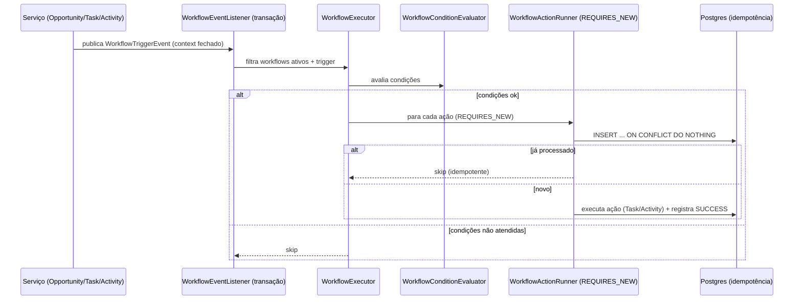

# Workflow Automation (Motor de Automatização)

## Objetivo

Documentar o motor de **workflows** do CRM SaaS Omnichannel: regras configuráveis que executam
automaticamente ações (criar tarefa / criar atividade) quando eventos de domínio ocorrem, de forma
**determinística e idempotente**. Sprint 13.

## Conceitos

| Termo | Descrição |
|---|---|
| **Disparo (Trigger)** | Evento de domínio que inicia a avaliação (`TriggerEvent`). |
| **Condição** | Predicado sobre campos **fechados** do contexto (opcional). |
| **Ação** | Efeito executado (CREATE_TASK ou CREATE_ACTIVITY). |
| **Execução** | Registro atômico e idempotente de uma ação para um evento. |
| **Contexto** | Conjunto fechado de campos transportado pelo `WorkflowTriggerEvent`. |

## Triggers suportados

- `OPPORTUNITY_CREATED`, `OPPORTUNITY_STAGE_CHANGED`, `OPPORTUNITY_WON`, `OPPORTUNITY_LOST`
- `TASK_CREATED`, `TASK_COMPLETED`
- `ACTIVITY_CREATED`

## Campos de condição (fechados)

- Oportunidade: `opportunity.stage`, `opportunity.value`
- Tarefa: `task.priority`
- Atividade: `activity.type`

Operadores: `EQUALS, NOT_EQUALS, GREATER_THAN, LESS_THAN, GREATER_OR_EQUAL, LESS_OR_EQUAL`.
Comparação: strings sem sensibilidade a caixa; numérica para `opportunity.value`.
Campo ausente no contexto ⇒ condição falsa.

## Ações

- `CREATE_TASK`: `{ title, description?, dueInDays?, priority? }`
- `CREATE_ACTIVITY`: `{ subject, description?, type? }`

Ações criadas pela automação usam ator de sistema e anexam atribuição "(criada pelo workflow)".

## Fluxo de execução


```

## Garantias

- **Idempotência**: chave única `(company_id, workflow_action_id, event_id)`; inserção atômica
  `ON CONFLICT DO NOTHING` → retry/concorrência nunca duplicam o efeito.
- **Isolamento transacional**: cada ação roda em `@Transactional(REQUIRES_NEW)`; falha de uma ação
  não reverte o evento originador e fica registrada como `FAILED` no histórico.
- **Sem loops**: guard por `eventId` (mesma chave de idempotência) impede que uma ação que
  re-dispara o mesmo trigger re-execute a mesma regra.
- **Campos fechados**: sem avaliação de código arbitrário.
- **RLS + permissões**: tabelas `workflow*` sob RLS; endpoints protegidos por
  `workflow:create/read/update/delete`.

## Backend (referência)

```
domain/workflow/         Workflow, WorkflowCondition, WorkflowAction, WorkflowExecution, enums
domain/workflow/event/   WorkflowTriggerEvent
application/workflow/    WorkflowService(UseCase), WorkflowExecutor, WorkflowConditionEvaluator,
                          WorkflowActionRunner, WorkflowTemplateSeeder
infrastructure/workflow/ persistence (JPA + inserts nativos ON CONFLICT), listener
presentation/rest/workflow/ WorkflowController
db/migration/            V041 (tabelas+RLS+idempotência), V042 (permissões)
```

## Frontend (referência)

```
features/workflows/      types, service, hooks, schemas, components (Form/Table/Executions/Dialog)
app/(dashboard)/workflows/  page (lista), new, [id] (detalhe+histórico), [id]/edit
```

## Documentos relacionados

- [WORKFLOWS.md](./WORKFLOWS.md) — workflows de negócio e fluxos do sistema
- [EVENT_MAP.md](./EVENT_MAP.md) — mapa de eventos
- [SECURITY_MAP.md](./SECURITY_MAP.md) — RLS e autorização
- [sprints/13/REPORT.md](../sprints/13/REPORT.md) — relatório completo do Sprint 13