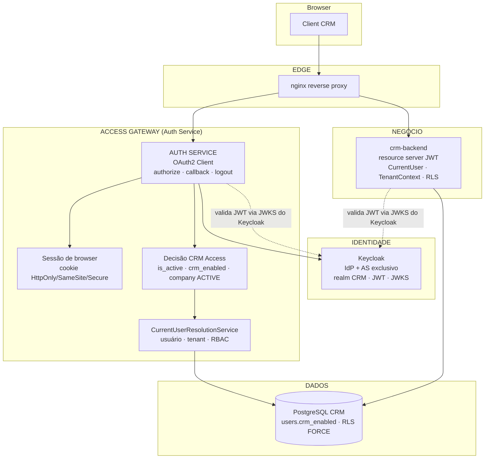

# Sprint 6 — ARCHITECTURE.md (Access Gateway)

## 1. Arquitetura Anterior (auditada — Sprint 1–5)

### Fluxo de autenticação atual

```
Browser
   │
   ▼
[Frontend Next.js]  keycloak-js (OIDC + PKCE S256, check-sso + silent SSO)
   │  login() → redirectUri origin + "/auth/callback?redirect=..."
   ▼
[Keycloak]  realm CRM · client crm-frontend · único emissor de JWT
   │  → callback no frontend
   ▼
[Frontend]  armazena tokens em localStorage (kc_accessToken/kc_refreshToken)
   │          + flag kc_authenticated em cookie (SSR/middleware)
   ├───────────────────────────────────────────────┐
   ▼                                               ▼
[Backend /api/v1/...] (Bearer JWT Keycloak)   [Auth Service] (stateless)
   resource server + JWKS do Keycloak             GET /internal/auth/current-user
   CurrentUserResolver → provisiona/reutiliza      → 200 RESOLVED / PROVISIONING_REQUIRED
   TenantFilter → TenantContext → RLS              → 401 USER_INACTIVE
```

### Características identificadas na auditoria

| Componente | Papel atual | Observação |
|---|---|---|
| **Frontend** | Inicia OIDC + PKCE **direto no Keycloak**; callback no próprio Next.js; tokens em localStorage; `/auth/me` no backend | `lib/keycloak.ts`, `KeycloakProvider.tsx`, `store/token-manager.ts`, `middleware.ts` |
| **Auth Service** | **Stateless**; um único endpoint interno `/internal/auth/current-user`; **não** faz code exchange, sessão, cookie, login, logout, refresh; não provisiona | Porta 8082 (VPS) |
| **Backend** | Resource server stateless; **não emite tokens**; `LocalCurrentUserResolver` (default) auto-provisiona; `AuthServiceCurrentUserResolver` (flag) consulta auth-service com fallback local; `TenantFilter` após `BearerTokenAuthenticationFilter` | RLS FORCE + `crm_app` (Sprint 5) |
| **Keycloak** | IdP + Authorization Server **exclusivo**; JWKS; OIDC/PKCE; nunca substituído | Realm CRM |
| **Modelo de dados** | `users` (`company_id NOT NULL`, `is_active`, `status`, `keycloak_sub`), `companies.status`, RBAC (`user_roles`→`roles`→`role_permissions`→`permissions`) | **Sem** gate explícito de CRM access; auto-provisioning = auto-concessão |

### Lacunas que a Sprint 6 resolve

1. **Acesso implícito**: existir no Keycloak + ser provisionado **concede acesso automaticamente**.
   Não há distinção entre "quem se autenticou" e "quem pode entrar no CRM".
2. **Auth Service fora do caminho do login**: o browser fala direto com o Keycloak; o
   auth-service não orquestra sessão nem decide acesso.
3. **Storage de tokens**: access/refresh em `localStorage` (vulnerável a XSS — token leakage).
4. **Logout parcial**: hoje o logout depende de `keycloak-js`; sem sessão própria do gateway,
   o encerramento coerente de todas as sessões (CRM + Auth Service + Keycloak) não é garantido.

---

## 2. Arquitetura Nova (alvo)

```
Browser
   │
   ▼
[Frontend Next.js]  crm.com.br/login (página de entrada da marca)
   │  redireciona para o Access Gateway (Auth Service)
   ▼
[AUTH SERVICE = Access Gateway]  (OAuth2 Client — Authorization Code + PKCE)
   │  /auth/authorize → redirect ao Keycloak (state + nonce + PKCE)
   │  /auth/callback  → code exchange (code_verifier), validação do token
   │  decide CRM ACCESS: usuário existe? is_active? crm_enabled? company ACTIVE?
   │  cria SESSÃO de browser (cookie HttpOnly/SameSite/Secure)
   │  /auth/logout → end_session_endpoint do Keycloak + limpeza de sessão
   ▼
[Keycloak]  IdP + Authorization Server exclusivo (autentica, emite JWT, JWKS)
   ▲
   └── Backend e Auth Service validam o MESMO JWT via JWKS do Keycloak

[Backend]  mantém: resource server JWT · CurrentUser · TenantContext · RLS FORCE
[AUTH SERVICE]  mantém: resolução de CurrentUser / RBAC (CurrentUserResolutionService)

Sessão do browser (cookie):
   Frontend → chamadas com o JWT do Keycloak (Bearer) OU sessão do gateway
   que expõe o JWT para o backend (que continua validando via JWKS do Keycloak)
```

### Princípios que permanecem

- **Keycloak nunca é substituído**: única autenticação real, único emissor de JWT, JWKS público.
- **Auth Service NÃO armazena senhas**; não faz password grant como fluxo principal.
- **Backend não emite tokens**; não confia em `companyId` vindo do frontend.
- **RLS FORCE + `crm_app` (NOBYPASSRLS)** permanecem como proteção final (Sprint 5).
- `company_id` é sempre derivado da identidade confiável (`users.keycloak_sub`), nunca do cliente.

---

## 3. Componentes Alterados vs Preservados

### 🔧 Alterados (Sprint 6)

| Componente | Arquivo(s) / área | Mudança |
|---|---|---|
| **Auth Service** | `auth-service/` — novo `OAuth2Client` (starter `spring-boot-starter-oauth2-client`), controllers `/auth/authorize`, `/auth/callback`, `/auth/logout`, serviço de sessão | Vira **Access Gateway**: code exchange + PKCE, sessão de browser (cookie), decisão de CRM access, logout OIDC coerente. Mantém `/internal/auth/current-user` e resolução de `CurrentUser`. |
| **Backend (provisioning)** | `LocalCurrentUserResolver`, `AuthService`, `RoleDataSeeder` | Separar **identity provisioning** de **access grant**: provisioning NÃO auto-concede `crm_enabled`. |
| **Backend (resolução)** | `CurrentUserResolver*` | Aplicar o gate completo de acesso (is_active + crm_enabled + company ACTIVE) no caminho de resolução/`/auth/me`. |
| **Modelo de dados** | Nova migration (ex.: `V023`) | `ALTER TABLE users ADD COLUMN crm_enabled BOOLEAN NOT NULL DEFAULT false;` + backfill explícito dos usuários existentes. Documentação em `CRM_ACCESS.md`. |
| **Frontend** | `lib/keycloak.ts`, `KeycloakProvider.tsx`, `store/token-manager.ts`, `LoginForm.tsx`, `app/auth/callback/*`, `useAuth.tsx`, `middleware.ts` | Login/callback/logout passam pelo Auth Service; tokens saem do `localStorage` para memória/cookie HttpOnly (fase de hardening); flag de sessão mantida apenas para SSR/middleware. |
| **Keycloak** | Client(s) do realm CRM | Novo client OIDC do Auth Service (redirect URIs fixas, PKCE) — sem alterar storage de senhas. |
| **Config/Deploy** | compose VPS, `.env` | Env do Auth Service (URL base, client id/secret, redirect URI), cookies Secure/SameSite em https; build/deploy/E2E na VPS. |

### ✅ Preservados (não alterar)

| Componente | Motivo |
|---|---|
| **Keycloak** (realm, JWKS, OIDC, PKCE, issuer validation, roles) | IdP exclusivo; regra absoluta "não remover". |
| **TenantFilter / TenantContext / TenantAwareDataSource** | Mecanismo de tenant validado na Sprint 5. |
| **RLS FORCE (V019–V022) / role `crm_app`** | Proteção final de dados multi-tenant. |
| **Resolução de `CurrentUser` (auth-service `CurrentUserResolutionService`)** | Reutilizar, não duplicar. |
| **`/internal/auth/current-user`** (RESOLVED / PROVISIONING_REQUIRED / 401 USER_INACTIVE) | Contrato de identidade mantido para o backend. |
| **Fluxos locais de senha** (register/forgot/reset/change-password) | Legado Sprint 1; **não remover nesta sprint** (regra: não quebrar o fluxo atual antes do novo validado); migração documentada no MIGRATION_PLAN. |
| **Modelo multi-tenant `user → company` (1:N invertida: 1 user = 1 company)** | Não alterar. |

---

## 4. Diagrama de Componentes (novo)



---

## 5. Decisões de Arquitetura (registradas)

| # | Decisão | Status | Justificativa |
|---|---|---|---|
| D1 | **CRM Access = `users.crm_enabled` + `users.is_active` + `companies.status = ACTIVE`** | ✅ **Decidida (fase 1)** | Opção 3 escolhida pelo usuário; mínimo, preserva `user → company`; evita tabela nova. |
| D2 | **Não criar `user_application_access`** | ✅ **Decidida** | Complexidade desnecessária para o modelo atual (1 usuário = 1 company). |
| D3 | **Auth Service vira OAuth2 Client (Access Gateway)** | 📝 Proposta | Autorização Code + PKCE; gateway orquestra identidade/sessão/acesso. |
| D4 | **Sessão do browser no Auth Service** (cookie HttpOnly/SameSite/Secure) | 📝 Proposta | Base para logout coerente e mitigação de token leakage. |
| D5 | **Provisioning ≠ access grant** (não auto-conceder) | ✅ **Decidida** | Regra absoluta: Keycloak autenticado ≠ CRM access. |
| D6 | **Storage de tokens: sair de localStorage → memória/cookie HttpOnly** | 📝 Proposta | Mitigar XSS/token leakage. |
| D7 | **Logout OIDC coerente** (CRM + Auth Service + Keycloak) | ✅ **Decidida (diretriz)** | Evitar logout parcial que deixe sessão reutilizável. |

> As decisões "📝 Proposta" serão confirmadas/refinadas na fase 2 (implementação), sempre
> preservando as regras absolutas. Nenhuma decisão quebra o fluxo atual antes da validação.

---

## 6. Não-Objetivos (reforço)

- Não introduzir emissor de tokens próprio / JWKS do auth-service.
- Não mover o provisionamento para fora do backend nesta sprint (permanece como está até
  migração futura documentada no MIGRATION_PLAN).
- Não alterar a infra de tenant/RLS.
- Não criar infra local duplicada (Docker/Keycloak/Postgres/build/E2E/deploy sempre na VPS).

---

*Data: 2026-08-02*
