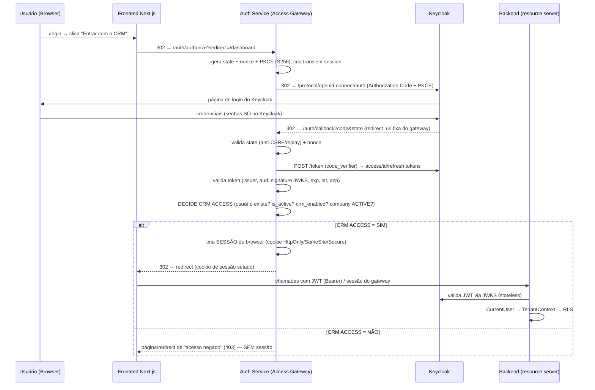
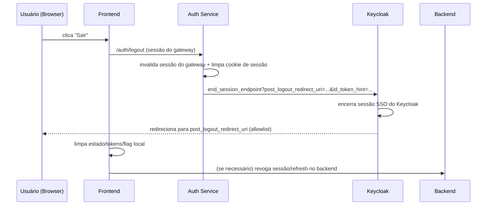

# Sprint 6 — AUTH_FLOW.md (Fluxos de Autenticação)

## 1. Fluxo Atual (baseline — auditado)

O fluxo atual usa **OIDC Authorization Code + PKCE** iniciado **diretamente no Keycloak**:

1. Usuário clica "Entrar com Keycloak" (`LoginForm.tsx` → `useAuth().loginKeycloak()`).
2. `keycloak-js` (`lib/keycloak.ts`) redireciona ao Keycloak com `response_type=code`,
   `code_challenge` (S256), `state` e `redirect_uri = origin + /auth/callback?redirect=...`.
3. Keycloak autentica e redireciona de volta ao **frontend** com `code` + `state`.
4. `keycloak-js` troca o `code` (com `code_verifier`) e recebe access/refresh/id tokens.
5. Tokens em `localStorage` (`store/token-manager.ts`); flag `kc_authenticated` em cookie.
6. `AuthProvider` (`useAuth.tsx`) chama `/api/v1/auth/me` no backend para montar o usuário.
7. Backend resolve `CurrentUser` (provisiona se necessário), aplica TenantContext + RLS.

**Limitação-chave:** o browser mantém tokens sensíveis em `localStorage` e o Auth Service
não participa do login/sessão.

---

## 2. Fluxo Novo (alvo — via Access Gateway)

### Pontos do fluxo

- **Login real acontece no Keycloak** (credenciais nunca passam pelo CRM/Auth Service).
- O **Auth Service** é o OAuth2 Client (não o Keycloak que é chamado pelo browser).
- **Sessão de browser** criada **somente após** a decisão positiva de CRM access.
- **Proibido**: password grant como fluxo principal; senhas em qualquer camada CRM.

---

## 3. Callback Seguro (controles obrigatórios)

| Controle | Onde | Por quê |
|---|---|---|
| `state` aleatório + validado no retorno | Auth Service | Anti-CSRF / impedir login fixation |
| `nonce` no ID token + validado | Auth Service | Anti-replay do ID token |
| PKCE `code_challenge`/`code_verifier` (S256) | Auth Service | Proteger contra interception (client público) |
| `redirect_uri` fixa, na allowlist | Keycloak + Auth Service | Previne open redirect / injection |
| Validação do token: `issuer`, `audience`, `azp`, assinatura (JWKS), `exp`, `iat` | Auth Service | Rejeita tokens falsos/alterados/expirados |
| Troca de código no servidor (nunca no browser) | Auth Service | Mantém `code_verifier` e secrets fora do cliente |

---

## 4. Sessão e Storage (endurecimento)

### Estado atual
- `kc_accessToken`, `kc_refreshToken` em **`localStorage`** → vulnerável a XSS.
- Flag `kc_authenticated` em cookie (`SameSite=Lax`, 7d) — apenas SSR/middleware.

### Alvo
| Item | Alvo | Motivo |
|---|---|---|
| Access token | Memória (React state) ou cookie `HttpOnly` | Mitigar XSS token leakage |
| Refresh token | Cookie `HttpOnly`/`SameSite`/`Secure` | Nunca exposto a JS |
| Sessão do gateway | Cookie `HttpOnly`/`SameSite=Strict ou Lax`/`Secure` (https) | Sessão não-legível por JS |
| Flag de sessão p/ SSR | Cookie `SameSite=Lax` sem dados sensíveis | Permite roteamento no middleware |

> **Decisão D6 (proposta):** mover os tokens de `localStorage` para memória + cookies
> `HttpOnly`. Migração por etapas, sem quebrar o fluxo atual.

---

## 5. Logout OIDC Coerente (decisão D7)

Objetivo: encerrar **todas** as sessões — CRM (frontend/backend), Auth Service e Keycloak —
sem deixar sessão reutilizável (logout parcial proibido).

### Cenários cobertos
1. **Sessão única no gateway** → logout encerra gateway + Keycloak.
2. **Keycloak com SSO ativo** → end_session_endpoint encerra o SSO.
3. **Logout iniciado no próprio Keycloak** → browser volta ao frontend deslogado
   (post_logout / verificação de sessão).
4. **Token expirado + sessão inválida** → roteamento para `/login` sem estado inconsistente.

### Regras
- `post_logout_redirect_uri` **na allowlist** (prevenir open redirect).
- `id_token_hint` no RP-initiated logout.
- Nunca limpar apenas o cookie local deixando o SSO do Keycloak vivo (sessão reutilizável).

---

## 6. Renovação de Sessão (Refresh)

| Cenário | Comportamento |
|---|---|
| Access token expira | Frontend usa refresh token (cookie HttpOnly) via Auth Service, ou re-autorização OIDC |
| Refresh token expira | Redireciona para `/login` (re-autenticação) |
| `kc_authenticated` expira | Middleware re-verifica sessão; se inválida → `/login?redirect=...` |

---

## 7. Comparativo: Fluxo Atual vs Novo

| Aspecto | Atual | Novo |
|---|---|---|
| Quem inicia o OIDC | Frontend (`keycloak-js`) | Auth Service (OAuth2 Client) |
| Callback recebe o code | Frontend | Auth Service (`/auth/callback`) |
| Sessão de browser | Não (tokens no cliente) | Sim (cookie HttpOnly no gateway) |
| Decisão de CRM access | Implícita (existir no Keycloak) | **Explícita** (is_active + crm_enabled + company ACTIVE) |
| Logout | keycloak-js | Auth Service + end_session_endpoint (coerente) |
| Token storage | localStorage | Memória / cookie HttpOnly |
| Senhas | Só no Keycloak | Só no Keycloak (inalterado) |

---

*Data: 2026-08-02*
