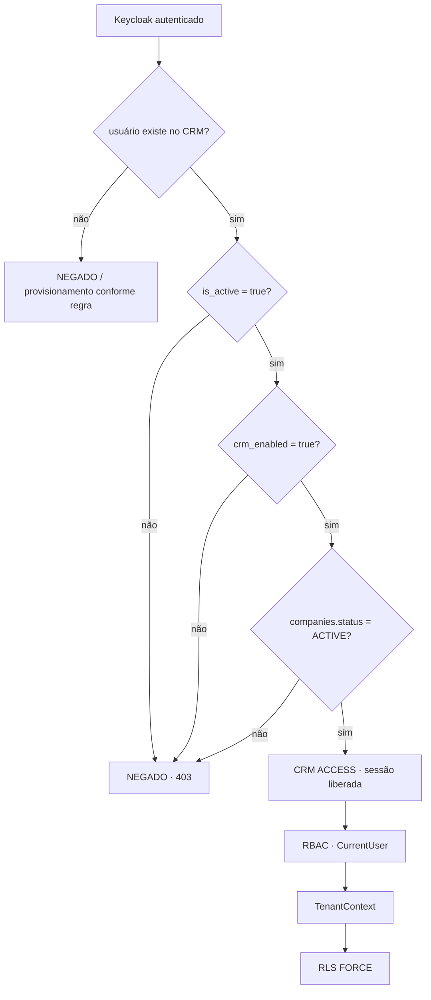

# Sprint 6 — CRM_ACCESS.md (Modelo de CRM Access)

## 1. Conceito

**CRM Access ≠ RBAC.**

- **Keycloak authentication** = "Quem é você?" (prova de identidade).
- **users.is_active** = "Seu usuário está ativo?" (indivíduo habilitado).
- **users.crm_enabled** = "Este usuário possui acesso ao CRM?" (**controle explícito, novo**).
- **companies.status** = "A empresa pode utilizar o CRM?" (bloqueio do tenant inteiro).
- **RBAC (roles/permissions)** = "O que este usuário pode fazer dentro do CRM?".
- **RLS** = "Quais dados este usuário pode acessar?" (isolamento final).

> Decisão **D1/D2 (fase 1):** implementar a **Opção 3** — flag `users.crm_enabled` +
> checagem de `companies.status = ACTIVE`. **Não** criar tabela `user_application_access`.

---

## 2. Cadeia de Gates (decisão de acesso)

```text
Keycloak autenticado
        ↓
usuário existe no CRM?
        ↓
users.is_active = true?
        ↓
users.crm_enabled = true?        ← NOVO (decisão explícita)
        ↓
companies.status = ACTIVE?
        ↓
SIM → acesso ao CRM
NÃO → acesso negado
```

Se **qualquer** gate falhar → **CRM ACCESS = DENIED** (403, sem sessão).



---

## 3. Modelo de Dados (Opção 3)

### 3.1 Nova coluna

| Coluna | Tipo | Default | Descrição |
|---|---|---|---|
| `users.crm_enabled` | `BOOLEAN NOT NULL` | `false` | Controle explícito de acesso ao CRM |

- Migration nova (ex.: `V023__add_crm_enabled_to_users.sql`).
- **Não** cria tabela; **não** altera RLS (a policy por `company_id` já cobre a coluna nova
  — `users` permanece tenant-scoped com RLS FORCE da Sprint 5).

### 3.2 Backfill de usuários existentes (regra obrigatória)

> O sistema está em produção. A migration **não pode** bloquear acidentalmente quem já tem
> acesso legítimo.

- **Usuários existentes** com acesso legítimo atual → `crm_enabled = true` **explicitamente**
  na migration (backfill documentado), para que o deploy não derrube ninguém.
- **Novos usuários** (provisionados depois da migration) → `crm_enabled = false` (default),
  salvo regra explícita de concessão.

```sql
-- V023 (exemplo de forma; valores reais a validar no deploy)
ALTER TABLE users ADD COLUMN crm_enabled BOOLEAN NOT NULL DEFAULT false;

-- Backfill explícito: usuários ativos existentes já legítimos mantêm acesso
UPDATE users SET crm_enabled = true WHERE is_active = true;
```

> ⚠️ Regra de concessão: definir antes de rodar se o backfill usa `is_active`, `status` ou
> lista explícita de ids. O objetivo é **preservar o acesso legítimo atual** e documentar a decisão.

---

## 4. Provisionamento separado de concessão (regra absoluta)

**Identity provisioning ≠ CRM access grant.**

Hoje (indesejado):
```text
Keycloak autenticou → usuário provisionado → CRM automaticamente liberado
```

Alvo (obrigatório):
```text
Keycloak autenticou → usuário provisionado → crm_enabled definido explicitamente
                                                   ↓
                              CRM access SOMENTE se permitido
```

- O provisionamento pode criar o usuário no CRM (identidade), mas **não** deve conceder
  acesso automaticamente.
- **Default para novos usuários: `crm_enabled = false`**, salvo regra explícita.
- Códigos a revisar (não remover provisioning — apenas separar o grant):
  - `LocalCurrentUserResolver` / `AuthServiceCurrentUserResolver` (backend)
  - `AuthService.createProvisionedUser` / `assignDefaultRole` (backend)
  - `CurrentUserResolutionService` (auth-service)
  - `RoleDataSeeder` (verificar interação com o novo campo)

---

## 5. Onde o gate é aplicado

### 5.1 No Access Gateway (Auth Service — decisão de sessão)
Após validar o JWT do Keycloak, antes de criar a sessão de browser:
```
usuário existe? AND is_active AND crm_enabled AND company.status = ACTIVE
→ cria sessão
senão → 403 (sem sessão)
```

### 5.2 No Backend (resolução de CurrentUser / `/auth/me`)
A resolução existente passa a exigir os mesmos gates (is_active AND crm_enabled AND
company ACTIVE) → resposta de acesso negado quando qualquer um falhar. Mantém o contrato
de `401 USER_INACTIVE` do auth-service para usuário inativo.

---

## 6. Empresa Suspensa (bloqueio em massa)

`companies.status` permite bloquear **todos os usuários da empresa de uma vez**:

| Company | status | User | is_active | crm_enabled | Resultado |
|---|---|---|---|---|---|
| Company A | SUSPENDED | A1 | true | true | **NEGADO** |
| Company A | SUSPENDED | A2 | true | true | **NEGADO** |
| Company B | ACTIVE | B1 | true | true | **LIBERADO** |

Mesmo com `is_active` e `crm_enabled = true`, `company.status != ACTIVE` → **nega todos**.
> Nota: o modelo atual consulta `companies.status`; na Sprint 6 o gate passa a **exigir** `ACTIVE`
> (suspensão/inativação do tenant bloqueia o acesso de todos os seus usuários).

---

## 7. Multi-tenant (inalterado)

- Modelo `user → company` **inalterado**; `company_id` continua derivado do usuário/identidade confiável.
- **Nunca** aceitar `companyId` arbitrário vindo do frontend.
- Após a autorização, a cadeia continua exatamente como validada na Sprint 5:
  `CurrentUser → companyId → TenantContext → TenantAwareDataSource → crm_app → RLS FORCE`.

---

## 8. Auditoria

Registrar as alterações de `crm_enabled`, `is_active` e `companies.status` quando aplicável
ao mecanismo de auditoria existente (`audit_logs`, RLS tenant-scoped, Sprint 5).

Devemos conseguir responder:
```
Quem concedeu acesso ao CRM?  Quando?  Quem revogou?  Quando?
```

> Limitação: se o modelo de auditoria atual não suportar o rastreio de quem/Quando de forma
> adequada, **documentar a limitação** e propor evolução — sem criar complexidade desnecessária.

---

## 9. Não confundir os gates (resumo)

| Conceito | Pergunta que responde | Onde é avaliado |
|---|---|---|
| Keycloak authentication | Quem é você? | Keycloak (IdP) |
| users.is_active | Seu usuário está ativo? | Auth Service / Backend |
| users.crm_enabled | Possui acesso ao CRM? | Auth Service / Backend (**novo**) |
| companies.status | A empresa pode usar o CRM? | Auth Service / Backend |
| RBAC | O que pode fazer? | Auth Service / Backend (permissions) |
| RLS | Quais dados pode acessar? | PostgreSQL (`crm_app`, FORCE) |

---

## 10. Testes Obrigatórios (a implementar)

| # | Cenário | Resultado esperado |
|---|---|---|
| 1 | Keycloak autenticado + ativo + `crm_enabled=true` + company ACTIVE | **Acesso permitido**; CurrentUser resolvido; sessão criada |
| 2 | Keycloak autenticado + `is_active=false` | **Acesso negado** |
| 3 | Keycloak autenticado + `crm_enabled=false` | **Acesso negado** |
| 4 | Keycloak autenticado + company **SUSPENDED** | **Acesso negado** |
| 5 | Keycloak autenticado + company **INACTIVE** | **Acesso negado** |
| 6 | Usuário inexistente no CRM | Negado/provisionamento conforme regra definida |
| 7 | Usuário autorizado | CurrentUser resolvido normalmente (`/auth/me` 200) |
| 8 | Usuário sem CRM access | Não recebe sessão/acesso ao CRM (403) |
| 9 | `crm_enabled` não é substituto de RBAC | `crm_enabled=true` sem role/permissão continua negado no acesso ao recurso |
| 10 | Multi-tenant | `company_id` derivado da identidade; tenant A/B isolados (RLS, Sprint 5) |

---

## 11. Critério de Aceite

A Sprint 6 deve demonstrar a arquitetura final:

```
Keycloak = autenticado
CRM access = independente
User active = gate
CRM enabled = gate
Company active = gate
RBAC = autorização
TenantContext = isolamento
RLS = proteção final dos dados
```

---

*Data: 2026-08-02*
